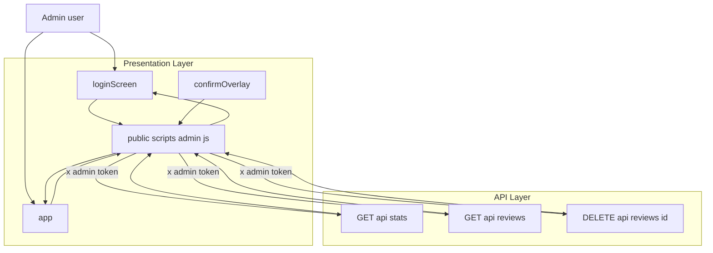
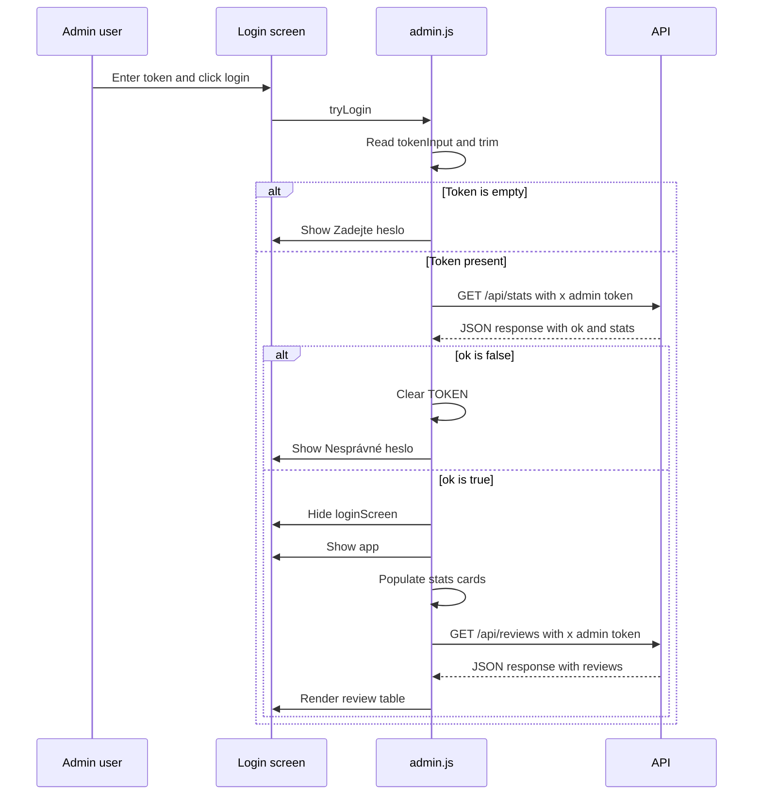
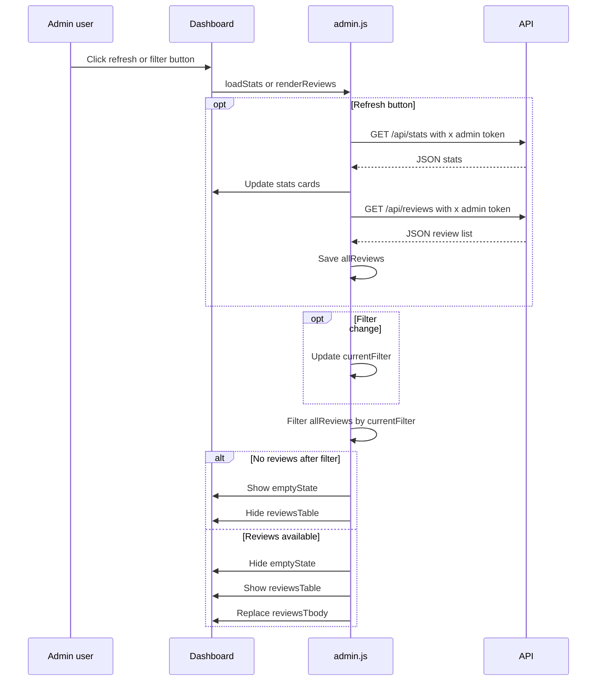
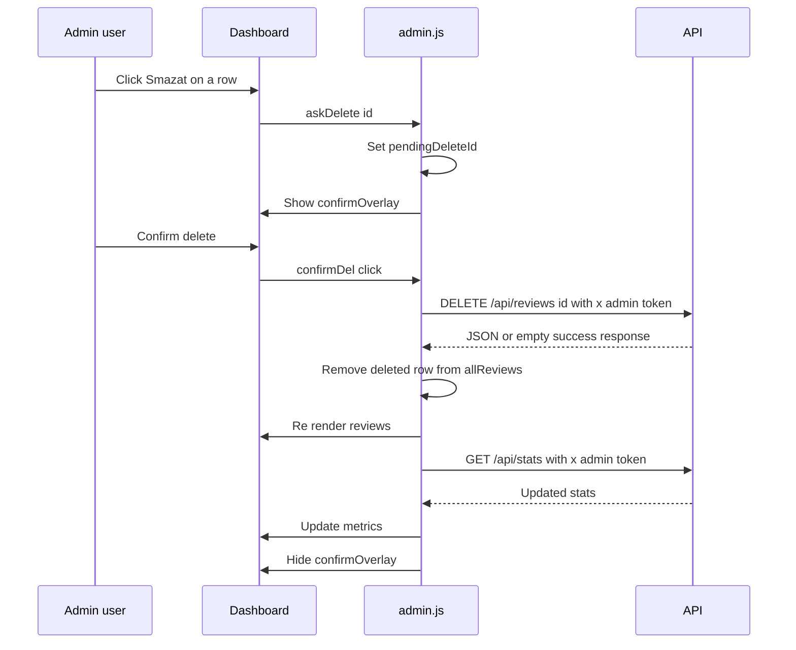
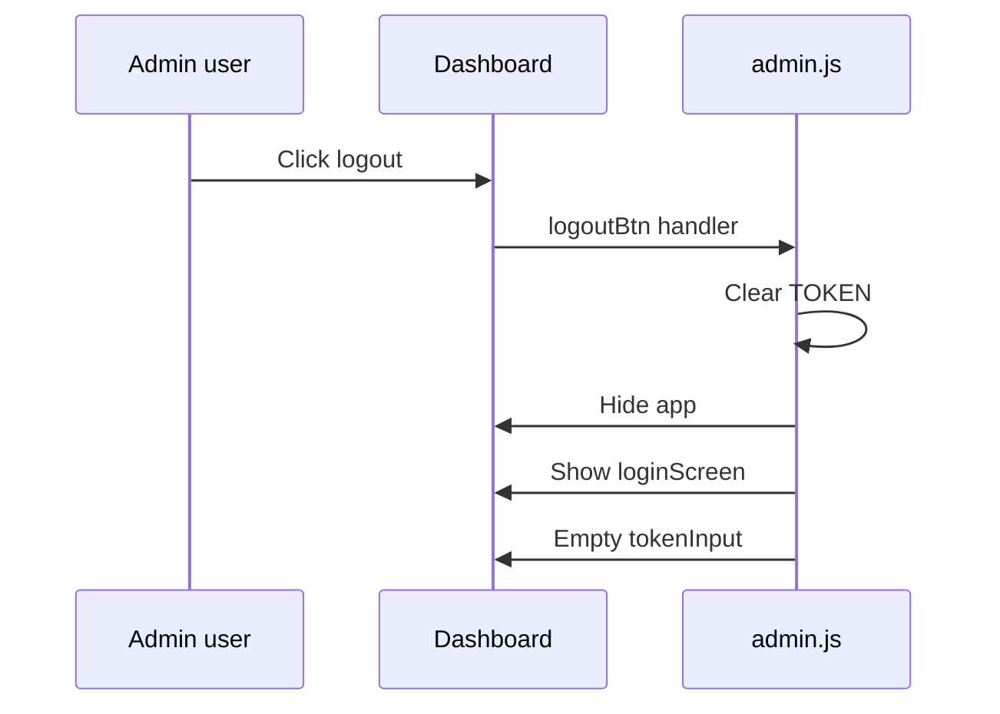

# Administration Domain - Admin Authentication Flow, Session State, and Screen Transitions

## Overview

This admin surface is a single-page browser flow that protects the review dashboard with a shared secret entered directly into the page. The login gate lives in , while  controls the token check, dashboard reveal, review loading, refresh, filtering, and deletion confirmation behavior.

The authentication model is intentionally compact: the browser keeps the entered secret only in the in-memory `TOKEN` variable and sends it on each protected request through the custom `x-admin-token` header. There is no separate backend session object in this client code; instead, a successful `GET /api/stats` response is used both to validate the token and to populate the dashboard metrics.

The screen flow is split into two top-level areas, `loginScreen` and `app`, plus a separate confirmation overlay for destructive actions. The script swaps these states by changing `style.display` and overlay classes, so the entire admin experience is driven by DOM state transitions and authenticated `fetch` calls.

## Architecture Overview



The page uses  as the static shell and  as the controller. The controller does not delegate to a separate client service layer; it calls the backend endpoints directly and uses the returned JSON to decide whether to reveal the dashboard or keep the login gate visible.

## Component Structure

### 1. Presentation Layer

#### `admin.html`

*`public/admin.html`*

`admin.html` defines the login gate, the authenticated dashboard region, and the delete-confirmation overlay that `admin.js` toggles at runtime. The script depends on a fixed set of DOM ids to show or hide the correct screen and to populate the dashboard values.

| DOM id | Role in the admin flow |
| --- | --- |
| `loginScreen` | Login gate container shown before token validation and restored on logout |
| `tokenInput` | Password input used to enter the admin token |
| `loginBtn` | Click target that starts `tryLogin` |
| `loginErr` | Inline error area for empty or invalid token messages |
| `app` | Authenticated dashboard container |
| `logoutBtn` | Clears the in-memory token and returns to the login screen |
| `refreshBtn` | Triggers a stats and review reload |
| `sTotal` | Total review count display |
| `sAvg` | Average star display |
| `sNeg` | Negative review count display |
| `sFive` | Five-star review count display |
| `loadingState` | Loading and error container for the review table |
| `emptyState` | Empty-state message when no reviews match the current filter |
| `reviewsTable` | Review list table |
| `reviewsTbody` | Table body replaced by `renderReviews` |
| `confirmOverlay` | Destructive-action confirmation overlay |
| `confirmCancel` | Closes the overlay without deleting |
| `confirmDel` | Confirms deletion of the selected review |


Screen state is split between the login panel, the dashboard, and the confirmation overlay. The dashboard itself also contains nested loading, empty, and table states that are swapped by `loadReviews` and `renderReviews`.

#### `admin.js`

*`public/scripts/admin.js`*

`admin.js` is the runtime controller for the admin surface. It stores the token in memory, validates it against `GET /api/stats`, reuses it for all protected requests, and drives the screen transitions by mutating DOM state.

##### State Properties

| Property | Type | Description |
| --- | --- | --- |
| `TOKEN` | `string` | In-memory admin token reused in the `x-admin-token` header |
| `allReviews` | `Array` | Full review set returned by `GET /api/reviews` |
| `currentFilter` | `string` | Active list filter; `all`, `positive`, or `negative` |
| `pendingDeleteId` | `number \ | null` | Review id selected for deletion before confirmation |


##### Public Functions

| Method | Description |
| --- | --- |
| `stars` | Builds the star display used in the review table |
| `formatDate` | Formats `created_at` for the Czech admin view |
| `loadStats` | Fetches dashboard metrics from `GET /api/stats` |
| `loadReviews` | Fetches the review list from `GET /api/reviews` |
| `renderReviews` | Filters and renders the review table into `reviewsTbody` |
| `escHtml` | Escapes `&`, `<`, and `>` before inserting review text into the table |
| `askDelete` | Stores the selected review id and opens the confirmation overlay |
| `tryLogin` | Validates the entered token against `GET /api/stats` and opens the dashboard on success |


##### Runtime Dependencies

| Type | Description |
| --- | --- |
| DOM | Reads and writes the ids defined by `admin.html` |
| `fetch` | Calls the protected admin endpoints directly |
| JSON responses | Uses the `ok` flag and data fields returned by the server |
| CSS classes | Uses `show`, `active`, `flagged`, `badge-neg`, and `badge-pos` for screen and row state |


`tryLogin` is the entry point for authentication. It reads `tokenInput`, trims the value, stores it in `TOKEN`, and sends it as the `x-admin-token` header on `GET /api/stats`. If the response JSON does not have a truthy `ok`, the function clears `TOKEN` and shows the invalid-password message.

## Feature Flows

### Login Validation and Dashboard Reveal



`tryLogin` uses `GET /api/stats` as both the credential check and the first dashboard payload. A successful response immediately unlocks the screen and seeds the metrics without a second auth step.

### Review Refresh and Filtered Rendering



Filtering is client-side only. The `positive` filter keeps reviews with `overall_stars >= 4`, while `negative` keeps reviews with `overall_stars < 4`; `all` shows the full cached list in `allReviews`.

### Delete Confirmation and Review Removal



The delete flow uses a separate confirmation overlay so the destructive action is not executed directly from the table row. After the request completes, the client updates its in-memory review list and refreshes the stats cards instead of reloading the whole page.

### Logout and Screen Reset



Logout is entirely client-side. The script resets the in-memory token and returns the user to the login screen; the page does not keep any authenticated session object in the browser runtime beyond `TOKEN`.

## State Management

### Client State

| State | Type | Default | Used By | Purpose |
| --- | --- | --- | --- | --- |
| `TOKEN` | `string` | `""` | `tryLogin`, `loadStats`, `loadReviews`, delete handler, logout handler | Stores the admin token only in memory |
| `allReviews` | `Array` | `[]` | `loadReviews`, `renderReviews`, delete handler | Holds the dashboard review dataset between renders |
| `currentFilter` | `string` | `"all"` | Filter button handlers, `renderReviews` | Controls client-side filtering of the visible rows |
| `pendingDeleteId` | `number \ | null` | `null` | `askDelete`, confirm/cancel handlers | Tracks which review is queued for deletion |


### Screen State Transitions

| From | Trigger | To | DOM change |
| --- | --- | --- | --- |
| `loginScreen` | Empty token | `loginScreen` | `loginErr` shows `Zadejte heslo.` |
| `loginScreen` | Invalid token | `loginScreen` | `TOKEN` is cleared and `loginErr` shows `Nesprávné heslo.` |
| `loginScreen` | Successful `tryLogin` | `app` | `loginScreen` is hidden, `app` is shown |
| `app` | `logoutBtn` click | `loginScreen` | `TOKEN` cleared, `tokenInput` emptied |
| `app` | `askDelete` | `confirmOverlay` visible | Overlay gets the `show` class |
| `confirmOverlay` | `confirmCancel` click | `app` | Overlay `show` class removed |
| `confirmOverlay` | `confirmDel` success or failure | `app` | Overlay `show` class removed, `pendingDeleteId` reset |
| `loadingState` | `loadReviews` start | `loadingState` visible | Table and empty state hidden |
| `loadingState` | Reviews returned | `reviewsTable` | Table shown, `loadingState` hidden |
| `loadingState` | No matching reviews | `emptyState` | Empty state shown, table hidden |


`loadStats` uses an empty `catch` block, so stats refresh failures do not replace the current dashboard values. `loadReviews` handles failures by replacing the loading message with an inline error string inside `loadingState`.

## API Integration

### Request Routing in `admin.js`

| Function | Endpoint | Role |
| --- | --- | --- |
| `tryLogin` | `GET /api/stats` | Validates the entered admin token |
| `loadStats` | `GET /api/stats` | Refreshes dashboard metrics |
| `loadReviews` | `GET /api/reviews` | Loads the review list for the admin table |
| Delete confirmation handler | `DELETE /api/reviews/{id}` | Deletes the selected review |


#### Validate Admin Token and Load Stats

```api
{
    "title": "Validate Admin Token and Load Stats",
    "description": "Uses the shared admin token in the x-admin-token header to validate access and return dashboard counters",
    "method": "GET",
    "baseUrl": "<AdminApiBaseUrl>",
    "endpoint": "/api/stats",
    "headers": [
        {
            "key": "x-admin-token",
            "value": "<admin-token>",
            "required": true
        }
    ],
    "queryParams": [],
    "pathParams": [],
    "bodyType": "none",
    "requestBody": "",
    "formData": [],
    "rawBody": "",
    "responses": {
        "200": {
            "description": "Authenticated stats payload",
            "body": "{\n    \"ok\": true,\n    \"total\": 128,\n    \"avg_stars\": 4.6,\n    \"negative\": 9,\n    \"five_star\": 84\n}"
        }
    }
}
```

`tryLogin` treats the JSON `ok` field as the authentication result. A falsy `ok` clears the client token and keeps the user on the login screen.

#### Load Admin Reviews

```api
{
    "title": "Load Admin Reviews",
    "description": "Returns the review list used by the dashboard table after the token has been validated",
    "method": "GET",
    "baseUrl": "<AdminApiBaseUrl>",
    "endpoint": "/api/reviews",
    "headers": [
        {
            "key": "x-admin-token",
            "value": "<admin-token>",
            "required": true
        }
    ],
    "queryParams": [],
    "pathParams": [],
    "bodyType": "none",
    "requestBody": "",
    "formData": [],
    "rawBody": "",
    "responses": {
        "200": {
            "description": "Authenticated review list payload",
            "body": "{\n    \"ok\": true,\n    \"reviews\": [\n        {\n            \"id\": 17,\n            \"created_at\": \"2026-04-29T10:15:00.000Z\",\n            \"overall_stars\": 2,\n            \"email\": \"customer@example.com\",\n            \"message\": \"The response time was slow, but the staff was helpful.\",\n            \"flagged\": true\n        }\n    ]\n}"
        }
    }
}
```

`loadReviews` reads `d.reviews`, stores it in `allReviews`, and delegates the visible list state to `renderReviews`. On failure it does not change the cached review array; instead it swaps the loading container text for an inline error message.

#### Delete Review by Id

```api
{
    "title": "Delete Review by Id",
    "description": "Deletes the selected review after confirmation using the shared admin token",
    "method": "DELETE",
    "baseUrl": "<AdminApiBaseUrl>",
    "endpoint": "/api/reviews/{id}",
    "headers": [
        {
            "key": "x-admin-token",
            "value": "<admin-token>",
            "required": true
        }
    ],
    "queryParams": [],
    "pathParams": [
        {
            "name": "id",
            "type": "number",
            "required": true
        }
    ],
    "bodyType": "none",
    "requestBody": "",
    "formData": [],
    "rawBody": "",
    "responses": {
        "200": {
            "description": "Deletion accepted",
            "body": "{\n    \"ok\": true\n}"
        }
    }
}
```

The delete request is only issued after `pendingDeleteId` has been set by `askDelete` and the user confirms in the overlay. After the request completes, the row is removed from `allReviews` and the stats cards are refreshed.

## Security Model

The admin access pattern is a shared-secret header check. The browser stores the entered secret only in `TOKEN`, sends it as `x-admin-token`, and relies on the JSON `ok` flag from `GET /api/stats` to decide whether the dashboard may open.

The code establishes no browser session object, cookie-based login, or persisted token state. Authentication is represented entirely by the in-memory TOKEN variable, so a reload or logout returns the page to the token prompt until the secret is entered again.

This model keeps the implementation compact for an internal dashboard, but every authenticated request depends on possession of the same secret value. The same token unlocks stats, review listing, and deletion, so the admin surface is only as strong as the secrecy of that shared header value.

## Error Handling

| Flow | Error condition | Observed behavior |
| --- | --- | --- |
| `tryLogin` | Blank input | `loginErr` shows `Zadejte heslo.` and no request is sent |
| `tryLogin` | `GET /api/stats` returns falsy `ok` | `TOKEN` is cleared and `loginErr` shows `Nesprávné heslo.` |
| `loadStats` | Network or parsing failure | Error is swallowed by `catch {}` |
| `loadReviews` | Network, parsing, or `ok` failure | `loadingState` is replaced with `Chyba: ...` text |
| Delete confirmation | Request failure | `alert("Chyba: ...")` is shown |
| Delete confirmation | Success or failure | Overlay is closed and `pendingDeleteId` is reset |


The review table only renders escaped message text through `escHtml`, which replaces `&`, `<`, and `>`. Email values are inserted into a `mailto:` link and table cell directly when present.

## Dependencies

- Browser `fetch` API for all admin requests
- DOM ids declared in 
- JSON responses that include `ok` and the fields consumed by `loadStats` and `loadReviews`
- The `x-admin-token` header expected by the server-side admin routes
- Czech locale formatting in `formatDate` via `toLocaleDateString("cs-CZ", ...)` and `toLocaleTimeString("cs-CZ", ...)`

## Testing Considerations

- Entering an empty token should keep the login screen visible and show `Zadejte heslo.`
- A wrong token should clear `TOKEN` and keep `loginScreen` active
- A valid token should hide `loginScreen`, show `app`, and populate the stats cards
- `loadReviews` should render rows into `reviewsTbody` and respect the `all`, `positive`, and `negative` filter buttons
- `askDelete` should open `confirmOverlay` and set `pendingDeleteId`
- Confirmed deletion should remove the row from the client list and refresh the stats cards
- `logoutBtn` should clear the token field and return the page to the login screen
- Refresh should call both `loadStats` and `loadReviews` while keeping the current filter active

## Key Classes Reference

| Class | Responsibility |
| --- | --- |
| `admin.html` | Declares the login gate, dashboard container, stats cards, review table, and delete confirmation overlay |
| `admin.js` | Manages token validation, client-side session state, screen transitions, filtering, refresh, and review deletion |
