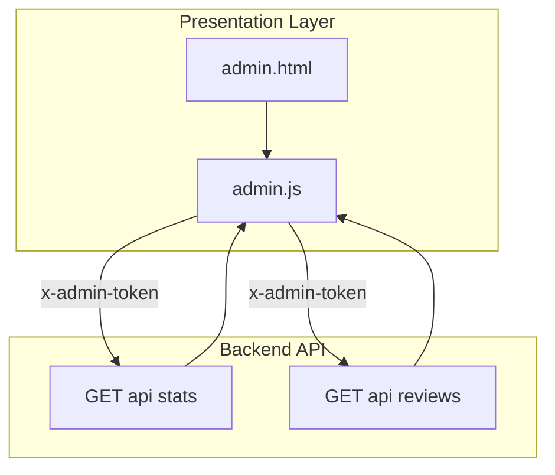
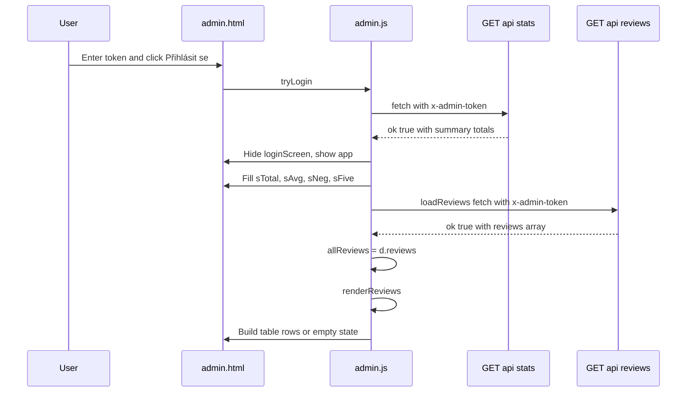
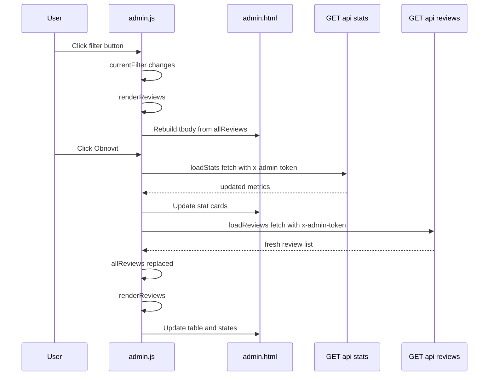

# Administration Domain - Admin dashboard metrics, review listing, and client-side filtering

*`public/admin.html`*

*`public/scripts/admin.js`*

## Overview

The admin dashboard presents a compact operational view of collected reviews. After a token check, it shows summary metrics for total reviews, average star rating, negative reviews, and five-star reviews, then loads the full review list into a table.

The page is designed for fast triage: the operator can switch between all reviews, positive reviews (`overall_stars >= 4`), and negative reviews (`overall_stars < 4`) without another server round-trip. The dashboard keeps the fetched reviews in memory in `allReviews`, and `currentFilter` controls how `renderReviews()` rebuilds the table.

## Architecture Overview



## Component Structure

### Presentation Layer

#### `admin.html`

*`public/admin.html`*

`admin.html` defines the entire dashboard shell that `admin.js` fills and controls. The markup includes the login screen, the main application container, summary cards, the filter/refresh toolbar, the loading and empty states, the review table, and the delete confirmation overlay.

**UI regions and controls**

| Element / ID | Purpose |
| --- | --- |
| `loginScreen` | Full-screen login gate shown before a valid admin token is accepted |
| `tokenInput` | Password field used to enter the admin token |
| `loginBtn` | Starts the login check |
| `loginErr` | Displays login validation errors |
| `app` | Main dashboard container shown after successful login |
| `statsGrid` | Container for the metric cards |
| `sTotal` | Total reviews card value |
| `sAvg` | Average stars card value |
| `sNeg` | Negative reviews card value |
| `sFive` | Five-star reviews card value |
| `.filter-btn[data-filter="all"]` | Shows all reviews |
| `.filter-btn[data-filter="positive"]` | Shows reviews with `overall_stars >= 4` |
| `.filter-btn[data-filter="negative"]` | Shows reviews with `overall_stars < 4` |
| `refreshBtn` | Reloads metrics and reviews |
| `loadingState` | Spinner and loading message while reviews are being fetched |
| `emptyState` | Empty state when the current list has no rows |
| `reviewsTable` | Table container for the review rows |
| `reviewsTbody` | Table body populated by `renderReviews()` |
| `confirmOverlay` | Confirmation dialog overlay for row deletion |
| `confirmCancel` | Cancels the confirmation overlay |
| `confirmDel` | Confirms deletion for the pending row |


The table columns are `#`, `Datum`, `Celkové`, `Email`, `Recenze`, and `Status`, plus a trailing action cell for the row-level delete button.

#### `admin.js`

*`public/scripts/admin.js`*

`admin.js` owns the dashboard state, data fetching, filtering, row rendering, and login/logout transitions. It reads and writes directly to the DOM elements declared in `admin.html`.

**Module state**

| Property | Type | Description |
| --- | --- | --- |
| `TOKEN` | `string` | Value sent as `x-admin-token` on protected requests |
| `allReviews` | `Array` | In-memory cache of review rows returned by `GET /api/reviews` |
| `currentFilter` | `string` | Active list filter: `all`, `positive`, or `negative` |
| `pendingDeleteId` | `number \ | null` | Selected review ID for the delete confirmation overlay |


**Script functions**

| Method | Description |
| --- | --- |
| `stars` | Renders a star display string for a numeric rating |
| `formatDate` | Converts an ISO timestamp into a Czech locale date/time string |
| `loadStats` | Fetches dashboard totals from `GET /api/stats` and fills the stat cards |
| `loadReviews` | Fetches the review list from `GET /api/reviews` and triggers table rendering |
| `renderReviews` | Applies `currentFilter`, handles empty/loading states, and rebuilds the table body |
| `escHtml` | Escapes `&`, `<`, and `>` before injecting review text into HTML |
| `askDelete` | Stores the row ID and opens the confirmation overlay |
| `tryLogin` | Validates the admin token through `GET /api/stats` and opens the dashboard |
| `logoutBtn` handler | Clears `TOKEN` and returns to the login screen |


### Review Summary Cards

The dashboard exposes four summary cards, each populated from `GET /api/stats`:

| Card label | DOM target | Value source |
| --- | --- | --- |
| Celkem recenzí | `sTotal` | `d.total` |
| Průměr hvězdiček | `sAvg` | `d.avg_stars` |
| Negativních | `sNeg` | `d.negative` |
| 5 hvězdiček | `sFive` | `d.five_star` |


`loadStats()` and the post-login bootstrap path both apply the same mapping, so the cards are refreshed from the same response shape.

### Review Listing and Row Rendering

`renderReviews()` rebuilds the `<tbody>` from `allReviews` on every filter change, refresh, and delete completion.

**Row formatting rules**

| Field | Rendered behavior |
| --- | --- |
| `id` | Displayed with a muted `#` prefix |
| `created_at` | Formatted by `formatDate()` into `cs-CZ` date and time |
| `overall_stars` | Rendered through `stars()` |
| `email` | Rendered as a `mailto:` link only when a value is present |
| `message` | Escaped with `escHtml()` before insertion into HTML |
| `flagged` | Controls the status badge class and label |
| Row action | “Smazat” button calls `askDelete(id)` |


## API Integration

### `GET /api/stats`

#### Get Admin Dashboard Stats

```api
{
    "title": "Get Admin Dashboard Stats",
    "description": "Fetches aggregate review metrics for the admin summary cards and validates the admin token during login",
    "method": "GET",
    "baseUrl": "<ServerBaseUrl>",
    "endpoint": "/api/stats",
    "headers": [
        {
            "key": "x-admin-token",
            "value": "<admin token>",
            "required": true
        }
    ],
    "queryParams": [],
    "pathParams": [],
    "bodyType": "none",
    "requestBody": "",
    "formData": [],
    "rawBody": "",
    "responses": {
        "200": {
            "description": "Success",
            "body": "{\n    \"ok\": true,\n    \"total\": 18,\n    \"avg_stars\": 4.6,\n    \"negative\": 3,\n    \"five_star\": 11\n}"
        }
    }
}
```

### `GET /api/reviews`

#### Get Admin Reviews

```api
{
    "title": "Get Admin Reviews",
    "description": "Fetches the review list used by the admin dashboard table and client-side filters",
    "method": "GET",
    "baseUrl": "<ServerBaseUrl>",
    "endpoint": "/api/reviews",
    "headers": [
        {
            "key": "x-admin-token",
            "value": "<admin token>",
            "required": true
        }
    ],
    "queryParams": [],
    "pathParams": [],
    "bodyType": "none",
    "requestBody": "",
    "formData": [],
    "rawBody": "",
    "responses": {
        "200": {
            "description": "Success",
            "body": "{\n    \"ok\": true,\n    \"reviews\": [\n        {\n            \"id\": 42,\n            \"created_at\": \"2026-04-29T10:15:00.000Z\",\n            \"overall_stars\": 5,\n            \"email\": \"jane@example.com\",\n            \"message\": \"Great service\",\n            \"flagged\": false\n        }\n    ]\n}"
        }
    }
}
```

## Feature Flows

### Login, stats load, and review list bootstrap



The client-side filter uses overall_stars thresholds (>= 4 for positive, < 4 for negative), while the status badge uses r.flagged. Those values are rendered independently in renderReviews(), so the visible badge and the active filter category can diverge if the backend sets flagged differently from the star threshold.

**Flow details**

1. The user enters a token in `tokenInput` and clicks `loginBtn`, or presses Enter.
2. `tryLogin()` trims the value and blocks empty input with the inline `loginErr` message.
3. The script sends `GET /api/stats` with `x-admin-token`.
4. On success, the dashboard is revealed and the four stat cards are populated.
5. `loadReviews()` then fetches `GET /api/reviews` with the same header.
6. The response is cached in `allReviews`, and `renderReviews()` draws the table.

### Client-side filtering and refresh



**Filtering rules**

| Filter value | Predicate applied in `renderReviews()` |
| --- | --- |
| `all` | No filtering, all rows in `allReviews` are shown |
| `positive` | `r.overall_stars >= 4` |
| `negative` | `r.overall_stars < 4` |


The filter buttons update the active `.filter-btn` class and then call `renderReviews()` immediately, so switching views never requests the server again.

## UI States

### Loading state

`loadReviews()` shows `loadingState`, hides `reviewsTable`, and hides `emptyState` before the fetch starts. If the request succeeds, `renderReviews()` hides the loading panel.

### Populated state

When filtered rows exist, `renderReviews()` shows `reviewsTable` and fills `reviewsTbody` with one row per review.

### Empty state

If the active filter yields zero rows, `renderReviews()` shows `emptyState` and keeps `reviewsTable` hidden.

### Error state

If `loadReviews()` fails, the loading panel is replaced with an inline error message inside `loadingState`. Invalid login attempts set `loginErr` to `Nesprávné heslo.` and leave the dashboard hidden.

## State Management

### Dashboard state values

| State value | Values / shape | Usage |
| --- | --- | --- |
| `TOKEN` | String token or empty string | Sent to protected GET requests |
| `allReviews` | Array of review objects | Source data for filtering and table rendering |
| `currentFilter` | `all`, `positive`, `negative` | Controls client-side row selection |
| `pendingDeleteId` | Number or null | Holds the selected row ID for the confirmation overlay |


### State transitions

- `tryLogin()` sets `TOKEN` only after the token field is non-empty.
- A failed login resets `TOKEN` back to an empty string.
- `loadReviews()` replaces `allReviews` with the latest server response.
- Filter button clicks only change `currentFilter`; the cached list remains intact.
- Refresh reloads both metrics and review rows from the server.
- Closing the confirmation overlay clears `pendingDeleteId`.

## Data Formatting Rules

### Star rendering

`stars(n, max = 5)` returns:

- a muted dash when `n` is falsy
- a string of filled stars followed by a muted span of empty stars otherwise

### Date formatting

`formatDate(s)` converts the raw timestamp into a Czech locale display string using:

- `toLocaleDateString("cs-CZ", { day: "2-digit", month: "2-digit", year: "numeric" })`
- `toLocaleTimeString("cs-CZ", { hour: "2-digit", minute: "2-digit" })`

### HTML escaping

`escHtml(s)` escapes only:

- `&`
- `<`
- `>`

It is applied to the review message before the string is assigned into the table row template.

## Error Handling

### Login validation

`tryLogin()` checks for an empty token before any request is sent and writes the error directly into `loginErr`.

### Stats fetch

`loadStats()` wraps the fetch in `try/catch` and suppresses thrown exceptions. The stat cards are only updated when the response contains `ok: true`.

### Reviews fetch

`loadReviews()` throws when `d.ok` is false and renders a red error message inside `loadingState` when the request fails.

### Delete confirmation path

The confirmation handler catches fetch errors and shows `alert("Chyba: ...")` before closing the overlay and clearing `pendingDeleteId`.

## Dependencies

- Browser `fetch()` for all API calls
- DOM access by hard-coded IDs from `admin.html`
- Backend endpoints:- `GET /api/stats`
- `GET /api/reviews`
- Request header dependency:- `x-admin-token`
- CSS classes and state styling from 
- External font loading from Google Fonts in `admin.html`

## Testing Considerations

- Validate that `tryLogin()` blocks an empty token and keeps the login screen visible.
- Verify that a successful token populates all four stat cards before the review list loads.
- Confirm that `renderReviews()` respects each filter threshold:- `positive` shows `overall_stars` 4 and 5
- `negative` shows `overall_stars` 1 through 3
- Check that `emptyState` appears when a filter removes all rows.
- Check that `loadingState` is shown during review fetches and replaced after success.
- Verify that `formatDate()` renders Czech-formatted date and time strings.
- Confirm that `escHtml()` prevents raw `<`, `>`, and `&` from being injected into the review message cell.

## Key Classes Reference

| Class | Responsibility |
| --- | --- |
| `admin.html` | Defines the admin dashboard shell, stat cards, filters, table states, and confirmation overlay |
| `admin.js` | Manages token validation, stats loading, review loading, filtering, formatting, and DOM rendering |
