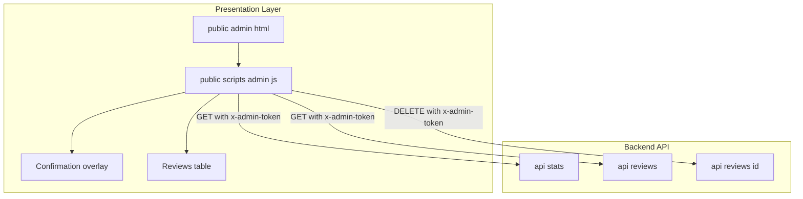
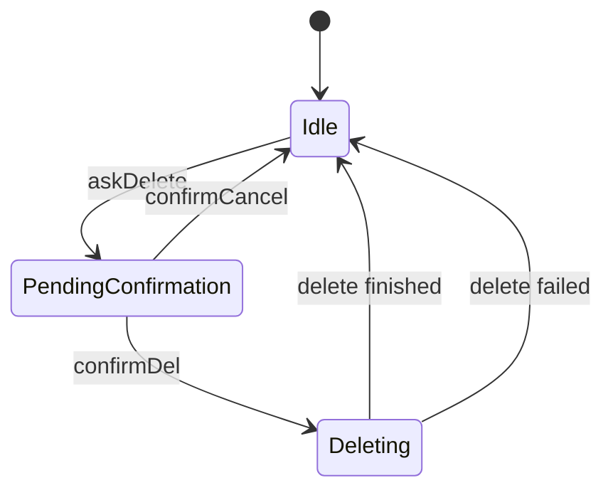
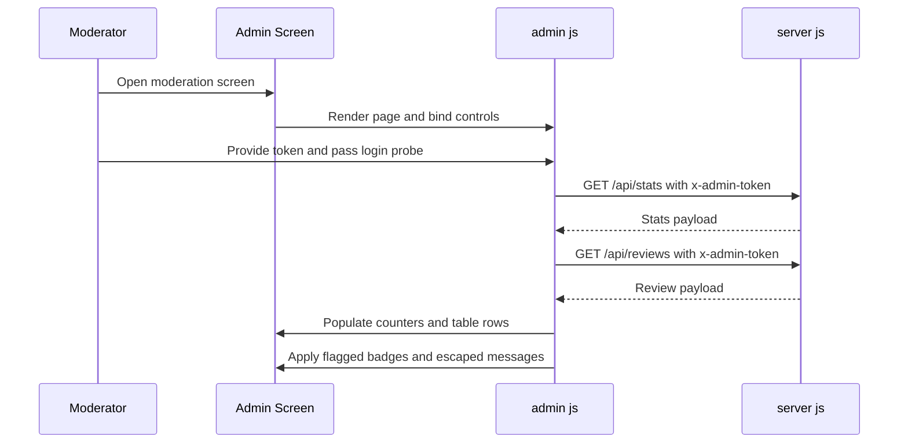
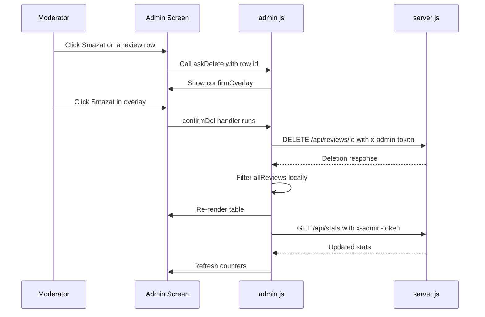

# Administration Domain - Moderation Operations, Deletion Workflow, and UI Safety Measures

*`public/admin.html`, `public/scripts/admin.js`, `server.js`*

## Overview

The admin screen is the moderation console for review operations. It shows aggregated review stats, a review table, and a destructive delete path that is gated by a confirmation overlay before any `DELETE /api/reviews/:id` call is sent.

Moderation is driven by a single client state snapshot in . Reviews are loaded into `allReviews`, filtered into the visible table, and rendered with row badges derived from the `flagged` state. Negative feedback is visually separated from positive feedback, and review text is passed through `escHtml` before it is injected into the table body.

Deletion is intentionally explicit: the moderator clicks **Smazat**, `askDelete` records the target id in `pendingDeleteId`, and the confirmation overlay must be accepted before the request is issued. After a delete request completes, the client reconciles local state, re-renders the table, and refreshes stats.

## Architecture Overview



## Moderation UI Shell

*`public/admin.html`*

The HTML shell provides the moderation workspace, the destructive-action overlay, and the high-level states the script toggles during load, empty, and error conditions.

### UI Controls and Safety Elements

| Element | ID | Purpose |
| --- | --- | --- |
| Login input | `tokenInput` | Collects the admin token before moderation data is shown. |
| Login button | `loginBtn` | Starts the token probe flow. |
| Login error area | `loginErr` | Shows token validation feedback. |
| Stats block | `statsGrid` | Holds the summary counters above the table. |
| Filter toolbar | `filter-btn` | Switches the visible review subset. |
| Refresh button | `refreshBtn` | Re-fetches stats and review rows. |
| Loading state | `loadingState` | Displays while reviews are being fetched. |
| Empty state | `emptyState` | Displays when the filtered list has no rows. |
| Reviews table | `reviewsTable` | Holds the moderation rows. |
| Confirmation overlay | `confirmOverlay` | Blocks deletion until the moderator confirms. |
| Cancel delete button | `confirmCancel` | Cancels the deletion flow and clears pending id. |
| Confirm delete button | `confirmDel` | Executes the destructive delete request. |


The confirmation copy explicitly marks the action as irreversible: “Tato akce je nevratná. Hodnocení bude trvale odstraněno.” That text is the primary UI warning before deletion.

## Client Moderation Controller

*`public/scripts/admin.js`*

`admin.js` owns the moderation state, the review rendering pipeline, the deletion confirmation flow, and the token-backed fetch calls to the backend. The script keeps all reviews in memory, derives the visible list from `currentFilter`, and updates the table after every moderation action.

### State Variables

| Property | Type | Description |
| --- | --- | --- |
| `TOKEN` | `string` | Current admin token sent in the `x-admin-token` header. |
| `allReviews` | `Array` | In-memory copy of the review list returned by `/api/reviews`. |
| `currentFilter` | `string` | Active filter value: `all`, `positive`, or `negative`. |
| `pendingDeleteId` | `number \ | null` | Review id staged by `askDelete` and used by the confirmation button. |


### Public Methods

| Method | Description |
| --- | --- |
| `stars` | Builds the star display string for a row. |
| `formatDate` | Formats the `created_at` value for table display. |
| `loadStats` | Fetches admin summary stats and updates the counters. |
| `loadReviews` | Fetches the review list and hands it to `renderReviews`. |
| `renderReviews` | Applies the current filter and renders the table rows. |
| `escHtml` | Escapes review message text before it is inserted into HTML. |
| `askDelete` | Stores the target id and opens the confirmation overlay. |
| `tryLogin` | Probes the admin token by calling `/api/stats`. |


### Review Row Rendering and Flag Badges

`renderReviews` is the moderation rendering engine. It applies the active filter, toggles loading and empty states, and writes rows into `reviewsTbody` with `tbody.innerHTML`.

| `flagged` value | Row class | Badge class | Badge text |
| --- | --- | --- | --- |
| `true` | `flagged` | `badge badge-neg` | `⚠ Negativní` |
| `false` | empty | `badge badge-pos` | `✓ Pozitivní` |


The row markup also includes:

- the review id in the first column,
- a formatted date from `formatDate`,
- star graphics from `stars`,
- a mailto link when `email` is present,
- the review message after `escHtml(r.message)`.

### Message Safety

`escHtml` is used specifically before inserting review messages into the table.

```javascript
function escHtml(s) {
  return s.replace(/&/g, "&amp;").replace(/</g, "&lt;").replace(/>/g, "&gt;");
}
```

That helper escapes `&`, `<`, and `>`, and it is applied to `r.message` inside `renderReviews` before the row HTML is built.

### Deletion Workflow

The deletion flow is staged and confirmed:

1. The row button calls `askDelete(r.id)`.
2. `askDelete` assigns the id to `pendingDeleteId`.
3. The confirmation overlay receives the `show` class.
4. `confirmCancel` closes the overlay and clears `pendingDeleteId`.
5. `confirmDel` sends `DELETE /api/reviews/:id` with `x-admin-token`.
6. The local list is filtered with `allReviews.filter(...)`.
7. `renderReviews()` re-renders the visible subset.
8. `loadStats()` refreshes the counters after deletion.

#### Deletion State Machine



### Client-Side UI State Handling

`loadReviews` drives the visible moderation states:

- `loadingState` is shown first.
- `reviewsTable` and `emptyState` are hidden during the fetch.
- If the filtered list is empty, `emptyState` is shown.
- If rows exist, `reviewsTable` is shown.
- If an error occurs while loading reviews, `loadingState` is replaced with a red error message.

`refreshBtn` triggers both `loadStats()` and `loadReviews()` so the dashboard and the table can be brought back into sync from the server.

## Backend Moderation API Contract

*`server.js`*

The moderation client talks to three admin endpoints and sends the admin token in `x-admin-token` for each one. The client treats the token as the access gate for reading stats, listing reviews, and deleting a review.

### Authorization Contract

- `GET /api/stats` requires `x-admin-token`.
- `GET /api/reviews` requires `x-admin-token`.
- `DELETE /api/reviews/:id` requires `x-admin-token`.

The client uses `/api/stats` as the token probe in `tryLogin`, then reuses the same token for the moderation table and delete action.

#### Get Admin Statistics

```api
{
    "title": "Get Admin Statistics",
    "description": "Fetches moderation summary metrics for the admin dashboard and is also used by the client as the token probe.",
    "method": "GET",
    "baseUrl": "<ServerBaseUrl>",
    "endpoint": "/api/stats",
    "headers": [
        {
            "key": "x-admin-token",
            "value": "<token>",
            "required": true
        }
    ],
    "queryParams": [],
    "pathParams": [],
    "bodyType": "none",
    "requestBody": "",
    "formData": [],
    "rawBody": "",
    "responses": {
        "200": {
            "description": "Success",
            "body": "{\n    \"ok\": true,\n    \"total\": 128,\n    \"avg_stars\": \"4.6\",\n    \"negative\": 9,\n    \"five_star\": 96\n}"
        }
    }
}
```

#### List Reviews for Moderation

```api
{
    "title": "List Reviews for Moderation",
    "description": "Fetches the review collection used by the moderation table.",
    "method": "GET",
    "baseUrl": "<ServerBaseUrl>",
    "endpoint": "/api/reviews",
    "headers": [
        {
            "key": "x-admin-token",
            "value": "<token>",
            "required": true
        }
    ],
    "queryParams": [],
    "pathParams": [],
    "bodyType": "none",
    "requestBody": "",
    "formData": [],
    "rawBody": "",
    "responses": {
        "200": {
            "description": "Success",
            "body": "{\n    \"ok\": true,\n    \"reviews\": [\n        {\n            \"id\": 42,\n            \"created_at\": \"2026-04-29T10:15:00.000Z\",\n            \"overall_stars\": 2,\n            \"email\": \"customer@example.com\",\n            \"message\": \"Long wait at checkout\",\n            \"flagged\": true\n        }\n    ]\n}"
        }
    }
}
```

#### Delete Review

```api
{
    "title": "Delete Review",
    "description": "Deletes a single review selected from the moderation table.",
    "method": "DELETE",
    "baseUrl": "<ServerBaseUrl>",
    "endpoint": "/api/reviews/:id",
    "headers": [
        {
            "key": "x-admin-token",
            "value": "<token>",
            "required": true
        }
    ],
    "queryParams": [],
    "pathParams": [
        {
            "key": "id",
            "value": "42"
        }
    ],
    "bodyType": "none",
    "requestBody": "",
    "formData": [],
    "rawBody": "",
    "responses": {
        "200": {
            "description": "Success",
            "body": "{\n    \"ok\": true\n}"
        }
    }
}
```

## Feature Flows

### Moderation List Load and Render



**Flow details**

- `loadStats` updates the summary counters.
- `loadReviews` stores the server response in `allReviews`.
- `renderReviews` filters the list and fills `reviewsTbody`.
- Row badges are derived directly from `r.flagged`.

### Confirmed Deletion



**Flow details**

- `pendingDeleteId` is the only staged identifier for the destructive action.
- The overlay is the confirmation gate.
- The table is updated locally immediately after the request resolves.
- Stats are refreshed after deletion, not by reloading the full list.

## State Management

### Visible Review State

| State | Source | Behavior |
| --- | --- | --- |
| `allReviews` | `loadReviews` | Stores the full review set returned by the server. |
| `currentFilter` | Filter buttons | Controls whether `renderReviews` shows all, positive, or negative rows. |
| `pendingDeleteId` | `askDelete` / cancel / delete handlers | Holds the id waiting for confirmation. |


### Display State Toggles

| UI region | Shown when | Hidden when |
| --- | --- | --- |
| `loadingState` | `loadReviews` starts or when no rows are available and an error is not being shown | Table is ready to render |
| `emptyState` | The filtered set has no rows | Rows exist |
| `reviewsTable` | The filtered set has rows | Loading or empty |
| `confirmOverlay` | A review id is staged for deletion | Delete is canceled or completed |


## Error Handling

confirmDel does not inspect the DELETE response body or check response.ok. Any fetch call that resolves at the network layer is treated as success, so the client removes the row locally and refreshes stats even if the server returned a non-throwing error payload.

`admin.js` uses different error surfaces depending on the action:

- `loadReviews` catches failures and writes a red message into `loadingState`.
- `loadStats` suppresses exceptions with an empty `catch`.
- `confirmDel` catches request failures and shows `alert("Chyba: " + e.message)`.
- `tryLogin` writes token validation errors into `loginErr`.

The server contract is also read through `d.ok` and `d.error` in the client. For review loading and login probing, the client expects JSON with an `ok` flag and a string `error` when validation fails.

## Operational Notes

- Deletion is destructive and the UI states that the action is irreversible.
- The confirmation overlay is the only in-app guard before delete is attempted.
- `pendingDeleteId` is cleared on cancel and after the delete attempt finishes.
- Local moderation state is reconciled after a delete so the row disappears immediately without re-fetching the full list.
- Review messages are escaped before insertion, which protects the moderation table from raw HTML in feedback content.

## Key Classes Reference

| Class | Responsibility |
| --- | --- |
| `admin.html` | Hosts the moderation screen, table shell, and delete confirmation overlay. |
| `admin.js` | Implements moderation state, review rendering, deletion confirmation, and admin fetch calls. |
| `server.js` | Serves the admin moderation endpoints for stats, review listing, and review deletion. |
