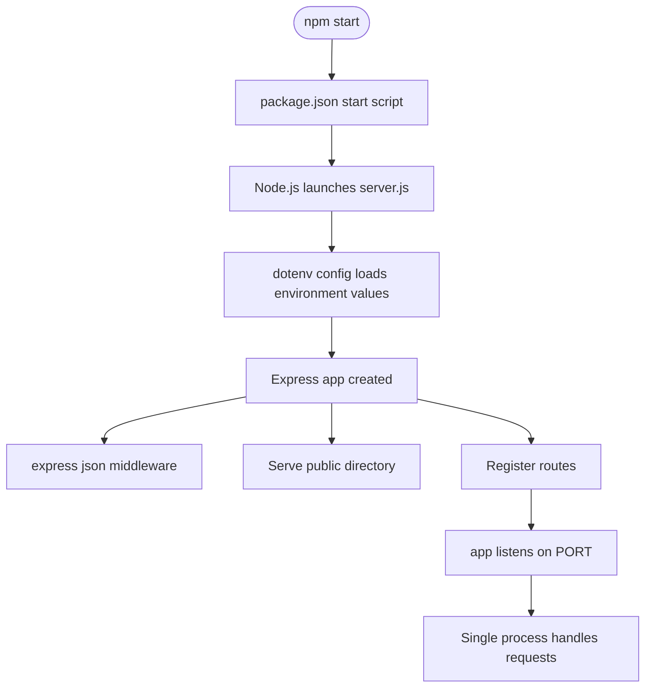
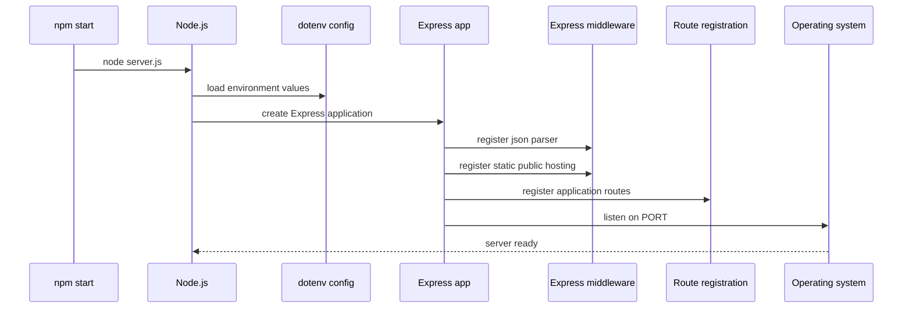

# Backend Service and Runtime - Application bootstrap, dependency model, and process lifecycle

## Overview

`package.json` and `server.js` define the runtime contract for the application. The repository is started through `npm start`, which launches a single Node.js process in ES module mode and hands control to `server.js` for Express bootstrapping.

`server.js` is responsible for loading environment values with `dotenv/config`, creating the Express application, registering global middleware, exposing the `public/` directory as static content, and starting the listener only after routing setup is complete. The result is one in-process server that serves the review UI and the backend request surface from the same runtime.

## Architecture Overview

## Runtime Contract

### `package.json`

`package.json` establishes how the application is launched and how Node interprets the source files.

#### Runtime fields

| Field | Purpose |
| --- | --- |
| `type` | Enables ES module mode for the runtime. |
| `scripts.start` | Defines the `npm start` entrypoint used to launch `server.js`. |

#### Startup role

- `npm start` resolves directly to `node server.js`.
- The runtime contract is intentionally minimal: one entrypoint, one server process, one listener.
- ES module mode is part of the application contract, so the server bootstrap uses `import` syntax rather than CommonJS loading.

### `server.js`

`server.js` owns application bootstrap and the process lifecycle. It wires startup-time configuration, middleware, static file hosting, route registration, and the final `listen` call.

#### Top-level properties

| Property | Type | Description |
| --- | --- | --- |
| `app` | `Express` application | The singleton Express instance used to register middleware, routes, and the listener. |
| `PORT` | `string` or `number` | The port resolved from environment configuration for the active process. |

#### Bootstrap responsibilities

| Step | Responsibility |
| --- | --- |
| Load environment values | `dotenv/config` injects environment variables at startup before application setup continues. |
| Create application | `express()` initializes the server instance. |
| Parse request bodies | `express.json()` enables JSON payload parsing for request handlers. |
| Serve static assets | `express.static('public')` exposes the `public/` directory from the same server process. |
| Register routes | Route setup runs before the server begins accepting requests. |
| Start listening | `app.listen(PORT)` opens the network socket after bootstrap is complete. |

## Dependency Model

### Runtime dependencies used by bootstrap

| Dependency | Role in the runtime |
| --- | --- |
| `express` | Provides the HTTP server, middleware pipeline, static asset hosting, and listener. |
| `dotenv/config` | Loads environment values into `process.env` before bootstrap logic uses them. |
| Node.js ES module support | Allows the runtime to load `server.js` through `import` syntax because the package is configured as an ES module project. |

### Contract between files

| File | Responsibility |
| --- | --- |
| `package.json` | Declares the start command and module mode used by the process. |
| `server.js` | Consumes that contract to build and start the server. |

## Process Lifecycle

### Startup sequence

dotenv/config is imported for its side effect at startup, so environment values are available during server initialization and PORT resolution.

1. `npm start` executes the `start` script from `package.json`.
2. Node launches `server.js` in ES module mode.
3. `dotenv/config` loads environment values before any runtime configuration is read.
4. The Express application is created once for the process.
5. `express.json()` is registered so JSON request bodies can be parsed by downstream handlers.
6. `express.static('public')` is registered so the same server can serve the client files in `public/`.
7. Application routes are registered.
8. `app.listen(PORT)` starts the listener on the selected port.
9. The process remains alive as a single server instance handling requests.

### Request handling order

- Middleware is registered before the server begins listening.
- Route registration happens before the socket opens.
- Static file handling and JSON parsing are part of the same Express pipeline as the application routes.
- The deployment model is one long-lived Node process per running instance.

## Process and Startup Flow

## Static Hosting and Request Parsing

`server.js` configures two global behaviors that shape the runtime contract:

- `express.json()` parses incoming JSON request bodies before route handlers run.
- `express.static('public')` exposes the `public/` directory from the same process, allowing the UI assets to be served without a separate web server.

These are application-wide bootstrap concerns, not per-route concerns, and they are installed before `app.listen(PORT)` opens the server.

## Single-Process Deployment Model

The application runs as one Node.js process started by `npm start`. That process owns:

- the Express application instance,
- JSON body parsing,
- static file hosting for `public/`,
- route registration,
- and the network listener bound to `PORT`.

This keeps bootstrap, request handling, and static delivery in one runtime boundary.

## Key Classes Reference

| Class | Responsibility |
| --- | --- |
| `package.json` | Declares ES module mode and the `npm start` entrypoint that launches the application. |
| `server.js` | Boots Express, installs middleware, serves `public/`, registers routes, and starts the listener on `PORT`. |
