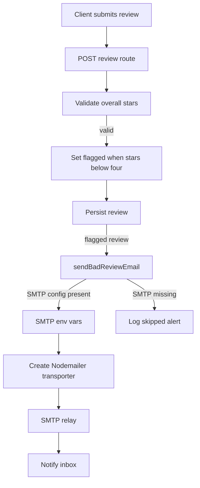
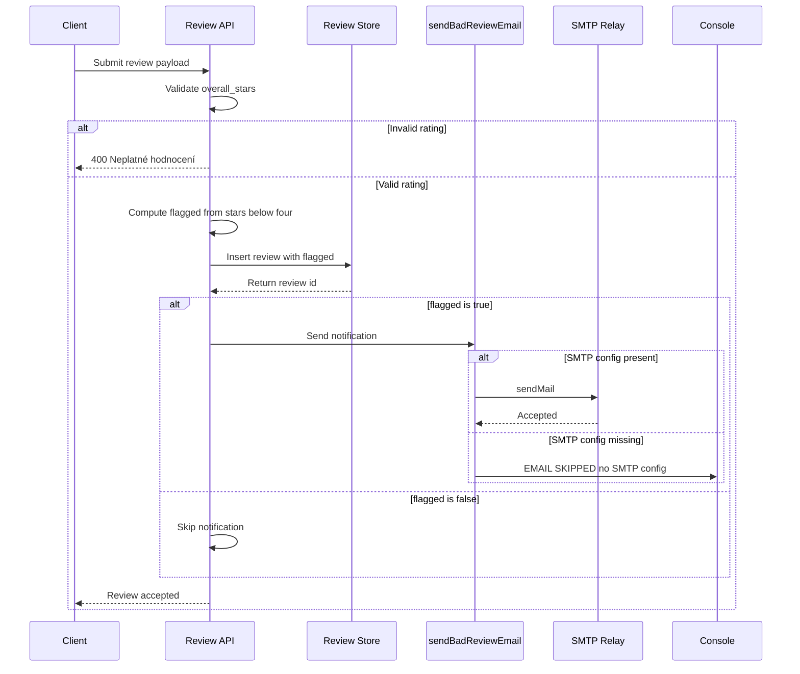

# Email Notification Pipeline for Flagged Reviews

## Overview

This runtime path turns a submitted review into an optional SMTP alert when the rating is negative. In `server.js`, the review payload is validated, the `flagged` state is derived from `overall_stars < 4`, and the review is then eligible for an email notification that is sent to the address configured in `NOTIFY_EMAIL`.

The notification flow is intentionally non-blocking from a product perspective: if SMTP is not configured, the helper logs the skipped alert and exits. That keeps the review submission path usable even when email delivery is unavailable.

## Architecture Overview



## SMTP Configuration

`server.js` enables email delivery only when the SMTP connection values are present. The transport is created with `SMTP_HOST`, `SMTP_PORT`, `SMTP_SECURE`, `SMTP_USER`, and `SMTP_PASS`, while message routing uses `FROM_EMAIL` and `NOTIFY_EMAIL`.

| Variable | Type | Role |
| --- | --- | --- |
| `SMTP_HOST` | string | SMTP host passed into `nodemailer.createTransport`; default shown in code is `smtp.resend.com`. |
| `SMTP_USER` | string | SMTP username used for transporter auth; default shown in code is `resend`. |
| `SMTP_PASS` | string | SMTP password used for transporter auth; required before the transporter is created. |
| `SMTP_PORT` | number | Port passed directly to the transporter. |
| `SMTP_SECURE` | boolean | Secure transport flag passed directly to the transporter. |
| `FROM_EMAIL` | string | Sender address used in `sendMail`. |
| `NOTIFY_EMAIL` | string | Recipient address used in `sendMail`; default shown in code is `fiserbretislav@email.cz`. |


The transporter is created only when `SMTP_HOST`, `SMTP_USER`, and `SMTP_PASS` are all available. That makes the notification path configuration-driven, while still keeping the port and secure mode separate so deployment can select the transport profile through environment variables.

## Runtime Helpers

### `sendBadReviewEmail`

*File: `server.js`*

`sendBadReviewEmail(review)` is the SMTP notification helper used by the review pipeline.

| Method | Description |
| --- | --- |
| `sendBadReviewEmail` | Sends the HTML alert for a negative review when a transporter exists; skips delivery when SMTP is not configured. |


#### Email Composition

The helper sends one HTML message with the following fields:

| Email Field | Source | Behavior |
| --- | --- | --- |
| `from` | `FROM_EMAIL` | Set as the sender of the alert email. |
| `to` | `NOTIFY_EMAIL` | Set as the recipient of the alert email. |
| `subject` | Static string | `⚠️ Nová negativní recenze` |
| `overall_stars` | `review.overall_stars` | Rendered as the star count out of 5. |
| customer email | `review.email` | Falls back to `(nevyplněno)` when empty. |
| review message | `review.message` | Falls back to `(bez textu)` when empty. |


#### Missing SMTP Behavior

When the transporter is not available, the helper writes a log entry and exits:

- log prefix: `[EMAIL SKIPPED - no SMTP config]`
- included context: `review.email` and `review.overall_stars`

That makes email delivery optional at runtime while preserving the review flow.

## Review Submission and Notification Flow

### Review Route

The notification pipeline is attached to the review submission path in `server.js`.

#### Create Review

```api
{
    "title": "Create Review",
    "description": "Accepts a review submission, validates the star rating, marks reviews below four stars as flagged, persists the review, and routes flagged reviews into the SMTP notification pipeline.",
    "method": "POST",
    "baseUrl": "<ReviewAppBaseUrl>",
    "endpoint": "/api/reviews",
    "headers": [
        {
            "key": "Content-Type",
            "value": "application/json",
            "required": true
        }
    ],
    "queryParams": [],
    "pathParams": [],
    "bodyType": "json",
    "requestBody": "{\n    \"overall_stars\": 2,\n    \"email\": \"customer@example.com\",\n    \"message\": \"The service was delayed and the experience felt poor.\"\n}",
    "formData": [],
    "rawBody": "",
    "responses": {
        "400": {
            "description": "Invalid rating",
            "body": "{\n    \"ok\": false,\n    \"error\": \"Neplatn\\u00e9 hodnocen\\u00ed.\"\n}"
        }
    }
}
```

### Pipeline Behavior

1. The route reads `overall_stars`, `email`, and `message` from `req.body`.
2. It rejects ratings outside the 1 to 5 range with a 400 response.
3. It computes `flagged = overall_stars < 4`.
4. It persists the review together with `flagged`.
5. Negative reviews continue into `sendBadReviewEmail(review)`.
6. The helper either sends the SMTP message or logs and skips when SMTP is unavailable.

### Notification Sequence



## Error Handling

The alert path is tied to the negative-review threshold. Only ratings below 4 are marked flagged, so 1 to 3 star reviews are the ones that reach the notification step.

The review and email paths use separate failure controls:

- **Invalid rating**: the route returns `400` with `{ ok: false, error: "Neplatné hodnocení." }`.
- **SMTP not configured**: `sendBadReviewEmail` logs the skipped delivery and returns immediately.
- **Notification path**: the email step is isolated from the rating validation and flag calculation, so the pipeline can decide whether to alert without changing the rating rule.

The runtime treats email as a notification add-on for negative feedback, not as a prerequisite for accepting the review.

## State Management

The email pipeline uses two derived runtime states:

| State | Meaning |
| --- | --- |
| `transporter = null` | SMTP delivery is unavailable because the required SMTP environment variables were not provided. |
| `flagged = true` | The review has `overall_stars < 4` and is eligible for a negative-review alert. |
| `flagged = false` | The review is positive enough to stay out of the alert path. |


The `flagged` value is computed once in the review route and stored with the review record before any email attempt is made.

## Dependencies

- `nodemailer` for SMTP transport creation and message sending.
- `express` for the `POST /api/reviews` handler.
- Environment variables for SMTP host, port, secure mode, sender, and recipient configuration.
- The review persistence step that stores `flagged` alongside the review before notification is attempted.

## Testing Considerations

- Submit `overall_stars` values below 1 and above 5 and verify the 400 validation response.
- Submit 1 to 3 star reviews and verify `flagged` is set to `true`.
- Submit 4 and 5 star reviews and verify they do not enter the alert path.
- Run with SMTP variables missing and verify the helper logs the skipped email instead of failing the review path.
- Verify `FROM_EMAIL` and `NOTIFY_EMAIL` are reflected in the outgoing message envelope.
- Verify the HTML body includes the star count, customer email, and message fallback text.

## Key Classes Reference

| Class | Responsibility |
| --- | --- |
| `server.js` | Hosts the review submission route, computes the negative-review flag, and sends SMTP alerts for flagged reviews when email is configured. |
