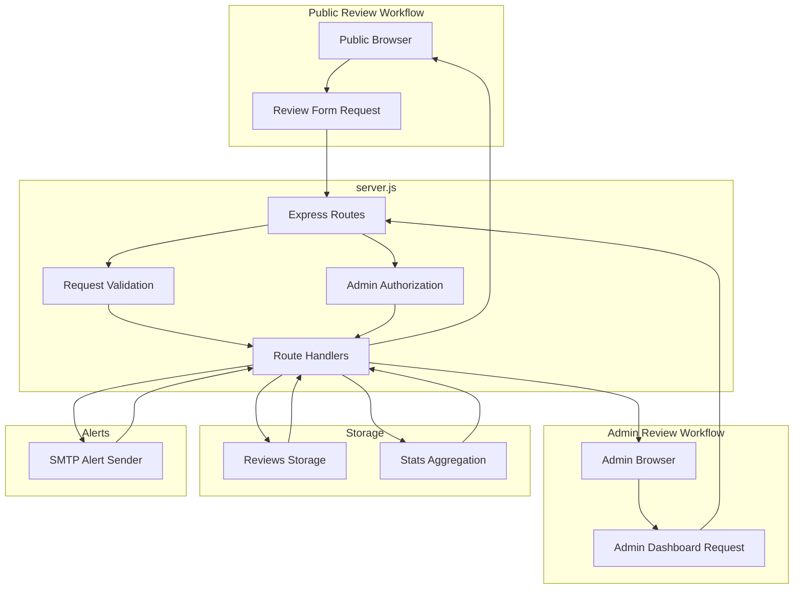
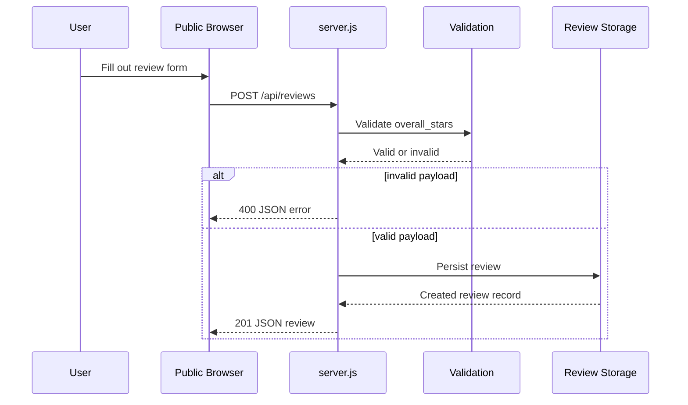
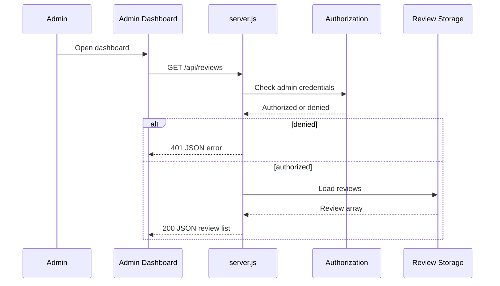
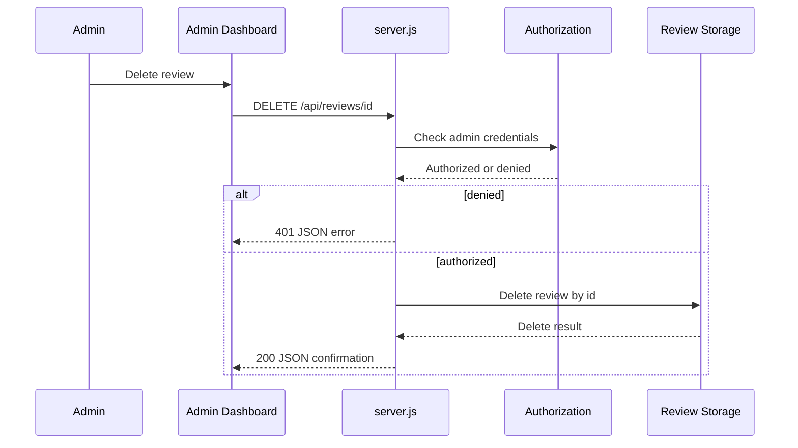
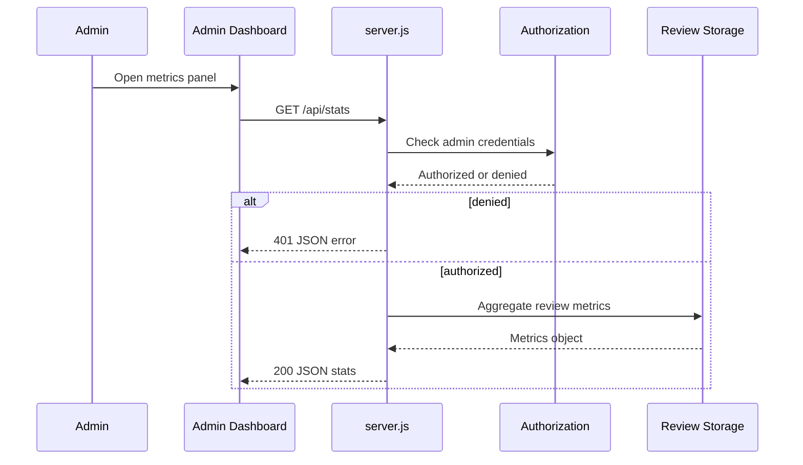

# Backend Service and Runtime - HTTP API Surface and Server-Side Request Handling

*server.js*

## Overview

`server.js` is the single runtime entry point for both user-facing and admin-facing review workflows. It receives public review submissions, exposes review data for the admin dashboard, deletes reviews for moderation, and returns dashboard metrics from the same Express server process.

The HTTP surface is compact and JSON-based: one public submission endpoint and three protected admin endpoints. Validation, authorization, persistence access, and error translation all happen server-side before responses are returned to the browser.

## Architecture Overview



## HTTP API Surface

### Public Review Submission

#### Submit Review

*server.js*

```api
{
    "title": "Submit Review",
    "description": "Accepts a public review submission, validates overall_stars, persists the review, and returns the created review record as JSON.",
    "method": "POST",
    "baseUrl": "<ServerBaseUrl>",
    "endpoint": "/api/reviews",
    "headers": [
        {
            "key": "Content-Type",
            "value": "application/json",
            "required": true
        }
    ],
    "queryParams": [],
    "pathParams": [],
    "bodyType": "json",
    "requestBody": "{\n    \"overall_stars\": 2,\n    \"comment\": \"The checkout flow was confusing and slow.\"\n}",
    "formData": [],
    "rawBody": "",
    "responses": {
        "201": {
            "description": "Review created",
            "body": "{\n    \"id\": 17,\n    \"overall_stars\": 2,\n    \"comment\": \"The checkout flow was confusing and slow.\",\n    \"created_at\": \"2026-04-29T14:12:00.000Z\"\n}"
        },
        "400": {
            "description": "Validation error",
            "body": "{\n    \"error\": \"overall_stars is required and must be between 1 and 5\"\n}"
        },
        "500": {
            "description": "Server error",
            "body": "{\n    \"error\": \"Internal Server Error\"\n}"
        }
    }
}
```

### Admin Review Listing

#### List Reviews

*server.js*

```api
{
    "title": "List Reviews",
    "description": "Returns the full review list for the admin dashboard as JSON.",
    "method": "GET",
    "baseUrl": "<ServerBaseUrl>",
    "endpoint": "/api/reviews",
    "headers": [
        {
            "key": "Authorization",
            "value": "Bearer <admin-token>",
            "required": true
        }
    ],
    "queryParams": [],
    "pathParams": [],
    "bodyType": "none",
    "requestBody": "",
    "formData": [],
    "rawBody": "",
    "responses": {
        "200": {
            "description": "Review collection",
            "body": "[\n    {\n        \"id\": 17,\n        \"overall_stars\": 2,\n        \"comment\": \"The checkout flow was confusing and slow.\",\n        \"created_at\": \"2026-04-29T14:12:00.000Z\"\n    }\n]"
        },
        "401": {
            "description": "Unauthorized",
            "body": "{\n    \"error\": \"Unauthorized\"\n}"
        },
        "500": {
            "description": "Server error",
            "body": "{\n    \"error\": \"Internal Server Error\"\n}"
        }
    }
}
```

### Admin Moderation

#### Delete Review

*server.js*

```api
{
    "title": "Delete Review",
    "description": "Deletes a review identified by the path parameter id after admin authorization succeeds.",
    "method": "DELETE",
    "baseUrl": "<ServerBaseUrl>",
    "endpoint": "/api/reviews/:id",
    "headers": [
        {
            "key": "Authorization",
            "value": "Bearer <admin-token>",
            "required": true
        }
    ],
    "queryParams": [],
    "pathParams": [
        {
            "key": "id",
            "value": "17",
            "required": true
        }
    ],
    "bodyType": "none",
    "requestBody": "",
    "formData": [],
    "rawBody": "",
    "responses": {
        "200": {
            "description": "Review deleted",
            "body": "{\n    \"success\": true,\n    \"id\": 17\n}"
        },
        "401": {
            "description": "Unauthorized",
            "body": "{\n    \"error\": \"Unauthorized\"\n}"
        },
        "500": {
            "description": "Server error",
            "body": "{\n    \"error\": \"Internal Server Error\"\n}"
        }
    }
}
```

### Admin Metrics

#### Get Review Stats

*server.js*

```api
{
    "title": "Get Review Stats",
    "description": "Returns aggregate admin metrics computed from stored reviews.",
    "method": "GET",
    "baseUrl": "<ServerBaseUrl>",
    "endpoint": "/api/stats",
    "headers": [
        {
            "key": "Authorization",
            "value": "Bearer <admin-token>",
            "required": true
        }
    ],
    "queryParams": [],
    "pathParams": [],
    "bodyType": "none",
    "requestBody": "",
    "formData": [],
    "rawBody": "",
    "responses": {
        "200": {
            "description": "Aggregated metrics",
            "body": "{\n    \"total_reviews\": 48,\n    \"average_overall_stars\": 4.3,\n    \"positive_reviews\": 41,\n    \"negative_reviews\": 7\n}"
        },
        "401": {
            "description": "Unauthorized",
            "body": "{\n    \"error\": \"Unauthorized\"\n}"
        },
        "500": {
            "description": "Server error",
            "body": "{\n    \"error\": \"Internal Server Error\"\n}"
        }
    }
}
```

## Server-Side Request Handling

### Public submission path

- The request enters `POST /api/reviews`.
- `overall_stars` is validated before persistence work continues.
- Invalid payloads return `400` with a JSON error body.
- Valid reviews are stored and the created record is returned to the caller.
- If the review is negative, the server-side workflow can continue into the notification path handled from the same runtime.

### Admin listing and moderation path

- `GET /api/reviews`, `DELETE /api/reviews/:id`, and `GET /api/stats` run behind the admin protection path in `server.js`.
- Requests that fail authorization return `401` as JSON before any data access work runs.
- Successful requests return JSON directly from the server process, allowing the admin dashboard to read, delete, and summarize reviews without a separate backend.

### Validation rules for `overall_stars`

- `overall_stars` is the primary server-side validation gate on public submission.
- Requests that omit it or provide an out-of-range value are rejected with `400`.
- The accepted range is `1` through `5`, matching the star-based review model used by the backend route handling.

## Error Handling

`server.js` returns JSON error bodies for all handled failure paths.

| Status | When it occurs | JSON shape |
| --- | --- | --- |
| `400` | Public review validation fails, including invalid `overall_stars` | `{ "error": "<message>" }` |
| `401` | Admin authorization fails for protected routes | `{ "error": "Unauthorized" }` |
| `500` | Persistence, stats, or runtime errors occur during request handling | `{ "error": "Internal Server Error" }` |


## Feature Flows

### Public review submission



### Admin review listing



### Admin moderation delete



### Admin metrics load



## Dependencies

### Runtime dependencies used by the HTTP layer

The admin routes are protected at the server layer, so authorization is enforced before listing, deleting, or stats generation can proceed. Public submission does not use that protection path.

- Express request routing and JSON responses
- Review persistence backend
- Admin authorization guard
- SMTP alert path for negative feedback

### Request-path dependencies

- Public submission depends on `overall_stars` validation before persistence.
- Admin endpoints depend on authorization before any data access work.
- Delete and stats requests depend on the review identifier or aggregated dataset supplied by the server-side storage layer.

## Integration Points

- Public review form submissions are handled by the same backend process that serves the admin dashboard.
- Admin dashboard reads, deletes, and summarizes reviews using the protected JSON endpoints in `server.js`.
- Negative review handling can route into the email notification pipeline from the same server runtime.

## Key Classes Reference

| Class | Location | Responsibility |
| --- | --- | --- |
| `server.js` | `server.js` | Express HTTP runtime, review submission handling, admin review listing, moderation delete, and admin stats endpoints |
