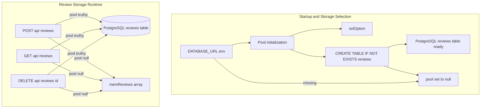
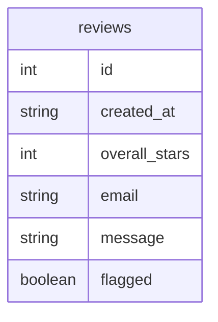
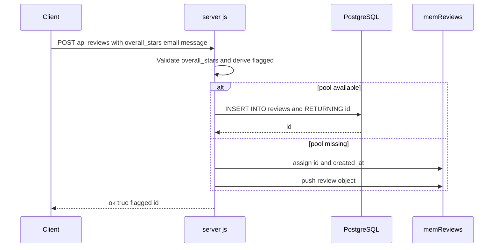
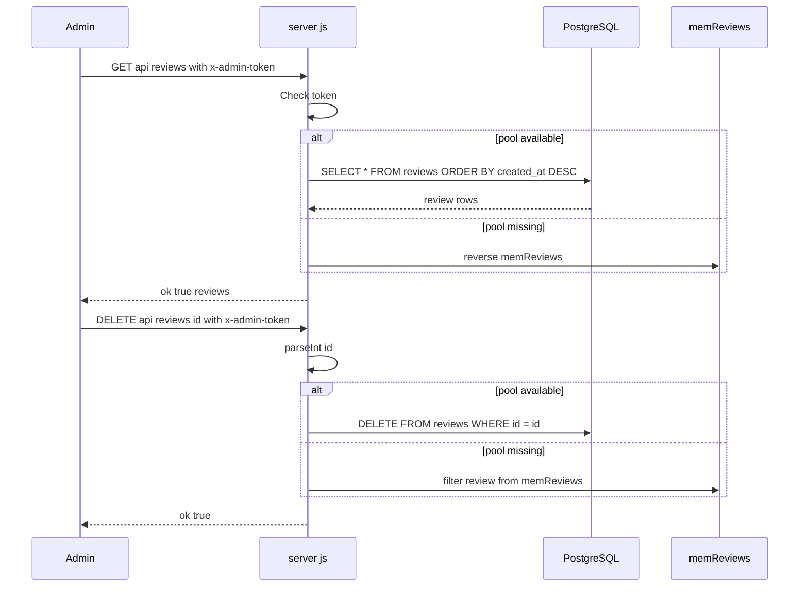

# Backend Service and Runtime - Persistence Strategy, Schema Creation, and Storage Fallback Behavior

*server.js*

## Overview

This runtime layer stores submitted reviews in PostgreSQL when `DATABASE_URL` is available and the database schema initializes successfully. When that path is not active, the same review routes fall back to the in-process `memReviews` array and keep serving the application without a database connection.

The storage choice affects durability, id generation, timestamps, and read ordering. SQL-backed data survives process restarts and is ordered by `created_at DESC`, while memory-backed data exists only for the current process and is returned by reversing the array in insertion order.

## Architecture Overview



## Runtime State and Storage Modes

The persistence behavior is driven by module-scoped runtime variables in `server.js`. Route handlers branch on the current truthiness of `pool`, so the same endpoints serve either persistent or ephemeral storage without changing the public API.

| Property | Type | Description |
| --- | --- | --- |
| `ADMIN_TOKEN` | string | Token compared against the `x-admin-token` header in protected review read and delete routes. Defaults to `"admin123"`. |
| `DATABASE_URL` | string | PostgreSQL connection string read from `process.env.DATABASE_URL`; an empty string disables the database-backed path. |
| `memReviews` | array | In-process fallback store for review objects when `pool` is not available. |
| `pool` | Pool or null | Active `pg` connection pool used for SQL-backed review persistence and retrieval. |


### Storage Mode Matrix

| Mode | Trigger | Write Behavior | Read Behavior | Durability |
| --- | --- | --- | --- | --- |
| PostgreSQL-backed | `DATABASE_URL` is set and schema initialization succeeds | Inserts into `reviews` with `RETURNING id` | Queries `SELECT * FROM reviews ORDER BY created_at DESC` | Persistent across restarts |
| In-memory fallback | `DATABASE_URL` is missing or schema initialization throws | Assigns `id = memReviews.length + 1`, sets `created_at`, then pushes into `memReviews` | Returns `[...memReviews].reverse()` | Lost when the process exits |


## Schema Creation

The SQL branch and the memory branch do not normalize stored values the same way. SQL inserts convert empty email and message values to null, while the memory branch stores the request values unchanged. [!NOTE] SQL reads are sorted by created_at DESC, while memory reads reverse the current array. The displayed order is newest-first in both cases, but the SQL branch uses timestamps and the memory branch uses insertion order. [!NOTE] The in-memory id allocator uses memReviews.length + 1, so ids are assigned from the current array size rather than a separate sequence.

When `DATABASE_URL` is present, `server.js` creates a `Pool` with the connection string and immediately runs a startup query that ensures the `reviews` table exists.

```sql
CREATE TABLE IF NOT EXISTS reviews (
  id SERIAL PRIMARY KEY,
  created_at TIMESTAMP DEFAULT NOW(),
  overall_stars INTEGER NOT NULL,
  email TEXT,
  message TEXT,
  flagged BOOLEAN DEFAULT false
);
```

### `reviews` Table Shape

| Field | SQL Type | Constraint or Default | Description |
| --- | --- | --- | --- |
| `id` | `SERIAL` | `PRIMARY KEY` | Database-generated identifier for each review. |
| `created_at` | `TIMESTAMP` | `DEFAULT NOW()` | Database timestamp used for ordering and display in SQL mode. |
| `overall_stars` | `INTEGER` | `NOT NULL` | Submitted rating from 1 to 5. |
| `email` | `TEXT` | none | Optional customer email. |
| `message` | `TEXT` | none | Optional review text. |
| `flagged` | `BOOLEAN` | `DEFAULT false` | Derived moderation flag set when the rating is below 4. |


### Stored Review Record Shape

| Property | Type | Description |
| --- | --- | --- |
| `id` | number | Identifier returned from PostgreSQL or assigned in memory mode. |
| `created_at` | string | Timestamp stored by PostgreSQL or generated with `new Date().toISOString()` in memory mode. |
| `overall_stars` | number | Rating submitted by the user. |
| `email` | string or null | Customer email. SQL mode stores empty values as `null`; memory mode keeps the request value. |
| `message` | string or null | Review text. SQL mode stores empty values as `null`; memory mode keeps the request value. |
| `flagged` | boolean | `true` when `overall_stars < 4`, otherwise `false`. |




## Helper Functions

### `sslOption`

| Method | Description |
| --- | --- |
| `sslOption` | Accepts a connection string `cs` and returns `{ rejectUnauthorized: false }` when `cs` matches hosted database providers such as `amazonaws`, `render`, `railway`, `supabase`, `azure`, `gcp`, `neon`, `timescale`, or `heroku` case-insensitively; otherwise returns `undefined`. The return value is passed to `Pool` as the `ssl` option. |


## API Endpoints

### Create Review

#### Create Review

```api
{
    "title": "Create Review",
    "description": "Validates the rating and stores the review in PostgreSQL when `pool` is available, otherwise appends it to `memReviews`.",
    "method": "POST",
    "baseUrl": "<ServerBaseUrl>",
    "endpoint": "/api/reviews",
    "headers": [
        {
            "key": "Content-Type",
            "value": "application/json",
            "required": true
        }
    ],
    "queryParams": [],
    "pathParams": [],
    "bodyType": "json",
    "requestBody": "{\n    \"overall_stars\": 2,\n    \"email\": \"customer@example.com\",\n    \"message\": \"The service was slow and the staff was unhelpful.\"\n}",
    "formData": [],
    "rawBody": "",
    "responses": {
        "200": {
            "description": "Review stored successfully",
            "body": "{\n    \"ok\": true,\n    \"flagged\": true,\n    \"id\": 42\n}"
        },
        "400": {
            "description": "Invalid rating",
            "body": "{\n    \"ok\": false,\n    \"error\": \"Neplatn\\u00e9 hodnocen\\u00ed.\"\n}"
        },
        "500": {
            "description": "Storage error",
            "body": "{\n    \"ok\": false,\n    \"error\": \"Database connection failed\"\n}"
        }
    }
}
```

The handler reads `overall_stars`, `email`, and `message` from `req.body`, rejects ratings outside 1 to 5, and derives `flagged` from `overall_stars < 4`. In SQL mode it inserts the row with `email || null` and `message || null`, then copies the returned `id` onto the review object. In memory mode it assigns the id from the current array length, sets `created_at`, and pushes the review into `memReviews`.

### List Reviews

#### List Reviews

```api
{
    "title": "List Reviews",
    "description": "Returns all reviews for the admin dashboard after validating `x-admin-token`. SQL mode reads from PostgreSQL in descending timestamp order; memory mode returns the in-process array in reverse insertion order.",
    "method": "GET",
    "baseUrl": "<ServerBaseUrl>",
    "endpoint": "/api/reviews",
    "headers": [
        {
            "key": "x-admin-token",
            "value": "<admin token>",
            "required": true
        }
    ],
    "queryParams": [],
    "pathParams": [],
    "bodyType": "none",
    "requestBody": "",
    "formData": [],
    "rawBody": "",
    "responses": {
        "200": {
            "description": "Review list returned",
            "body": "{\n    \"ok\": true,\n    \"reviews\": [\n        {\n            \"id\": 42,\n            \"created_at\": \"2026-04-29T10:15:00.000Z\",\n            \"overall_stars\": 2,\n            \"email\": \"customer@example.com\",\n            \"message\": \"The service was slow and the staff was unhelpful.\",\n            \"flagged\": true\n        }\n    ]\n}"
        },
        "401": {
            "description": "Unauthorized",
            "body": "{\n    \"ok\": false,\n    \"error\": \"Neopr\\u00e1vn\\u011bn\\u00fd p\\u0159\\u00edstup.\"\n}"
        },
        "500": {
            "description": "Storage error",
            "body": "{\n    \"ok\": false,\n    \"error\": \"Database query failed\"\n}"
        }
    }
}
```

This endpoint checks `req.headers["x-admin-token"]` before any storage access. If the token does not match `ADMIN_TOKEN`, it returns `401` immediately. When the token matches, the handler chooses PostgreSQL or `memReviews` based on `pool`.

### Delete Review

#### Delete Review

```api
{
    "title": "Delete Review",
    "description": "Deletes a review by numeric id after validating `x-admin-token`. SQL mode deletes the row from PostgreSQL; memory mode filters it out of `memReviews`.",
    "method": "DELETE",
    "baseUrl": "<ServerBaseUrl>",
    "endpoint": "/api/reviews/:id",
    "headers": [
        {
            "key": "x-admin-token",
            "value": "<admin token>",
            "required": true
        }
    ],
    "queryParams": [],
    "pathParams": [
        {
            "key": "id",
            "type": "string",
            "required": true,
            "description": "Review identifier parsed with `parseInt`."
        }
    ],
    "bodyType": "none",
    "requestBody": "",
    "formData": [],
    "rawBody": "",
    "responses": {
        "200": {
            "description": "Review deleted",
            "body": "{\n    \"ok\": true\n}"
        },
        "401": {
            "description": "Unauthorized",
            "body": "{\n    \"ok\": false,\n    \"error\": \"Neopr\\u00e1vn\\u011bn\\u00fd p\\u0159\\u00edstup.\"\n}"
        },
        "500": {
            "description": "Storage error",
            "body": "{\n    \"ok\": false,\n    \"error\": \"Delete failed\"\n}"
        }
    }
}
```

The handler parses `req.params.id` with `parseInt` and then branches on `pool`. In SQL mode it executes `DELETE FROM reviews WHERE id=$1`; in memory mode it reassigns `memReviews` to a filtered array that excludes the matching id.

## Feature Flows

### Review Persistence Flow



The same request body produces the same response envelope in both modes. The only visible difference is where the record lands and how its storage metadata is created.

### Admin Read and Delete Flow



The read path uses a protected header check before any data access. The delete path uses the same header gate and then removes the review from the active storage backend.

## Error Handling

The persistence layer uses small, explicit error branches around startup and request-time storage access.

| Situation | Behavior |
| --- | --- |
| Startup database schema creation fails | Logs `DB init error:` and sets `pool = null`, which moves later requests to the in-memory branch. |
| Invalid rating in POST | Returns `400` with `{ ok: false, error: "Neplatné hodnocení." }`. |
| Wrong admin token | Returns `401` with `{ ok: false, error: "Neoprávněný přístup." }`. |
| Storage query or delete throws | Returns `500` with `{ ok: false, error: e.message }`. |


The request handlers do not transform storage errors into a different shape; they pass the thrown message through the JSON error envelope.

## Dependencies

| Dependency | Use in this section |
| --- | --- |
| `pg` | Provides `Pool` for PostgreSQL-backed review storage. |
| PostgreSQL | Stores the `reviews` table when `DATABASE_URL` is available. |
| Express JSON parsing | Supplies `req.body` for `POST /api/reviews` via `express.json()`. |


## Key Classes Reference

| Class | Responsibility |
| --- | --- |
| `server.js` | Initializes PostgreSQL persistence, creates the `reviews` table, branches between SQL and in-memory storage, and exposes the review persistence endpoints. |
