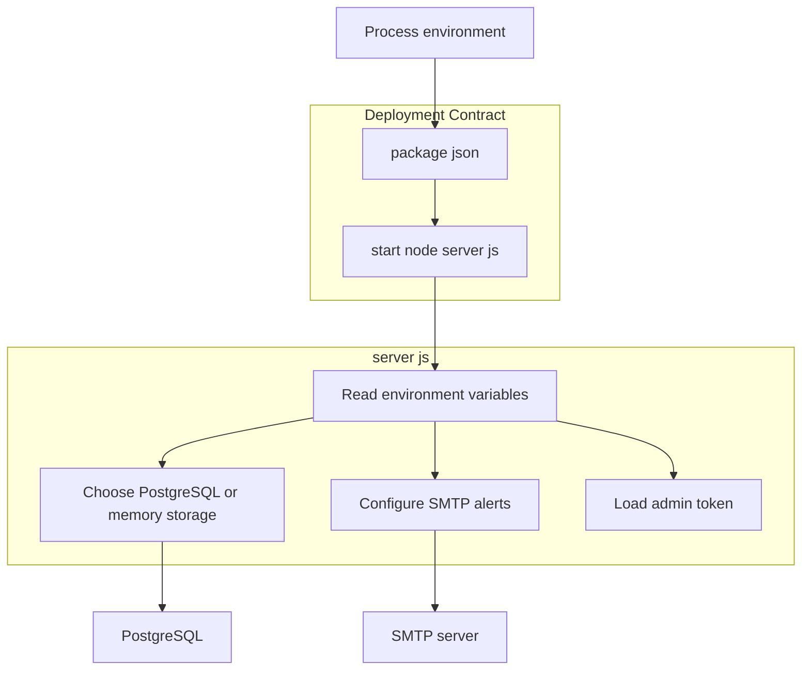
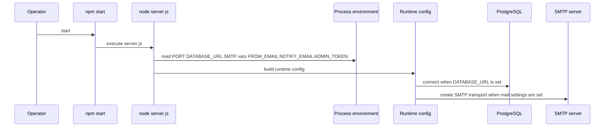

# Configuration, Security, and Operations

## Overview

This section documents the runtime configuration surface that `server.js` reads from the process environment and the minimal deployment contract exposed by `package.json`. The application is designed to run as a single Node.js process with environment-driven settings for persistence, SMTP alerts, and admin access control.

Operationally, the app can run with PostgreSQL-backed storage when `DATABASE_URL` is present, or with the in-memory fallback when it is not. Email alerting for negative feedback is controlled through the SMTP variables, and the admin dashboard relies on a shared secret token carried in the `x-admin-token` request header.

## Architecture Overview

## Runtime Configuration Surface

### Environment Variables

*server.js*

| Variable | Purpose | Default or fallback in code | Required for | Behavior when omitted |
| --- | --- | --- | --- | --- |
| `PORT` | HTTP listener port for the Node.js server | Not shown in the recovered configuration snippet | Server startup | The server reads the listener port from the environment. |
| `DATABASE_URL` | PostgreSQL connection string | No default shown | Database-backed review persistence | Reviews use the in-memory fallback instead of PostgreSQL. |
| `SMTP_HOST` | SMTP host name | `smtp.resend.com` | Outbound email alerts | The SMTP host defaults to `smtp.resend.com`. |
| `SMTP_PORT` | SMTP port number | `465` | Outbound email alerts | The SMTP port defaults to `465`. |
| `SMTP_USER` | SMTP username | No default shown | Outbound email alerts | The SMTP transport uses the environment value directly. |
| `SMTP_PASS` | SMTP password | `""` | Outbound email alerts | The SMTP password falls back to an empty string. |
| `SMTP_SECURE` | SMTP TLS mode flag | Derived from `SMTP_PORT === 465` when unset | Outbound email alerts | When not set, secure mode is enabled for port `465`. |
| `FROM_EMAIL` | Sender address for alert email | No default shown | Outbound email alerts | The sender address is taken from the environment. |
| `NOTIFY_EMAIL` | Recipient address for alert email | No default shown | Outbound email alerts | The alert recipient is taken from the environment. |
| `ADMIN_TOKEN` | Shared secret for protected admin requests | No default shown | Admin access control | Admin requests rely on the configured token value. |

### Persistence Mode Selection

SMTP_SECURE is the only SMTP setting with conditional logic visible in the recovered code: if the variable is present, the code checks whether it equals "true"; otherwise it derives the value from SMTP_PORT === 465.

`DATABASE_URL` is the switch between the two storage modes used by the application:

- **Present**: the app can use PostgreSQL for persistent review storage.
- **Absent**: the app falls back to in-memory persistence.

This is the only documented storage decision point in the recovered configuration surface.

## Security and Secrets

### Secret-bearing values

*server.js*

| Variable | Security role | Notes from code |
| --- | --- | --- |
| `DATABASE_URL` | Database connection secret | Drives PostgreSQL-backed persistence. |
| `SMTP_USER` | SMTP credential | Used with the SMTP transport. |
| `SMTP_PASS` | SMTP credential | Defaults to an empty string when omitted. |
| `ADMIN_TOKEN` | Admin access secret | Protects admin-facing requests through the shared token flow. |

### Operationally sensitive values

- `FROM_EMAIL` and `NOTIFY_EMAIL` control message routing for email alerts.
- `SMTP_HOST`, `SMTP_PORT`, and `SMTP_SECURE` define the transport characteristics for outgoing mail.
- `PORT` defines the public listener endpoint for the Node.js process.

### Request-side admin secret usage

The admin client sends the token in the `x-admin-token` header for privileged requests. That makes `ADMIN_TOKEN` the shared value that must match between client input and server-side verification.

## Operational Contract

### package.json Start Script

*package.json*

| Field | Value | Operational effect |
| --- | --- | --- |
| `scripts.start` | `node server.js` | The application is launched directly with Node.js. |
| `type` | `module` | `server.js` runs as an ES module. |

The deployment surface is intentionally minimal: there is only one script entry, so running the app means installing dependencies and invoking `npm start`.

### Runtime Dependencies

*package.json*

| Package | Operational role |
| --- | --- |
| `express` | HTTP server runtime |
| `dotenv` | Runtime dependency bundled with the app |
| `nodemailer` | SMTP email delivery |
| `pg` | PostgreSQL connectivity |

## Startup and Configuration Flow

### Startup sequence

1. `npm start` invokes `node server.js`.
2. `server.js` reads the environment variables listed above.
3. The storage path is selected using `DATABASE_URL`.
4. SMTP settings are assembled from the `SMTP_*` values plus `FROM_EMAIL` and `NOTIFY_EMAIL`.
5. The admin secret is loaded from `ADMIN_TOKEN` for protected requests.

## Key Classes Reference

| Class | Location | Responsibility |
| --- | --- | --- |
| `server.js` | `server.js` | Bootstraps runtime configuration, selects persistence and email settings, and consumes environment variables. |
| `package.json` | `package.json` | Defines the deployment entry point and runtime dependency set. |
