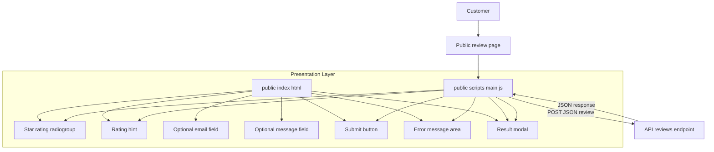
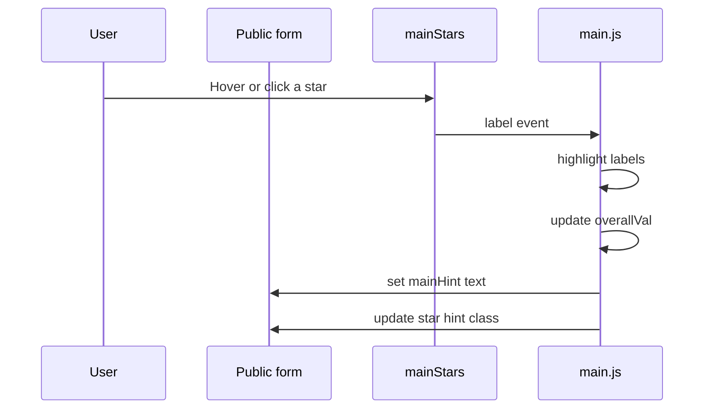
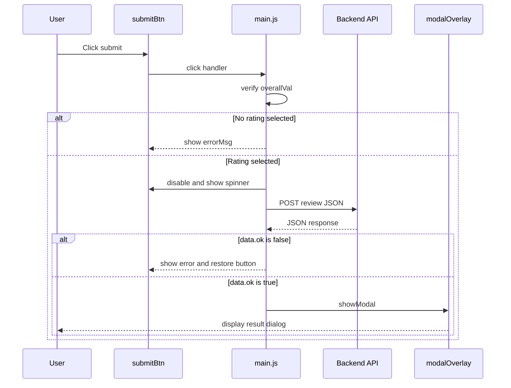

# Public Review Submission Domain

## Overview

This domain is the customer-facing review entry point for the application. It presents a single rating form, encourages the user to choose a star score first, and then submits the captured feedback to `POST /api/reviews` as JSON.

The flow is intentionally lightweight: users select 1–5 stars, optionally add an email and a message, and submit from the same page. The client script manages the visible rating state, validates that a rating was chosen, shows loading and error feedback during submission, and opens a post-submit modal when the backend accepts the review.

## Architecture Overview



## Component Structure

### Public Form Shell

*public/index.html*

The public page defines the review form structure and the visual containers that  updates at runtime. It exposes a star-based overall rating, optional contact and free-text fields, a submit button, an inline error area, and a modal overlay used after the backend responds.

#### Key DOM Targets

| ID | Element | Purpose |
| --- | --- | --- |
| `mainStars` | `div.stars-row` | Star rating radiogroup container with `role="radiogroup"` and `aria-label="Celkové hodnocení"` |
| `mainHint` | `div.star-hint` | Instructional and sentiment hint text updated after selection |
| `email` | `input[type="email"]` | Optional email field |
| `message` | `textarea` | Optional message field |
| `submitBtn` | `button.btn-submit` | Sends the review and shows loading state |
| `errorMsg` | `div.error-msg` | Displays validation and submission errors |
| `modalOverlay` | `div.modal-overlay` | Result modal overlay |
| `modalTitle` | `h2` | Modal headline updated by `showModal` |
| `modalText` | `p` | Modal body text updated by `showModal` |
| `modalBtns` | `div` | Modal action buttons injected by `showModal` |


The rating control is rendered as five labels, each wrapping a radio input named `overall` and carrying a `data-val` attribute from `1` to `5`. That structure gives the script a stable way to map hover and click interactions to the selected score.

### Submission Script

*public/scripts/main.js*

The script owns the client-side state for rating selection, submission gating, and post-submit feedback. It wires hover and click behavior for the stars, stores the current score in `overallVal`, and performs the `fetch` call to the reviews API.

#### Module Constants and State

| Name | Type | Description |
| --- | --- | --- |
| `HINTS` | `string[]` | Sentiment hint text mapped by star value |
| `GOOGLE_MAPS_URL` | `string` | External review destination used in the positive modal |
| `overallVal` | `number` | Selected star value used by the submit guard and payload |


#### Hint Mapping

| Value | Hint text |
| --- | --- |
| `0` | `""` |
| `1` | `Velké zklamání` |
| `2` | `Nic extra` |
| `3` | `Průměr` |
| `4` | `Velmi v pořádku` |
| `5` | `Perfektní` |


#### Functions

| Method | Description |
| --- | --- |
| `setupStars` | Attaches hover and click listeners to the star labels inside a rating container |
| `highlight` | Applies or removes the `active` class across labels up to the selected value |
| `showModal` | Builds the result modal content, adds the optional Google Maps action, and opens the overlay |


## Rating Selection UX

The star control is a radio group, not a free-text rating input. Each star is both a clickable label and a native radio option, so the form clearly communicates that the user must choose exactly one overall score before submission.

`setupStars` drives the interactive experience:

- `mouseenter` previews the hovered score by calling `highlight`
- `mouseleave` restores the last checked radio value, or clears the preview if nothing is selected
- `click` locks the selection, updates `overallVal`, and updates `mainHint`

`highlight` toggles the `active` class on all labels whose `data-val` is less than or equal to the selected value. That gives the form the classic “filled stars up to the current rating” look while keeping the underlying value discrete.

### Rating Selection Flow



## Submission State Management

> **Note:** `overallVal` is updated only from the label click callback inside `setupStars`, while submission validation reads `overallVal` instead of the checked radio input. A selection path that changes the radio state without triggering that callback can leave the client-side guard at `0` or an older value.

The submit button is the only action that sends data to the backend. Before any request is made, the handler blocks submission if `overallVal` is still `0` and writes the Czech validation message into `errorMsg`.

When a valid score exists, the script builds a JSON payload and moves the button into a loading state:

- `btn.disabled = true`
- `btn.innerHTML = '<span class="spinner"></span>Odesílám...'`

If the request fails or the response JSON contains `ok: false`, the button is restored and the error message is shown inline. On success, `showModal` opens the result overlay and the page is reset after the user closes it or clicks the backdrop.

### Review Submission Flow



### UI State Summary

| State | Trigger | Visible Behavior |
| --- | --- | --- |
| Idle | Page load | Instructional hint is visible, button is enabled |
| Hover preview | Pointer enters a star label | Temporary star fill preview is shown |
| Selected | User clicks a star | `overallVal` is stored and `mainHint` is replaced with sentiment text |
| Validation error | Submit clicked with no rating | `errorMsg` shows `Prosím vyberte celkové hodnocení hvězdičkami.` |
| Submitting | Valid submit starts | Button is disabled and shows spinner text |
| Submission error | Network error or `data.ok === false` | Error text is shown and button is restored |
| Success modal | `data.ok === true` | Modal opens and can be dismissed to reset the page |


## API Integration

#### Submit Review

```api
{
    "title": "Submit Review",
    "description": "Accepts a public customer review from the rating form and returns a JSON envelope with ok and error fields",
    "method": "POST",
    "baseUrl": "<BaseUrl>",
    "endpoint": "/api/reviews",
    "headers": [
        {
            "key": "Content-Type",
            "value": "application/json",
            "required": true
        }
    ],
    "queryParams": [],
    "pathParams": [],
    "bodyType": "json",
    "requestBody": "{\n    \"overall_stars\": 5,\n    \"email\": \"jana@example.com\",\n    \"message\": \"Byli jsme spokojeni s obsluhou a rychlost\\u00ed.\"\n}",
    "formData": [],
    "rawBody": "",
    "responses": {
        "200": {
            "description": "Review accepted",
            "body": "{\n    \"ok\": true\n}"
        },
        "400": {
            "description": "Validation or business rule failure",
            "body": "{\n    \"ok\": false,\n    \"error\": \"Please select an overall rating.\"\n}"
        }
    }
}
```

The client sends `email` and `message` as `null` when the fields are empty after trimming. The request body always includes `overall_stars`, which comes from `overallVal` and is the only required form value on the client side.

## Error Handling

The form uses two distinct error paths:

- **Client-side validation:** prevents a request when no star rating has been selected and writes the inline error message.
- **Request failure handling:** catches network or JSON-response errors, restores the button label and enabled state, and shows `Chyba při odesílání: ...`.

The modal close behavior also acts as a state reset. Both the close button and the overlay backdrop remove the modal, then reload the page after a short delay so the form returns to its initial state.

## Integration Points

- **Same-server reviews API:** the form submits to `POST /api/reviews` from the same origin.
- **Google Maps CTA:** when `showModal(true)` runs, it inserts a link using `GOOGLE_MAPS_URL` with `target="_blank"` and `rel="noopener"`.

## Testing Considerations

- Select each star value and verify `overallVal` and the hint text match the expected `HINTS` entry.
- Hover over a star and confirm `highlight` previews the correct fill range.
- Submit with no rating and verify no network request is sent.
- Submit with empty email and message fields and verify the payload uses `null` for both.
- Simulate a failed response with `ok: false` and confirm the button is restored and the error text appears.
- Simulate success and confirm `showModal` renders the correct modal text and optional Google Maps button for positive scores.

## Key Classes Reference

| Class | Responsibility |
| --- | --- |
| `index.html` | Renders the public review form, rating controls, error area, and result modal containers |
| `main.js` | Manages star interaction, client-side validation, submission state, and modal presentation |
