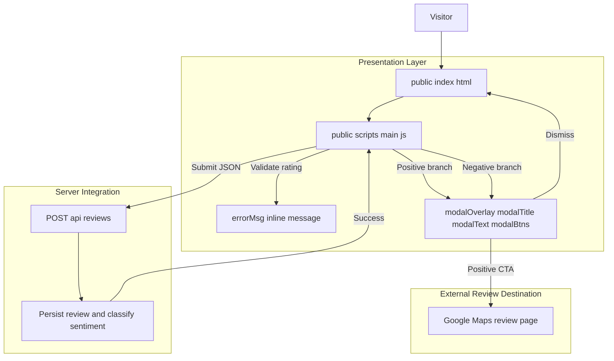
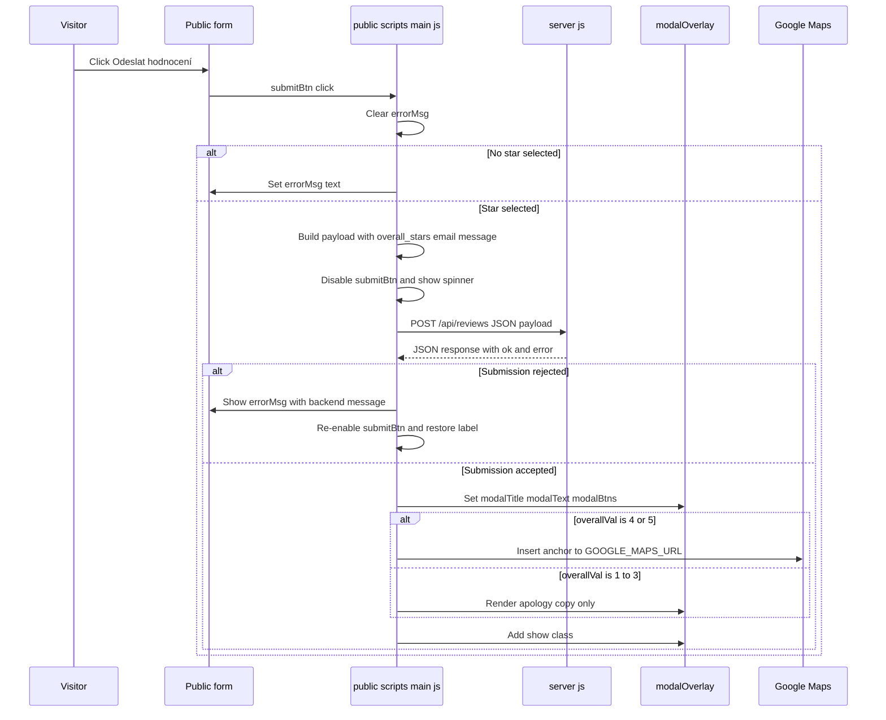

# Public Review Submission Domain - Submission outcomes, post-submit branching, and external review redirection

*Source files: `public/index.html`, `public/scripts/main.js`, `server.js`*

## Overview

This part of the review app handles what happens after a visitor presses **Odeslat hodnocení**. The client validates that a star rating exists, submits the review to the backend, and then branches into one of two post-submit paths: a positive-review modal that offers a Google Maps review CTA, or a negative-review modal that acknowledges the feedback and keeps the reviewer inside the app.

The business goal is split into two outcomes. Reviews that meet the positive threshold are immediately routed toward an external public review destination through `GOOGLE_MAPS_URL`, while lower ratings are acknowledged privately in-place. The same submitted star value is also what drives the positive/negative post-submit copy, so the UI path changes only after a successful backend submission and not before.

## Architecture Overview



## Component Structure

### Presentation Layer

#### 

*`public/index.html`*

This file renders the public review form and the modal shell that  fills after a successful submission. The markup defines the inline error region, the submit button, and the modal container that is shown or hidden by script.

| Element ID | Type | Purpose |
| --- | --- | --- |
| `mainStars` | rating container | Hosts the selectable star labels that set `overallVal` through `setupStars` |
| `mainHint` | hint text | Displays the rating hint text from `HINTS` |
| `email` | email input | Optional reviewer email sent with the payload |
| `message` | textarea | Optional free-text review body sent with the payload |
| `submitBtn` | button | Triggers the validation and submission flow |
| `errorMsg` | inline message area | Displays required-rating and request-failure errors |
| `modalOverlay` | modal container | Hidden by default, shown after a successful post |
| `modalTitle` | heading | Updated to the positive or negative modal title |
| `modalText` | paragraph | Updated to the positive or negative modal body copy |
| `modalBtns` | action container | Populated with the Google Maps CTA and close button |


The modal shell is already present in the HTML and is controlled entirely from the script. `role="dialog"` and `aria-modal="true"` are set on `modalOverlay`, and the script only toggles the `show` class and replaces the modal contents.

#### 

*`public/scripts/main.js`*

This module owns the entire submission outcome flow. It captures the selected star value, validates it, sends the review to `/api/reviews`, and branches the UI after the server accepts the payload.

| Member | Type | Purpose |
| --- | --- | --- |
| `HINTS` | `string[]` | Human-readable rating hints for the selected star count |
| `GOOGLE_MAPS_URL` | `string` | External review destination used for positive submissions |
| `overallVal` | `number` | Current selected star rating used for validation and post-submit branching |


| Function | Description |
| --- | --- |
| `setupStars` | Attaches hover and click behavior to the star labels and forwards the selected rating |
| `highlight` | Applies or removes the `active` class based on the current star count |
| `showModal` | Renders the success modal, branches copy by sentiment, and wires dismissal reload behavior |


`setupStars` and `highlight` only exist to maintain the selected rating state that drives submission. The post-submit branch itself is decided in `showModal(overallVal >= 4)`, so the selected star value is the single input that determines whether the reviewer sees the Google Maps prompt or the private-feedback message.

### Server Integration

#### `POST /api/reviews`

*`server.js`*

```api
{
    "title": "Submit Review",
    "description": "Submits a public review, accepts the review payload, and returns a JSON success or failure response consumed by public/scripts/main.js",
    "method": "POST",
    "baseUrl": "<AppBaseUrl>",
    "endpoint": "/api/reviews",
    "headers": [
        {
            "key": "Content-Type",
            "value": "application/json",
            "required": true
        }
    ],
    "queryParams": [],
    "pathParams": [],
    "bodyType": "json",
    "requestBody": "{\n    \"overall_stars\": 5,\n    \"email\": \"jana.novakova@example.com\",\n    \"message\": \"Skvela obsluha a rychle vyrizeni.\"\n}",
    "formData": [],
    "rawBody": "",
    "responses": {
        "200": {
            "description": "Submission accepted",
            "body": "{\n    \"ok\": true,\n    \"error\": null\n}"
        },
        "400": {
            "description": "Submission rejected",
            "body": "{\n    \"ok\": false,\n    \"error\": \"Overall rating is required.\"\n}"
        }
    }
}
```

The client only inspects the JSON body returned by this endpoint. A response is treated as successful when `data.ok` is truthy; otherwise the client throws with `data.error` and keeps the user on the form.

## Submission Outcome Matrix

| Condition | Inline result | Modal content | CTA |
| --- | --- | --- | --- |
| No star selected | `errorMsg` shows `Prosím vyberte celkové hodnocení hvězdičkami.` | No modal | None |
| Request fails or backend returns `ok: false` | `errorMsg` shows `Chyba při odesílání: ...` | No modal | None |
| Successful submission with `overallVal >= 4` | No inline error | `Skvělé, děkujeme!` plus a Google Maps encouragement message | `★ Ohodnotit na Google Mapách` |
| Successful submission with `overallVal < 4` | No inline error | `Děkujeme za zpětnou vazbu` plus an apology and follow-up message | None |


## Feature Flows

### Submission and Branch Selection



### Modal Dismissal and Reload

The client chooses the post-submit branch from overallVal >= 4, not from a server-returned sentiment flag. The backend response only determines whether the submission is accepted; after success, the modal copy is selected locally from the star rating the visitor already chose.

After the modal is visible, the user can close it in two ways: by clicking the **Zavřít** button or by clicking the overlay outside the modal box. Both paths remove the `show` class and schedule `location.reload()` after 350 milliseconds.

| Dismissal path | Handler | Result |
| --- | --- | --- |
| Close button | `close.addEventListener("click", ...)` | Hides the modal and reloads the page |
| Overlay click | `modalOverlay.addEventListener("click", ...)` when `e.target === e.currentTarget` | Hides the modal and reloads the page |


This reload-on-close pattern resets the form, clears any selected stars, and returns the page to its initial state without requiring a separate reset handler.

## State Management

The submission domain uses a small amount of local browser state in . The state is intentionally minimal and tied directly to what the user just selected or submitted.

| State | Type | Description |
| --- | --- | --- |
| `overallVal` | `number` | Selected star rating used for validation and the positive or negative modal branch |
| `submitBtn.disabled` | `boolean` | Prevents duplicate submissions while the request is in flight |
| `errorMsg.textContent` | `string` | Holds inline validation and submission errors |
| `modalOverlay.classList.contains("show")` | `boolean` | Controls whether the success modal is visible |
| `modalBtns.innerHTML` | `string` | Rebuilt for each success state to avoid stale CTA content |


The modal content is rebuilt on every success. `modalBtns.innerHTML = ""` clears previous actions before `showModal` inserts either only the close button or both the Google Maps link and the close button.

## Error Handling

 handles two distinct error paths:

- **Client-side validation**- If `overallVal` is `0`, the script writes `Prosím vyberte celkové hodnocení hvězdičkami.` into `#errorMsg` and stops before any network call.
- **Submission failure**- The `fetch("/api/reviews")` call is wrapped in `try/catch`.
- The script parses the response with `await res.json()`.
- If `data.ok` is falsy, it throws `new Error(data.error)`.
- The catch block writes `Chyba při odesílání: ...` into `#errorMsg`, re-enables `submitBtn`, and restores the button text to `Odeslat hodnocení`.

## Integration Points

The script does not branch on res.ok. It relies on the JSON response body, specifically data.ok, so the server contract is defined by the JSON payload rather than the HTTP status alone.

- **Backend review submission API**- `POST /api/reviews` accepts the payload from .
- **Server-side review classification**- The saved review is later surfaced through the backend with a sentiment-oriented classification that downstream consumers can use to distinguish positive and negative entries.
- **Google Maps review destination**- Positive submissions expose the `GOOGLE_MAPS_URL` anchor in the modal, opening the external review page in a new tab with `rel="noopener"`.
- **Same-page reset behavior**- Modal dismissal reloads , returning the visitor to the original form state.

## Dependencies

| Dependency | Used by | Purpose |
| --- | --- | --- |
| Browser DOM APIs |  | Querying elements, updating content, toggling classes, binding events |
| `fetch` |  | Sending the review payload to `/api/reviews` |
| `setTimeout` |  | Delaying the page reload after modal dismissal |
| `location.reload()` |  | Resetting the form after the modal is closed |
| `GOOGLE_MAPS_URL` |  | External redirect target for positive reviews |
| Review API contract in `server.js` |  | Returns the JSON `{ ok, error }` shape consumed by the client |


## Testing Considerations

- Submit with no stars selected and confirm the inline error appears in `#errorMsg`.
- Submit a successful 4-star or 5-star review and confirm:- `modalTitle` shows `Skvělé, děkujeme!`
- `modalText` asks the visitor to support the business on Google Maps
- `modalBtns` contains a link to `GOOGLE_MAPS_URL`
- Submit a successful 1-star, 2-star, or 3-star review and confirm:- `modalTitle` shows `Děkujeme za zpětnou vazbu`
- `modalText` contains the apology and follow-up copy
- no Google Maps anchor is rendered
- Dismiss the modal using both the close button and overlay click, and confirm the page reloads after the 350 ms delay.
- Force the API to return `ok: false` and confirm the button re-enables and the inline error is shown.
- Confirm the submit button shows the spinner state while the request is in flight.

## Key Classes Reference

| Class | Responsibility |
| --- | --- |
|  | Renders the review form, inline error slot, and modal container used after submission |
|  | Validates the selected rating, submits the review, branches the post-submit modal, and handles Google Maps redirection |
| `server.js` | Accepts review submissions and provides the JSON response consumed by the public form |
