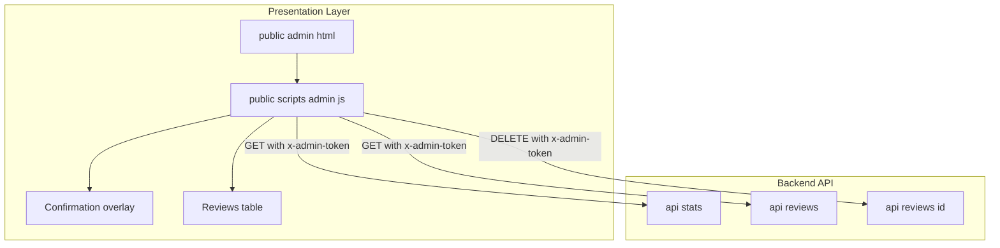
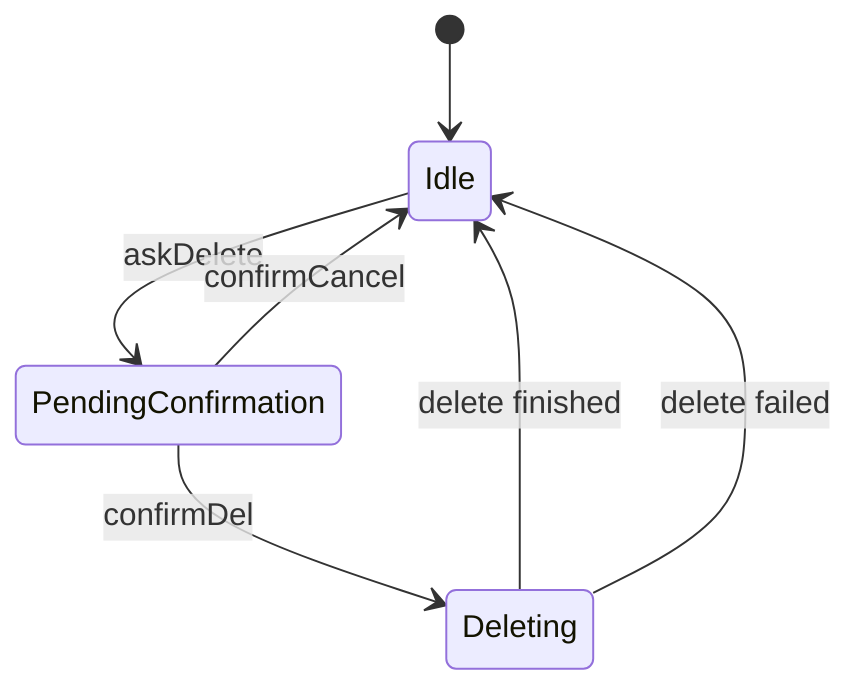
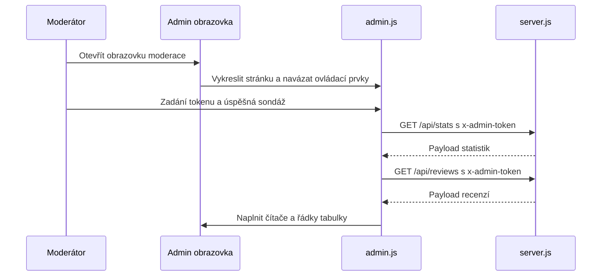
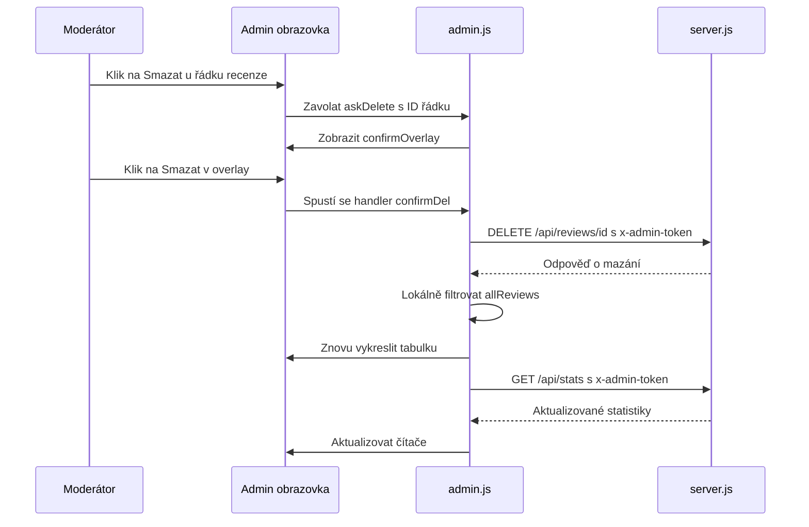

# Administration Domain - Moderation Operations, Deletion Workflow, and UI Safety Measures

*`public/admin.html`, `public/scripts/admin.js`, `server.js`*

## Overview

The admin screen is the moderation console for review operations. It shows aggregated review stats, a review table, and a destructive delete path that is gated by a confirmation overlay before any `DELETE /api/reviews/:id` call is sent.

Moderation is driven by a single client state snapshot in . Reviews are loaded into `allReviews`, filtered into the visible table, and rendered with row badges derived from the `flagged` state. Negative feedback is visually separated from positive feedback, and review text is passed through `escHtml` before it is injected into the table body.

Deletion is intentionally explicit: the moderator clicks **Smazat**, `askDelete` records the target id in `pendingDeleteId`, and the confirmation overlay must be accepted before the request is issued. After a delete request completes, the client reconciles local state, re-renders the table, and refreshes stats.

## Architecture Overview



## Moderation UI Shell

*`public/admin.html`*

The HTML shell provides the moderation workspace, the destructive-action overlay, and the high-level states the script toggles during load, empty, and error conditions.

### UI Controls and Safety Elements

| Element | ID | Purpose |
| --- | --- | --- |
| Login input | `tokenInput` | Collects the admin token before moderation data is shown. |
| Login button | `loginBtn` | Starts the token probe flow. |
| Login error area | `loginErr` | Shows token validation feedback. |
| Stats block | `statsGrid` | Holds the summary counters above the table. |
| Filter toolbar | `filter-btn` | Switches the visible review subset. |
| Refresh button | `refreshBtn` | Re-fetches stats and review rows. |
| Loading state | `loadingState` | Displays while reviews are being fetched. |
| Empty state | `emptyState` | Displays when the filtered list has no rows. |
| Reviews table | `reviewsTable` | Holds the moderation rows. |
| Confirmation overlay | `confirmOverlay` | Blocks deletion until the moderator confirms. |
| Cancel delete button | `confirmCancel` | Cancels the deletion flow and clears pending id. |
| Confirm delete button | `confirmDel` | Executes the destructive delete request. |


The confirmation copy explicitly marks the action as irreversible: “Tato akce je nevratná. Hodnocení bude trvale odstraněno.” That text is the primary UI warning before deletion.

## Client Moderation Controller

*`public/scripts/admin.js`*

`admin.js` owns the moderation state, the review rendering pipeline, the deletion confirmation flow, and the token-backed fetch calls to the backend. The script keeps all reviews in memory, derives the visible list from `currentFilter`, and updates the table after every moderation action.

# Administrace — moderace, workflow mazání a bezpečnostní prvky UI

*`public/admin.html`, `public/scripts/admin.js`, `server.js`*

## Přehled

Administrátorská obrazovka slouží jako konzole pro moderaci recenzí. Zobrazuje souhrnné statistiky, tabulku recenzí a destruktivní cestu mazání, která je před odesláním `DELETE /api/reviews/:id` chráněna potvrzovacím overlayem.

Moderace je řízena jedním snímkem stavu na klientovi. Recenze se načtou do `allReviews`, z nich se vyfiltruje viditelná sada a vykreslí se s řádkovými badgy podle pole `flagged`. Negativní zpětná vazba je vizuálně oddělena od pozitivní a text recenze je před vložením do tabulky vždy prošel přes `escHtml`.

Mazání je záměrně explicitní: moderátor klikne na **Smazat**, `askDelete` uloží cílové ID do `pendingDeleteId` a potvrzovací overlay musí být přijat před odesláním požadavku. Po dokončení smazání klient zreviduje lokální stav, znovu vykreslí tabulku a obnoví statistiky.

## Architektura (přehled)

```mermaid
flowchart TB
    subgraph PresentationLayer [Prezentační vrstva]
        AdminHtml[public admin html]
        AdminJs[public/scripts/admin.js]
        ConfirmOverlay[Potvrzovací overlay]
        ReviewsTable[Tabulka recenzí]
    end

    subgraph BackendApi [Backend API]
        StatsApi[GET /api/stats]
        ReviewsApi[GET /api/reviews]
        ReviewDeleteApi[DELETE /api/reviews/{id}]
    end

    AdminHtml --> AdminJs
    AdminJs --> ConfirmOverlay
    AdminJs --> ReviewsTable
    AdminJs -->|GET s x-admin-token| StatsApi
    AdminJs -->|GET s x-admin-token| ReviewsApi
    AdminJs -->|DELETE s x-admin-token| ReviewDeleteApi
```

## Shell moderace (UI)

*`public/admin.html`*

HTML shell poskytuje pracovní prostor pro moderaci, overlay pro destruktivní akce a vysokoúrovňové stavy, které skript přepíná během načítání, prázdného nebo chybového stavu.

### Ovládací prvky a bezpečnostní elementy

| Prvek | ID | Účel |
| --- | --- | --- |
| Přihlašovací vstup | `tokenInput` | Sběr admin tokenu před zobrazením dat moderace. |
| Tlačítko přihlášení | `loginBtn` | Spouští tok ověření tokenu. |
| Oblast chyb přihlášení | `loginErr` | Zobrazuje zpětnou vazbu k validaci tokenu. |
| Blok statistik | `statsGrid` | Obsahuje souhrnné čítače nad tabulkou. |
| Panel filtrů | `filter-btn` | Přepíná viditelnou podmnožinu recenzí. |
| Tlačítko obnovení | `refreshBtn` | Znovu načte statistiky a řádky recenzí. |
| Stav načítání | `loadingState` | Zobrazuje se při načítání recenzí. |
| Prázdný stav | `emptyState` | Zobrazuje se, když filtrovaný seznam nemá žádné řádky. |
| Tabulka recenzí | `reviewsTable` | Obsahuje řádky moderace. |
| Potvrzovací overlay | `confirmOverlay` | Blokuje mazání, dokud moderátor nepotvrdí. |
| Tlačítko zrušit mazání | `confirmCancel` | Zruší tok mazání a vymaže pending id. |
| Tlačítko potvrdit mazání | `confirmDel` | Provede destruktivní DELETE požadavek. |


Text v potvrzovacím dialogu explicitně označuje akci za nevratnou: „Tato akce je nevratná. Hodnocení bude trvale odstraněno.“ To je hlavní UI varování před smazáním.

## Klientský kontroler moderace

*`public/scripts/admin.js`*

`admin.js` řídí stav moderace, pipeline vykreslování recenzí, tok potvrzení mazání a volání k backendu zabezpečená tokenem. Skript uchovává všechny recenze v paměti, odvozuje viditelný seznam z `currentFilter` a po každé moderátorské akci aktualizuje tabulku.

### Stavové proměnné

| Vlastnost | Typ | Popis |
| --- | --- | --- |
| `TOKEN` | `string` | Aktuální admin token posílaný v hlavičce `x-admin-token`. |
| `allReviews` | `Array` | Kopie seznamu recenzí vráceného `/api/reviews`. |
| `currentFilter` | `string` | Aktivní filtr: `all`, `positive` nebo `negative`. |
| `pendingDeleteId` | `number \| null` | ID recenze připravené `askDelete` a použité potvrzovacím tlačítkem. |


### Veřejné metody

| Metoda | Popis |
| --- | --- |
| `stars` | Sestaví řetězec zobrazení hvězd pro řádek. |
| `formatDate` | Formátuje `created_at` pro zobrazení v tabulce. |
| `loadStats` | Načte souhrnné statistiky a aktualizuje čítače. |
| `loadReviews` | Načte seznam recenzí a předá je `renderReviews`. |
| `renderReviews` | Aplikuje aktivní filtr a vykreslí řádky tabulky. |
| `escHtml` | Escapuje texty zpráv před vložením do HTML. |
| `askDelete` | Uloží cílové ID a otevře potvrzovací overlay. |
| `tryLogin` | Ověří admin token voláním `/api/stats`. |


### Vykreslení řádků a status badgy

`renderReviews` je vykreslovací engine pro moderaci. Aplikuje aktivní filtr, přepíná stavy načítání/prázdno a zapíše řádky do `reviewsTbody` pomocí `tbody.innerHTML`.

| Hodnota `flagged` | Třída řádku | Třída badgu | Text badgu |
| --- | --- | --- | --- |
| `true` | `flagged` | `badge badge-neg` | `⚠ Negativní` |
| `false` | (prázdná) | `badge badge-pos` | `✓ Pozitivní` |


Markup řádku také obsahuje:

- ID recenze v prvním sloupci,
- naformátované datum z `formatDate`,
- hvězdičkovou grafiku z `stars`,
- `mailto:` odkaz pokud je vyplněn `email`,
- text recenze po aplikaci `escHtml(r.message)`.

### Bezpečnost vkládaných zpráv

Funkce `escHtml` se používá výhradně před vložením textu recenze do tabulky.

```javascript
function escHtml(s) {
  return s.replace(/&/g, "&amp;").replace(/</g, "&lt;").replace(/>/g, "&gt;");
}
```

Tento pomocník escapuje `&`, `<` a `>` a je použit na `r.message` uvnitř `renderReviews` před sestavením HTML řádku.

### Workflow mazání

Proces mazání je etapizovaný a potvrzený:

1. Tlačítko v řádku zavolá `askDelete(r.id)`.
2. `askDelete` přiřadí ID do `pendingDeleteId`.
3. Potvrzovací overlay dostane třídu `show`.
4. `confirmCancel` uzavře overlay a vyčistí `pendingDeleteId`.
5. `confirmDel` pošle `DELETE /api/reviews/:id` s `x-admin-token`.
6. Lokální seznam se filtruje `allReviews.filter(...)`.
7. `renderReviews()` znovu vykreslí viditelnou podmnožinu.
8. `loadStats()` obnoví čítače po smazání.

#### Stavový diagram mazání



### Klientské přepínání UI stavů

`loadReviews` řídí viditelné stavy moderace:

- `loadingState` je viditelný jako první.
- `reviewsTable` a `emptyState` jsou během fetch skryté.
- Pokud je filtrovaný seznam prázdný, zobrazí se `emptyState`.
- Pokud jsou řádky k dispozici, zobrazí se `reviewsTable`.
- Pokud během načítání nastane chyba, `loadingState` je nahrazen červenou chybovou zprávou.

`refreshBtn` spouští `loadStats()` i `loadReviews()`, takže dashboard a tabulka lze synchronizovat s aktuálním stavem serveru.

## Backend — API kontrakt pro moderaci

*`server.js`*

Klient pro moderaci komunikuje se třemi administrátorskými endpointy a při každém z nich posílá admin token v `x-admin-token`. Klient považuje token za bránu pro čtení statistik, výpis recenzí a mazání jednotlivé recenze.

### Autorizace

- `GET /api/stats` vyžaduje `x-admin-token`.
- `GET /api/reviews` vyžaduje `x-admin-token`.
- `DELETE /api/reviews/:id` vyžaduje `x-admin-token`.

Klient používá `/api/stats` jako sondáž v `tryLogin` a pak stejný token znovu používá pro tabulku a mazání.

#### Získat administrátorské statistiky

```api
{
    "title": "Get Admin Statistics",
    "description": "Fetches moderation summary metrics for the admin dashboard and is also used by the client as the token probe.",
    "method": "GET",
    "baseUrl": "<ServerBaseUrl>",
    "endpoint": "/api/stats",
    "headers": [
        {
            "key": "x-admin-token",
            "value": "<token>",
            "required": true
        }
    ],
    "queryParams": [],
    "pathParams": [],
    "bodyType": "none",
    "requestBody": "",
    "formData": [],
    "rawBody": "",
    "responses": {
        "200": {
            "description": "Success",
            "body": "{\n    \"ok\": true,\n    \"total\": 128,\n    \"avg_stars\": \"4.6\",\n    \"negative\": 9,\n    \"five_star\": 96\n}"
        }
    }
}
```

#### Seznam recenzí pro moderaci

```api
{
    "title": "List Reviews for Moderation",
    "description": "Fetches the review collection used by the moderation table.",
    "method": "GET",
    "baseUrl": "<ServerBaseUrl>",
    "endpoint": "/api/reviews",
    "headers": [
        {
            "key": "x-admin-token",
            "value": "<token>",
            "required": true
        }
    ],
    "queryParams": [],
    "pathParams": [],
    "bodyType": "none",
    "requestBody": "",
    "formData": [],
    "rawBody": "",
    "responses": {
        "200": {
            "description": "Success",
            "body": "{\n    \"ok\": true,\n    \"reviews\": [\n        {\n            \"id\": 42,\n            \"created_at\": \"2026-04-29T10:15:00.000Z\",\n            \"overall_stars\": 2,\n            \"email\": \"customer@example.com\",\n            \"message\": \"Long wait at checkout\",\n            \"flagged\": true\n        }\n    ]\n}"
        }
    }
}
```

#### Smazat recenzi

```api
{
    "title": "Delete Review",
    "description": "Deletes a single review selected from the moderation table.",
    "method": "DELETE",
    "baseUrl": "<ServerBaseUrl>",
    "endpoint": "/api/reviews/:id",
    "headers": [
        {
            "key": "x-admin-token",
            "value": "<token>",
            "required": true
        }
    ],
    "queryParams": [],
    "pathParams": [
        {
            "key": "id",
            "value": "42"
        }
    ],
    "bodyType": "none",
    "requestBody": "",
    "formData": [],
    "rawBody": "",
    "responses": {
        "200": {
            "description": "Success",
            "body": "{\n    \"ok\": true\n}"
        }
    }
}
```

## Toky funkcionality

### Načtení seznamu moderace a vykreslení



**Detaily průchodu**

- `loadStats` aktualizuje souhrnné čítače.
- `loadReviews` uloží odpověď serveru do `allReviews`.
- `renderReviews` aplikuje filtr a naplní `reviewsTbody`.
- Řádkové badgy jsou odvozeny přímo z `r.flagged`.
### Potvrzené mazání



**Detaily průchodu**

- `pendingDeleteId` je jediný připravený identifikátor pro destruktivní akci.
- Overlay je potvrzovací brána.
- Tabulka se lokálně aktualizuje bez čekání na úplné znovunačtení.
- Statistiky se obnoví po smazání.
## Správa stavu

### Viditelný stav recenzí

| Stav | Zdroj | Chování |
| --- | --- | --- |
| `allReviews` | `loadReviews` | Uchovává kompletní množinu recenzí vrácenou serverem. |
| `currentFilter` | Tlačítka filtrů | Řídí, zda `renderReviews` zobrazí `all`, `positive` nebo `negative` řádky. |
| `pendingDeleteId` | `askDelete` / zrušení / handlery mazání | Drží ID čekající na potvrzení. |


### Přepínání viditelných oblastí

| UI oblast | Zobrazena když | Skryta když |
| --- | --- | --- |
| `loadingState` | `loadReviews` startuje nebo nejsou dostupné řádky a není zobrazena chyba | Tabulka je připravena k vykreslení |
| `emptyState` | Filtrovaná sada nemá žádné řádky | Jsou přítomny řádky |
| `reviewsTable` | Filtrovaná sada obsahuje řádky | Načítání nebo prázdno |
| `confirmOverlay` | Je připravené ID k mazání | Mazání je zrušeno nebo dokončeno |


## Zpracování chyb

`confirmDel` nezkoumá tělo odpovědi DELETE ani nekontroluje `response.ok`. Jakýkoli fetch, který se úspěšně dokončí na síťové vrstvě, je považován za úspěch, takže klient lokálně odstraní řádek a obnoví statistiky i v případech, kdy server vrátil chybový payload bez vyhození výjimky.

`admin.js` používá různé chybové povrchy dle akce:

- `loadReviews` zachytává chyby a zapíše červenou zprávu do `loadingState`.
- `loadStats` potlačuje výjimky prázdným `catch` blokem.
- `confirmDel` zachytává selhání požadavku a zobrazí `alert("Chyba: " + e.message)`.
- `tryLogin` zapíše chyby validace tokenu do `loginErr`.

Klient očekává v odpovědi JSON pole `ok` a volitelně `d.error` při selhání autentizace nebo načítání.

## Provozní poznámky

- Mazání je destruktivní a UI jasně uvádí, že akce je nevratná.
- Potvrzovací overlay je jedinou ochranou v rámci aplikace před provedením mazání.
- `pendingDeleteId` se vymaže při zrušení i po dokončení mazání.
- Lokální stav moderace se po smazání upraví, takže řádek okamžitě zmizí bez úplného opětovného načtení.
- Texty recenzí jsou escapovány před vložením, což chrání tabulku před syrovým HTML v obsahu.

## Referenční třídy

| Třída | Odpovědnost |
| --- | --- |
| `admin.html` | Hostuje obrazovku pro moderaci, shell tabulky a potvrzovací overlay. |
| `admin.js` | Implementuje stav moderace, vykreslování recenzí, potvrzení mazání a volání admin endpointů. |
| `server.js` | Zajišťuje admin endpointy pro statistiky, výpis recenzí a mazání recenzí. |
