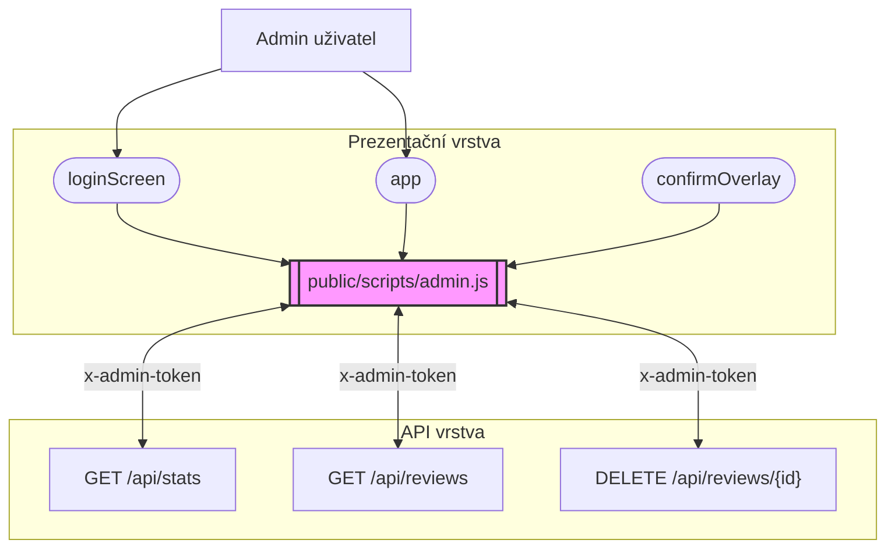
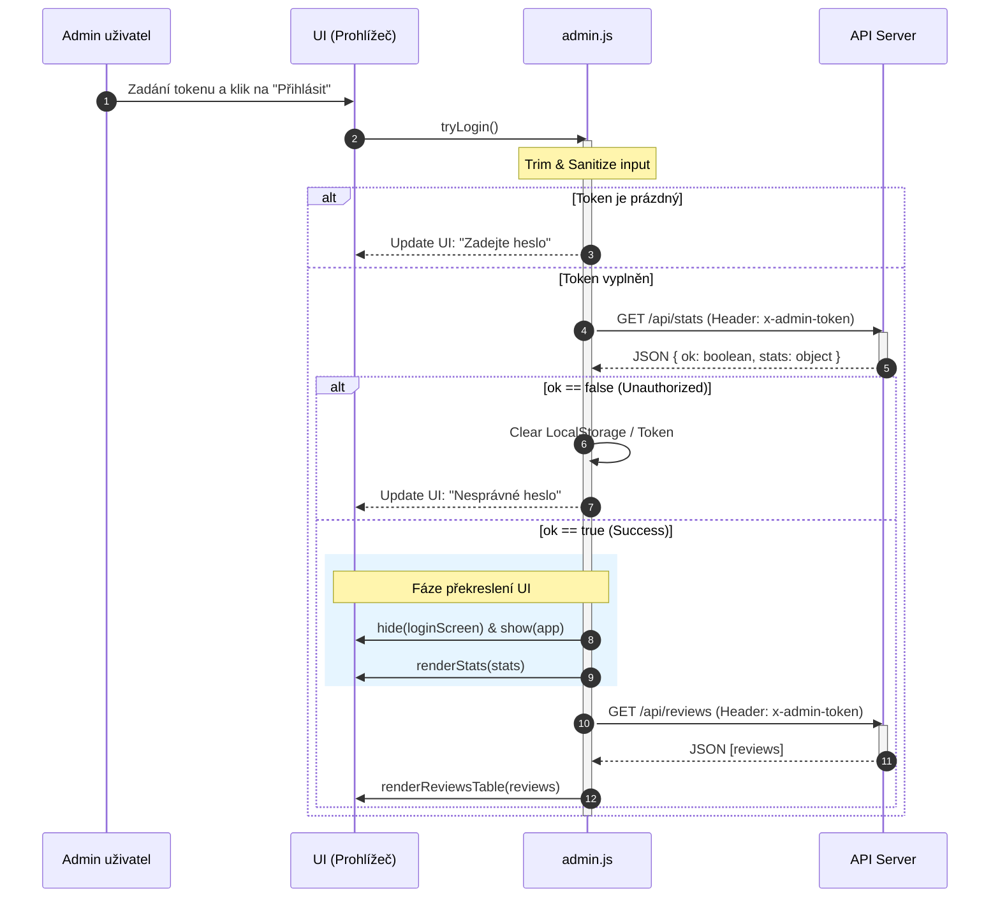
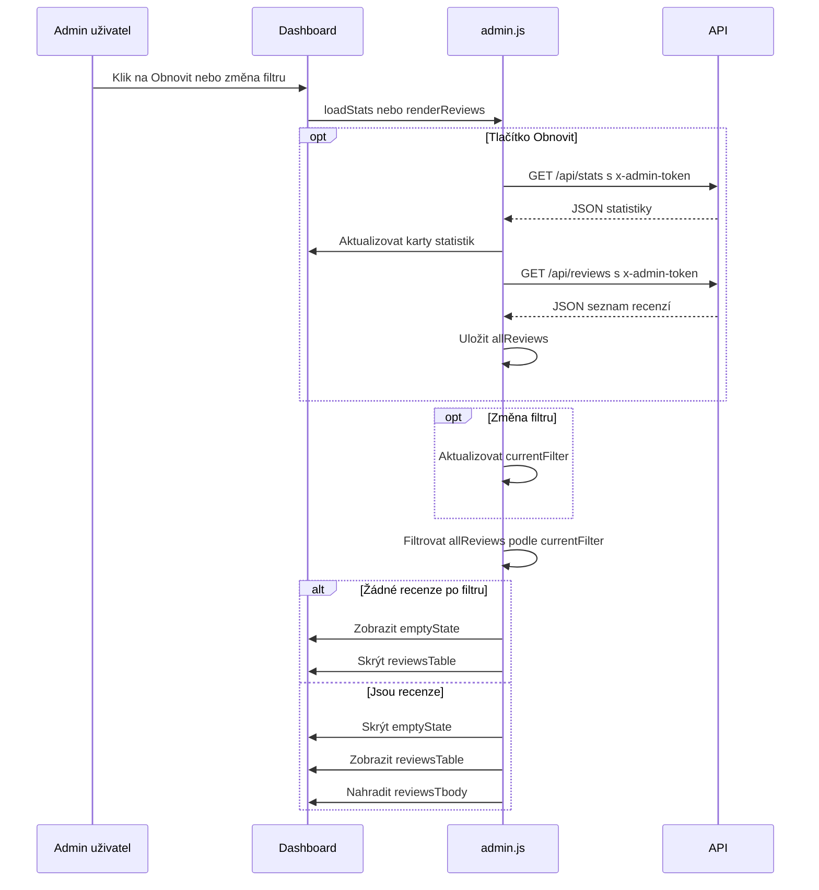
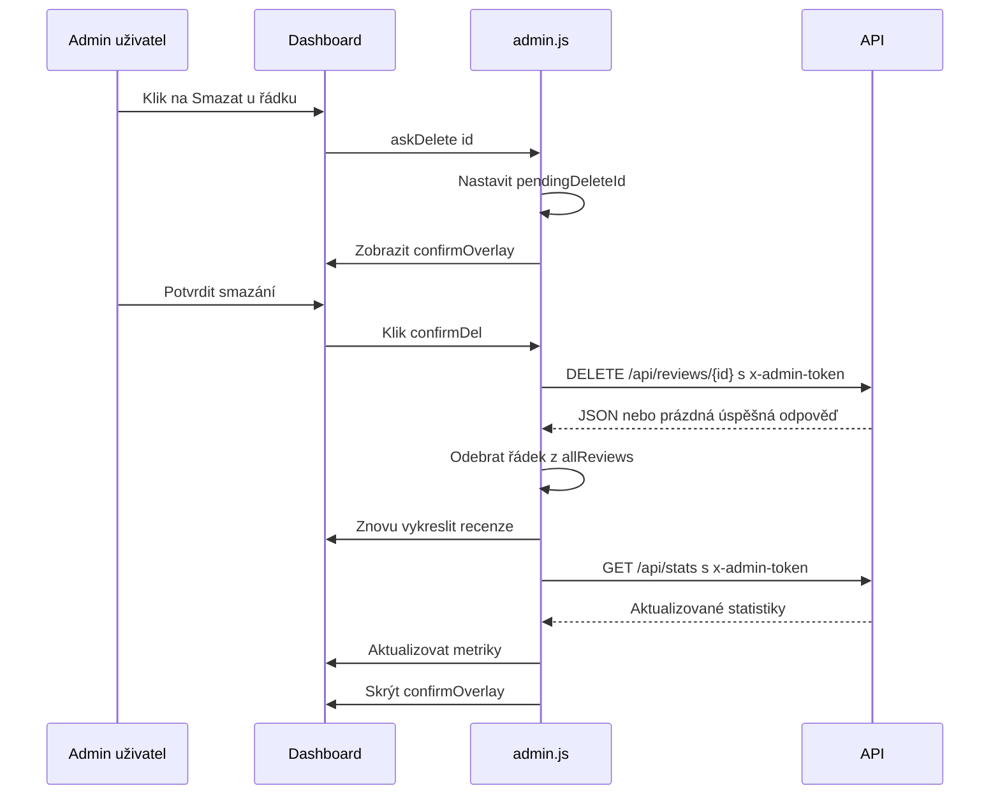
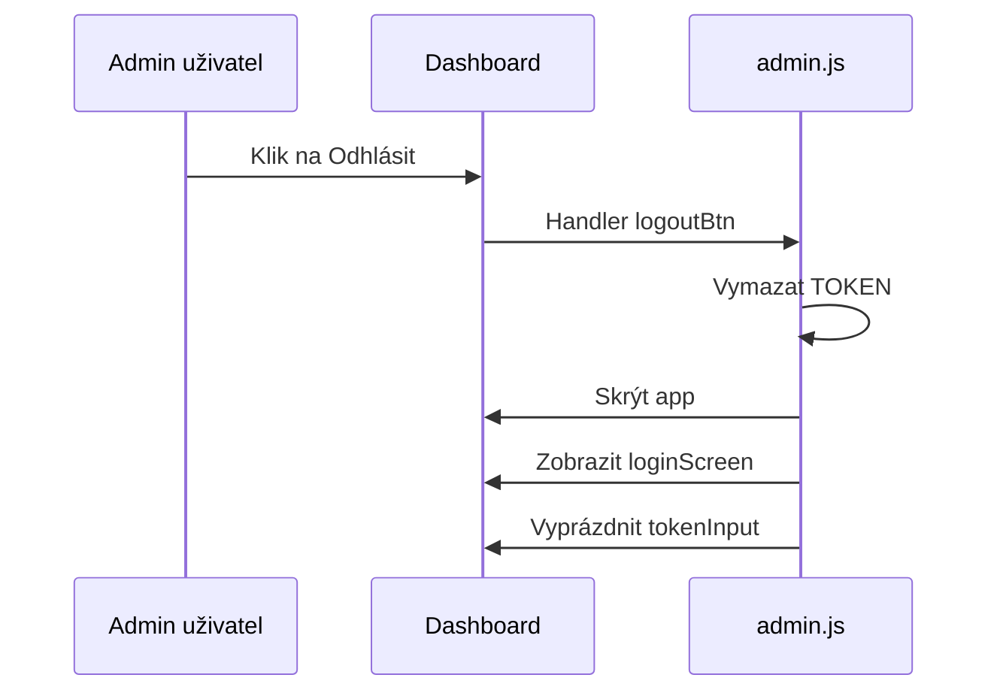

# Administrace — autentizační tok, stav relace a přechody obrazovek

## Přehled

Toto administrační rozhraní je jednoduchý jednopage flow v prohlížeči, které chrání dashboard s recenzemi pomocí sdíleného tajného tokenu zadaného přímo na stránce. Přihlašovací část je v `admin.html`, zatímco `admin.js` řídí kontrolu tokenu, zobrazení dashboardu, načítání recenzí, obnovu, filtrování a potvrzení smazání.

Model autentizace je úmyslně jednoduchý: prohlížeč si uloží zadané heslo pouze do paměťové proměnné `TOKEN` a při každém chráněném požadavku jej posílá v hlavičce `x-admin-token`. V klientském kódu tedy není žádný separátní serverový session objekt; úspěšná odpověď `GET /api/stats` slouží zároveň k ověření tokenu i jako první zaplnění metrik dashboardu.

Průchod obrazovkami je rozdělen na dvě hlavní oblasti — `loginScreen` a `app` — plus potvrzovací overlay pro destruktivní akce. Skript přepíná stavy změnou `style.display` a tříd overlaye, takže celá administrace je řízena přechody v DOMu a autentizovanými voláními `fetch`.

## Architektura (přehled)



Stránka funguje jako statický shell (`admin.html`) s `admin.js` jako kontrolerem. Kontroler nevyužívá samostatnou klientskou servisní vrstvu; volá přímo backendové endpointy a podle vráceného JSONu rozhoduje, zda odemknout dashboard nebo ponechat login.

## Struktura komponent

### 1) Prezentační vrstva

#### `admin.html`

*`public/admin.html`*

`admin.html` definuje přihlašovací bránu, autentizovaný dashboard a potvrzovací overlay pro mazání, které `admin.js` za běhu přepíná. Skript spoléhá na pevné ID v DOMu, aby správně zobrazil nebo skryl příslušné obrazovky a naplnil hodnoty v dashboardu.

| DOM id | Funkce v administraci |
| --- | --- |
| `loginScreen` | Kontejner přihlašovací obrazovky, zobrazený před ověřením tokenu a znovu po odhlášení |
| `tokenInput` | Pole pro zadání admin tokenu |
| `loginBtn` | Tlačítko, které spouští `tryLogin` |
| `loginErr` | Místo pro chybové hlášky (prázdné pole nebo neplatný token) |
| `app` | Kontejner autentizovaného dashboardu |
| `logoutBtn` | Vymaže token z paměti a vrátí uživatele na přihlašovací obrazovku |
| `refreshBtn` | Spustí znovunačtení statistik a recenzí |
| `sTotal` | Zobrazení celkového počtu recenzí |
| `sAvg` | Zobrazení průměru hvězdiček |
| `sNeg` | Počet negativních recenzí |
| `sFive` | Počet pětihvězdičkových recenzí |
| `loadingState` | Zóna s načítáním nebo chybou pro tabulku recenzí |
| `emptyState` | Zpráva, když po filtru neexistují žádné recenze |
| `reviewsTable` | Tabulka s výpisem recenzí |
| `reviewsTbody` | Tělo tabulky, které nahrazuje `renderReviews` |
| `confirmOverlay` | Overlay pro potvrzení destruktivní akce |
| `confirmCancel` | Zavře overlay bez smazání |
| `confirmDel` | Potvrdí smazání vybrané recenze |

Stavy obrazovek jsou tedy rozdělené mezi přihlašovací panel, dashboard a potvrzovací overlay. Dashboard obsahuje také vnořené stavy (načítání, prázdné zobrazení, tabulka), které přepínají `loadReviews` a `renderReviews`.

#### `admin.js`

*`public/scripts/admin.js`*

`admin.js` je runtime kontroler administrace. Ukládá token v paměti, ověřuje jej přes `GET /api/stats`, znovu jej používá pro všechny chráněné požadavky a řídí přechody obrazovek mutací DOMu.

##### Stavové proměnné

| Proměnná | Typ | Popis |
| --- | --- | --- |
| `TOKEN` | `string` | Token uložený v paměti, posílá se v hlavičce `x-admin-token` |
| `allReviews` | `Array` | Kompletní sada recenzí vrácená `GET /api/reviews` |
| `currentFilter` | `string` | Aktivní filtr: `all`, `positive` nebo `negative` |
| `pendingDeleteId` | `number \| null` | ID recenze vybrané k smazání před potvrzením |

##### Veřejné funkce (přehled)

| Funkce | Popis |
| --- | --- |
| `stars` | Sestaví zobrazení hvězdiček v tabulce recenzí |
| `formatDate` | Naformátuje `created_at` pro české zobrazení |
| `loadStats` | Načte metriky dashboardu z `GET /api/stats` |
| `loadReviews` | Načte seznam recenzí z `GET /api/reviews` |
| `renderReviews` | Filtrovaně vykreslí tabulku do `reviewsTbody` |
| `escHtml` | Escapuje `&`, `<`, `>` před vložením textu recenze |
| `askDelete` | Uloží ID recenze a otevře potvrzovací overlay |
| `tryLogin` | Ověří zadaný token přes `GET /api/stats` a při úspěchu zobrazí dashboard |

##### Runtime závislosti

| Typ | Popis |
| --- | --- |
| DOM | Čte a upravuje prvky podle ID definovaných v `admin.html` |
| `fetch` | Volá chráněné admin endpointy |
| JSON odpovědi | Používá pole `ok` a datové pole vrácené serverem |
| CSS třídy | Používá `show`, `active`, `flagged`, `badge-neg` a `badge-pos` pro stav obrazovky a řádků |

Funkce `tryLogin` je vstupním bodem autentizace: načte `tokenInput`, ořeže hodnotu, uloží do `TOKEN` a pošle ji v hlavičce `x-admin-token` na `GET /api/stats`. Pokud odpověď JSON neobsahuje pravdivé `ok`, token se vymaže a zobrazí se chybová zpráva.

## Hlavní toky funkcionality

### Ověření přihlášení a zobrazení dashboardu



`tryLogin` tedy používá `GET /api/stats` zároveň jako ověření a jako první payload pro dashboard. Úspěšná odpověď okamžitě odemkne obrazovku a naplní metriky.

### Obnovení recenzí a filtrované vykreslování



Filtrování probíhá pouze na klientovi. Filtr `positive` nechává recenze s `overall_stars >= 4`, `negative` bere `overall_stars < 4` a `all` zobrazí vše z cache `allReviews`.

### Potvrzení smazání a odstranění recenze



Požadavek na smazání se odešle až po potvrzení v overlay. Po dokončení klient odstraní položku z paměti a obnoví statistiky, místo aby načítal celou stránku.

### Odhlášení a reset obrazovky



Odhlášení je kompletně na straně klienta: skript vymaže token v paměti a vrátí uživatele na přihlašovací obrazovku; po reloadu nebo odhlášení není žádný perzistentní session objekt.

## Správa stavů

### Klientské stavy

| Stav | Typ | Výchozí | Používá | Účel |
| --- | --- | --- | --- | --- |
| `TOKEN` | `string` | `""` | `tryLogin`, `loadStats`, `loadReviews`, handler mazání, handler logout | Ukládá admin token pouze v paměti |
| `allReviews` | `Array` | `[]` | `loadReviews`, `renderReviews`, handler mazání | Uchovává dataset recenzí pro vykreslení |
| `currentFilter` | `string` | `"all"` | Handlery filtru, `renderReviews` | Řídí klientské filtrování viditelných řádků |
| `pendingDeleteId` | `number \| null` | `null` | `askDelete`, handlery confirm/cancel | Sleduje, která recenze je připravena ke smazání |

### Přechody stavů obrazovek

| Z | Spouštěč | Do | Změna v DOM |
| --- | --- | --- | --- |
| `loginScreen` | Prázdný token | `loginScreen` | `loginErr` zobrazuje `Zadejte heslo.` |
| `loginScreen` | Neplatný token | `loginScreen` | `TOKEN` se vymaže a `loginErr` zobrazuje `Nesprávné heslo.` |
| `loginScreen` | Úspěšný `tryLogin` | `app` | `loginScreen` skryto, `app` zobrazeno |
| `app` | Klik logoutBtn | `loginScreen` | `TOKEN` vymazán, `tokenInput` vyprázdněn |
| `app` | `askDelete` | `confirmOverlay` viditelný | Overlay dostane třídu `show` |
| `confirmOverlay` | Klik confirmCancel | `app` | Overlay `show` odstraněn |
| `confirmOverlay` | confirmDel úspěch/neúspěch | `app` | Overlay `show` odstraněn, `pendingDeleteId` resetován |
| `loadingState` | Start `loadReviews` | `loadingState` viditelný | Tabulka a empty state skryty |
| `loadingState` | Recenze vráceny | `reviewsTable` | Tabulka zobrazena, `loadingState` skryto |
| `loadingState` | Žádné recenze po filtru | `emptyState` | Empty state zobrazen, tabulka skryta |

Funkce `loadStats` má prázdný `catch` blok — chyba při obnovení statistik tedy nezmění aktuální hodnoty dashboardu. `loadReviews` na chyby reaguje zobrazením inline chybové zprávy v oblasti `loadingState`.

## Integrace API

### Směrování požadavků v `admin.js`

| Funkce | Endpoint | Role |
| --- | --- | --- |
| `tryLogin` | `GET /api/stats` | Ověří zadaný admin token |
| `loadStats` | `GET /api/stats` | Obnoví metriky dashboardu |
| `loadReviews` | `GET /api/reviews` | Načte seznam recenzí pro tabulku |
| Handler potvrzení mazání | `DELETE /api/reviews/{id}` | Smaže vybranou recenzi |

#### Ověření admin tokenu a načtení statistik

```api
{
    "title": "Validate Admin Token and Load Stats",
    "description": "Používá sdílený admin token v hlavičce x-admin-token k ověření přístupu a vrácení počtů do dashboardu",
    "method": "GET",
    "baseUrl": "<AdminApiBaseUrl>",
    "endpoint": "/api/stats",
    "headers": [
        {
            "key": "x-admin-token",
            "value": "<admin-token>",
            "required": true
        }
    ],
    "responses": {
        "200": {
            "description": "Authenticated stats payload",
            "body": "{\n    \"ok\": true,\n    \"total\": 128,\n    \"avg_stars\": 4.6,\n    \"negative\": 9,\n    \"five_star\": 84\n}"
        }
    }
}
```

Funkce `tryLogin` považuje pole `ok` v JSONu za výsledek autentizace. Pokud je `ok` nepravdivé, klientský token se vymaže a uživatel zůstane na přihlašovací obrazovce.

#### Načtení recenzí pro administraci

```api
{
    "title": "Load Admin Reviews",
    "description": "Vrátí seznam recenzí použitý v tabulce dashboardu po ověření tokenu",
    "method": "GET",
    "baseUrl": "<AdminApiBaseUrl>",
    "endpoint": "/api/reviews",
    "headers": [
        {
            "key": "x-admin-token",
            "value": "<admin-token>",
            "required": true
        }
    ],
    "responses": {
        "200": {
            "description": "Authenticated review list payload",
            "body": "{\n    \"ok\": true,\n    \"reviews\": [\n        {\n            \"id\": 17,\n            \"created_at\": \"2026-04-29T10:15:00.000Z\",\n            \"overall_stars\": 2,\n            \"email\": \"customer@example.com\",\n            \"message\": \"The response time was slow, but the staff was helpful.\",\n            \"flagged\": true\n        }\n    ]\n}"
        }
    }
}
```

`loadReviews` uloží `d.reviews` do `allReviews` a stav viditelné seznamy deleguje na `renderReviews`. Při chybě nemění cache, místo toho zobrazí chybové hlášení v oblasti načítání.

#### Smazání recenze podle ID

```api
{
    "title": "Delete Review by Id",
    "description": "Smaže vybranou recenzi po potvrzení s použitím sdíleného admin tokenu",
    "method": "DELETE",
    "baseUrl": "<AdminApiBaseUrl>",
    "endpoint": "/api/reviews/{id}",
    "headers": [
        {
            "key": "x-admin-token",
            "value": "<admin-token>",
            "required": true
        }
    ],
    "pathParams": [
        {
            "name": "id",
            "type": "number",
            "required": true
        }
    ],
    "responses": {
        "200": {
            "description": "Deletion accepted",
            "body": "{\n    \"ok\": true\n}"
        }
    }
}
```

Požadavek na smazání se odešle až po nastavení `pendingDeleteId` voláním `askDelete` a potvrzení uživatelem v overlay. Po úspěchu je položka odstraněna z `allReviews` a aktualizují se statistiky.

## Bezpečnostní model

Přístup do administrace je založen na sdíleném tajném tokenu posílaném v hlavičce. Prohlížeč token ukládá pouze do proměnné `TOKEN` v paměti a posílá jej jako `x-admin-token`; rozhodnutí o zobrazení dashboardu se opírá o pole `ok` v odpovědi `GET /api/stats`.

Kód nezavádí cookie-based přihlášení ani perzistentní ukládání tokenu. Autentizace je reprezentována pouze proměnnou `TOKEN` v paměti, proto reload nebo odhlášení vrátí uživatele zpět k výzvě pro zadání tokenu.

Model je jednoduchý a vhodný pro interní použití, ale bezpečnost celé administrace závisí na utajení sdíleného tokenu — ten dává plný přístup ke statistikám, výpisu recenzí i mazání.

## Zpracování chyb

| Tok | Chybová podmínka | Pozorované chování |
| --- | --- | --- |
| `tryLogin` | Prázdné zadání | `loginErr` zobrazí `Zadejte heslo.` a žádný požadavek se nepošle |
| `tryLogin` | `GET /api/stats` vrátí nepravdivé `ok` | `TOKEN` se vymaže a `loginErr` zobrazí `Nesprávné heslo.` |
| `loadStats` | Síťová nebo parsovací chyba | Chyba je pohlcena prázdným `catch` blokem |
| `loadReviews` | Network, parsing, or `ok` failure | `loadingState` is replaced with `Chyba: ...` text |
| Delete confirmation | Request failure | `alert("Chyba: ...")` is shown |
| Delete confirmation | Success or failure | Overlay is closed and `pendingDeleteId` is reset |


The review table only renders escaped message text through `escHtml`, which replaces `&`, `<`, and `>`. Email values are inserted into a `mailto:` link and table cell directly when present.

## Dependencies

- Browser `fetch` API for all admin requests
- DOM ids declared in 
- JSON responses that include `ok` and the fields consumed by `loadStats` and `loadReviews`
- The `x-admin-token` header expected by the server-side admin routes
- Czech locale formatting in `formatDate` via `toLocaleDateString("cs-CZ", ...)` and `toLocaleTimeString("cs-CZ", ...)`

## Testing Considerations

- Entering an empty token should keep the login screen visible and show `Zadejte heslo.`
- A wrong token should clear `TOKEN` and keep `loginScreen` active
- A valid token should hide `loginScreen`, show `app`, and populate the stats cards
- `loadReviews` should render rows into `reviewsTbody` and respect the `all`, `positive`, and `negative` filter buttons
- `askDelete` should open `confirmOverlay` and set `pendingDeleteId`
- Confirmed deletion should remove the row from the client list and refresh the stats cards
- `logoutBtn` should clear the token field and return the page to the login screen
- Refresh should call both `loadStats` and `loadReviews` while keeping the current filter active

## Key Classes Reference

| Class | Responsibility |
| --- | --- |
| `admin.html` | Declares the login gate, dashboard container, stats cards, review table, and delete confirmation overlay |
| `admin.js` | Manages token validation, client-side session state, screen transitions, filtering, refresh, and review deletion |
