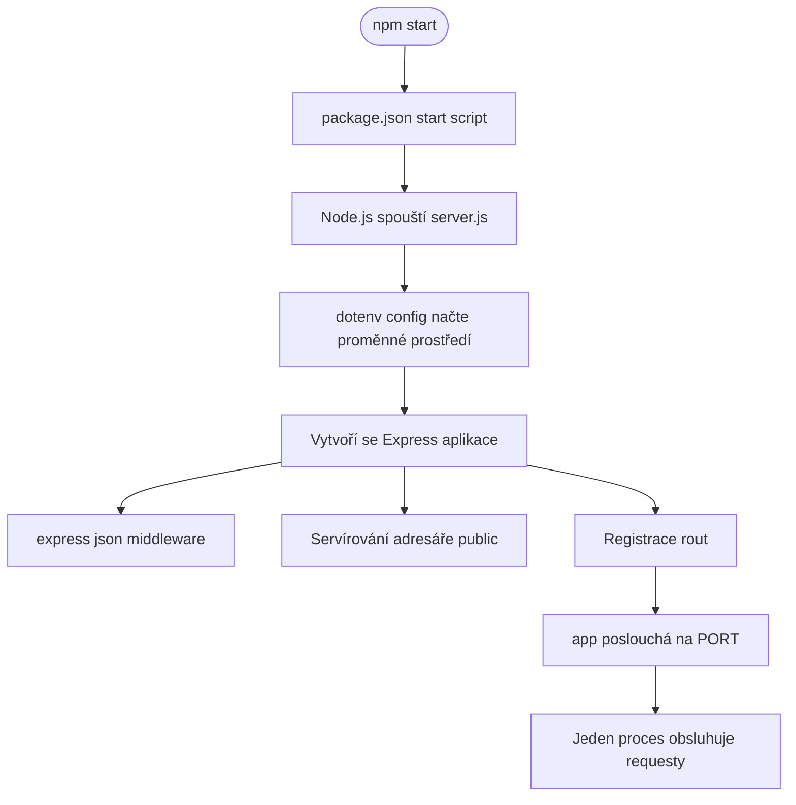
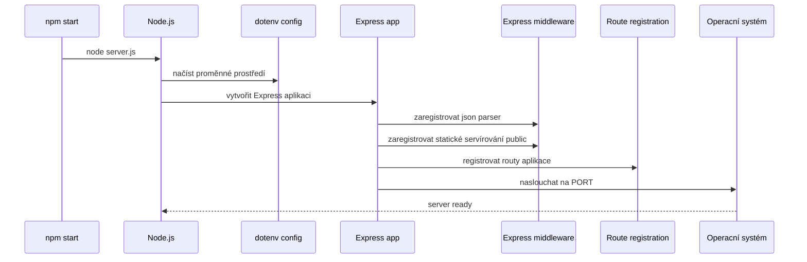

# Backend — bootstrap aplikace, závislosti a životní cyklus procesu

## Přehled

`package.json` a `server.js` definují runtime kontrakt aplikace. Repozitář se spouští pomocí `npm start`, který spustí jeden Node.js proces v režimu ES modulů a předá řízení `server.js` pro bootstrap Expressu.

`server.js` se stará o načtení hodnot prostředí přes `dotenv/config`, vytvoření Express aplikace, registraci globálního middleware, zpřístupnění adresáře `public/` jako statického obsahu a spuštění posluchače až po dokončení registrace rout. Výsledkem je jeden proces, který obsluhuje UI i backendové requesty ve stejném běhu.

## Architektura (přehled)

## Runtime kontrakt

### `package.json`

`package.json` určuje, jak se aplikace spouští a jak Node interpretuje zdrojové soubory.

#### Důležité pole

| Pole | Účel |
| --- | --- |
| `type` | Zapíná režim ES modulů pro runtime. |
| `scripts.start` | Definuje `npm start` entrypoint, který spouští `server.js`. |

#### Role při startu

- `npm start` se mapuje přímo na `node server.js`.
- Runtime kontrakt je úmyslně minimalistický: jeden entrypoint, jeden proces a jeden listener.
- Režim ES modulů je součástí kontraktu, takže bootstrap serveru používá `import` místo CommonJS `require`.

### `server.js`

`server.js` vlastní bootstrap aplikace a životní cyklus procesu. Propojuje konfiguraci při startu, middleware, hostování statických souborů, registraci rout a finální volání `listen`.

#### Vrcholové proměnné

| Proměnná | Typ | Popis |
| --- | --- | --- |
| `app` | `Express` aplikace | Singleton Express instance používaná k registraci middleware, rout a listeneru. |
| `PORT` | `string` nebo `number` | Port získaný z konfigurace prostředí pro běžící proces. |

#### Odpovědnosti při bootstrapu

| Krok | Odpovědnost |
| --- | --- |
| Načíst proměnné prostředí | `dotenv/config` vloží proměnné do `process.env` před pokračováním inicializace. |
| Vytvořit aplikaci | `express()` inicializuje serverový instance. |
| Parsovat těla požadavků | `express.json()` umožní parsování JSON payloadů v handlerech. |
| Servírovat statické assety | `express.static('public')` zpřístupní `public/` z toho samého procesu. |
| Registrovat routy | Registrace rout proběhne před tím, než server začne přijímat požadavky. |
| Spustit posluchač | `app.listen(PORT)` otevře síťový socket po dokončení bootstrapu. |

## Model závislostí

### Závislosti použité při bootstrapu

| Závislost | Role v runtime |
| --- | --- |
| `express` | Poskytuje HTTP server, pipeline middleware, hostování statických souborů a listener. |
| `dotenv/config` | Načítá proměnné prostředí do `process.env` před bootstrap logikou. |
| Podpora ES modulů v Node.js | Umožňuje načítání `server.js` přes `import`, protože balíček je nastaven jako ES modul. |

### Smlouva mezi soubory

| Soubor | Odpovědnost |
| --- | --- |
| `package.json` | Deklaruje startovací příkaz a modulový režim procesu. |
| `server.js` | Spotřebovává tuto smlouvu k vytvoření a spuštění serveru. |

## Životní cyklus procesu

### Pořadí startu

`dotenv/config` je importovaný pro vedlejší efekt při startu, takže proměnné prostředí jsou dostupné během inicializace serveru a při resolvování `PORT`.

1. `npm start` spustí `start` skript z `package.json`.
2. Node spustí `server.js` v režimu ES modulů.
3. `dotenv/config` načte proměnné prostředí před čtením konfigurace runtime.
4. Express aplikace je vytvořena jednou pro tento proces.
5. `express.json()` se zaregistruje, aby se JSON těla mohla parsovat v handlerech.
6. `express.static('public')` se zaregistruje, aby stejný server mohl servírovat klientské soubory.
7. Registrují se routy aplikace.
8. `app.listen(PORT)` spustí posluchače na zvoleném portu.
9. Proces zůstává aktivní jako jeden běžící server obsluhující požadavky.

### Pořadí při zpracování požadavků

- Middleware je zaregistrován před tím, než server začne naslouchat.
- Registrace rout proběhne před otevřením socketu.
- Statické soubory a JSON parsování jsou součástí stejné Express pipeline jako aplikační routy.
- Nasazení používá model jednoho dlouho běžícího Node procesu na instanci.

## Tok procesu a startu

## Hostování statických souborů a parsování požadavků

`server.js` konfiguruje dvě globální chování, která formují runtime kontrakt:

- `express.json()` parsuje příchozí JSON těla požadavků před tím, než handlery běží.
- `express.static('public')` zpřístupní adresář `public/` ze stejného procesu, což umožní servírování UI assetů bez samostatného web serveru.

Tyto chování jsou bootstrap záležitosti aplikace a instalují se před tím, než `app.listen(PORT)` otevře server.

## Model nasazení v jednom procesu

Aplikace běží jako jeden Node.js proces spuštěný přes `npm start`. Tento proces vlastní:

- Express aplikaci,
- parsování JSON těla,
- servírování statických souborů z `public/`,
- registraci rout,
- a network listener vázaný na `PORT`.

To drží bootstrap, zpracování požadavků a servírování statických souborů v jedné runtime hranici.

## Referenční třídy

| Třída | Odpovědnost |
| --- | --- |
| `package.json` | Deklaruje režim ES modulů a `npm start` entrypoint, který spouští aplikaci. |
| `server.js` | Bootuje Express, instaluje middleware, servíruje `public/`, registruje routy a spouští listener na `PORT`. |
