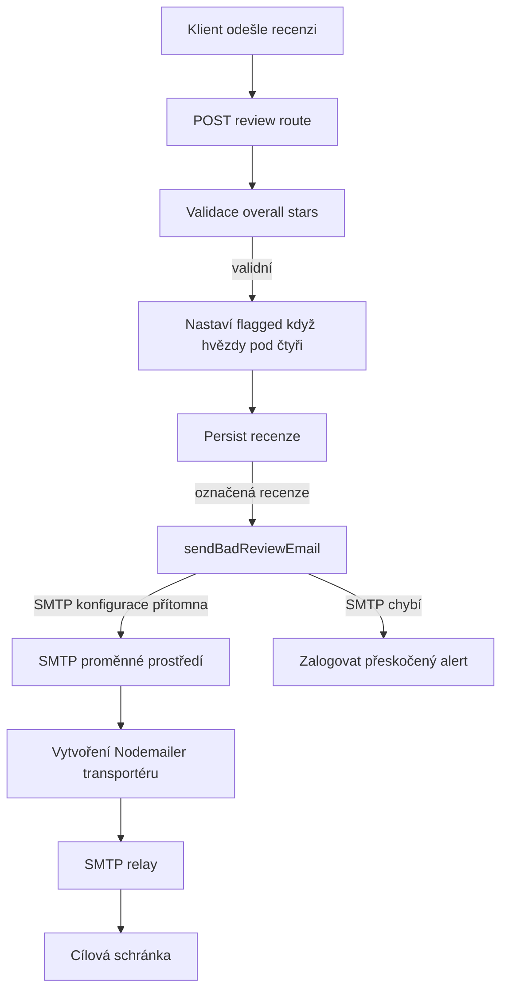
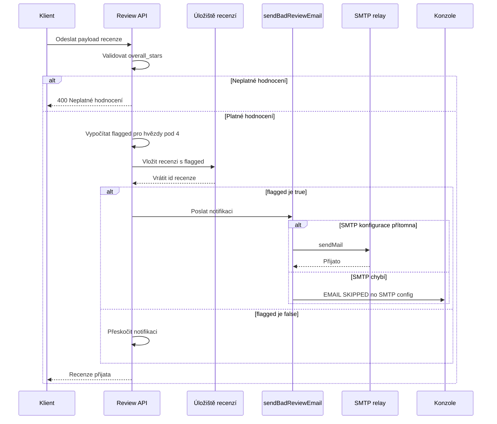

# Pipeline emailových notifikací pro označené recenze

## Přehled

Tato runtime cesta převede odeslanou recenzi na volitelný SMTP alert, pokud je hodnocení negativní. V `server.js` se uživatelský payload validuje, stav `flagged` se odvodí z podmínky `overall_stars < 4` a takto označená recenze se stane kandidátem pro emailovou notifikaci zaslanou na adresu definovanou v `NOTIFY_EMAIL`.

Notifikační tok je úmyslně neblokující z pohledu produktu: pokud není SMTP nakonfigurováno, pomocná funkce zaloguje přeskočení alertu a ukončí se. Díky tomu zůstává cesta pro odeslání recenze funkční i bez dostupného emailového doručení.

## Architektura (přehled)



## Konfigurace SMTP

`server.js` povolí odesílání emailů pouze pokud jsou přítomny hodnoty pro SMTP. Transportér se vytváří z `SMTP_HOST`, `SMTP_PORT`, `SMTP_SECURE`, `SMTP_USER` a `SMTP_PASS`, zatímco pole zprávy používají `FROM_EMAIL` a `NOTIFY_EMAIL`.

| Proměnná | Typ | Role |
| --- | --- | --- |
| `SMTP_HOST` | string | SMTP host předaný do `nodemailer.createTransport`; v ukázkovém kódu je výchozí `smtp.resend.com`. |
| `SMTP_USER` | string | Uživatelské jméno pro autentizaci transportéru; ve vzorovém kódu `resend`. |
| `SMTP_PASS` | string | Heslo pro autentizaci transportéru; nutné pro vytvoření transportéru. |
| `SMTP_PORT` | number | Port předaný transportéru. |
| `SMTP_SECURE` | boolean | Příznak pro bezpečný transport předaný transportéru. |
| `FROM_EMAIL` | string | Adresa odesílatele použitá v `sendMail`. |
| `NOTIFY_EMAIL` | string | Adresa příjemce použitá v `sendMail`; ve vzorovém kódu `fiserbretislav@email.cz`. |


Transportér je vytvořen pouze pokud jsou k dispozici `SMTP_HOST`, `SMTP_USER` a `SMTP_PASS`. To dělá notifikační cestu konfigurovatelnou, přičemž port a zabezpečení lze stále řídit pomocí proměnných prostředí.

## Pomocné runtime funkce

### `sendBadReviewEmail`

*Soubor: `server.js`*

`sendBadReviewEmail(review)` je pomocník pro SMTP notifikace použitý v pipeline recenzí.

| Metoda | Popis |
| --- | --- |
| `sendBadReviewEmail` | Odesílá HTML alert pro negativní recenzi, pokud existuje transportér; pokud SMTP není nakonfigurováno, přeskočí doručení. |


#### Složení emailu

Pomocník posílá jeden HTML email s těmito poli:

| Pole emailu | Zdroj | Chování |
| --- | --- | --- |
| `from` | `FROM_EMAIL` | Nastaví odesílatele alertu. |
| `to` | `NOTIFY_EMAIL` | Nastaví příjemce alertu. |
| `subject` | Statický řetězec | `⚠️ Nová negativní recenze` |
| `overall_stars` | `review.overall_stars` | Vykreslí počet hvězd z 5. |
| email zákazníka | `review.email` | Náhradní text `(nevyplněno)` pokud prázdné. |
| text recenze | `review.message` | Náhradní text `(bez textu)` pokud prázdné. |


#### Chování při chybějícím SMTP

Pokud není dostupný transportér, pomocník zapíše do logu a ukončí:

- prefix logu: `[EMAIL SKIPPED - no SMTP config]`
- zahrnutý kontext: `review.email` a `review.overall_stars`

To dělá odesílání emailů volitelným v runtime a zároveň zachovává funkčnost odeslání recenze.

## Tok odeslání recenze a notifikace

### Route pro recenzi

Notifikační pipeline je připojena k cestě pro odeslání recenze v `server.js`.

#### Vytvoření recenze

```api
{
    "title": "Create Review",
    "description": "Accepts a review submission, validates the star rating, marks reviews below four stars as flagged, persists the review, and routes flagged reviews into the SMTP notification pipeline.",
    "method": "POST",
    "baseUrl": "<ReviewAppBaseUrl>",
    "endpoint": "/api/reviews",
    "headers": [
        {
            "key": "Content-Type",
            "value": "application/json",
            "required": true
        }
    ],
    "queryParams": [],
    "pathParams": [],
    "bodyType": "json",
    "requestBody": "{\n    \"overall_stars\": 2,\n    \"email\": \"customer@example.com\",\n    \"message\": \"The service was delayed and the experience felt poor.\"\n}",
    "formData": [],
    "rawBody": "",
    "responses": {
        "400": {
            "description": "Invalid rating",
            "body": "{\n    \"ok\": false,\n    \"error\": \"Neplatn\\u00e9 hodnocen\\u00ed.\"\n}"
        }
    }
}
```

### Chování pipeline

1. Route načte `overall_stars`, `email` a `message` z `req.body`.
2. Odmítne hodnocení mimo rozsah 1 až 5 s odpovědí 400.
3. Vypočítá `flagged = overall_stars < 4`.
4. Uloží recenzi společně s `flagged`.
5. Negativní recenze pokračují do `sendBadReviewEmail(review)`.
6. Pomocník buď odešle SMTP zprávu, nebo zaloguje a přeskočí, pokud SMTP není dostupné.

### Sekvence notifikace



## Zpracování chyb

Notifikační cestu váže prahová hodnota pro negativní recenze. Jen hodnocení pod 4 jsou označena jako `flagged`, tedy 1 až 3 hvězdičky dospějí do notifikačního kroku.

Cesty pro recenzi a email používají oddělené chybové mechanismy:

- **Neplatné hodnocení**: route vrátí `400` s `{ ok: false, error: "Neplatné hodnocení." }`.
- **SMTP není nakonfigurováno**: `sendBadReviewEmail` zaloguje přeskočení doručení a vrátí se okamžitě.
- **Notifikační krok**: emailová část je izolovaná od validace hodnocení, takže pipeline může rozhodnout o odeslání bez změny pravidel hodnocení.

Runtime tedy považuje email pouze za doplněk pro negativní zpětnou vazbu, nikoli za podmínku přijetí recenze.

## Správa stavu

Email pipeline používá dva odvozené runtime stavy:

| Stav | Význam |
| --- | --- |
| `transporter = null` | SMTP doručení není dostupné, protože chybí potřebné proměnné prostředí pro SMTP. |
| `flagged = true` | Recenze má `overall_stars < 4` a je kandidátem na alert. |
| `flagged = false` | Recenze je dostatečně pozitivní a nebude součástí alert cesty. |


Hodnota `flagged` se vypočítá jednou v route a uloží se s recenzním záznamem před jakýmkoli pokusem o odeslání emailu.

## Závislosti

- `nodemailer` pro vytvoření SMTP transportéru a odeslání zpráv.
- `express` pro handler `POST /api/reviews`.
- Proměnné prostředí pro konfiguraci hosta, portu, secure módu, odesílatele a příjemce.
- Krok persistence recenze, který uloží `flagged` spolu s recenzí před tím, než se pokusí o notifikaci.

## Testovací poznámky

- Odeslat `overall_stars` menší než 1 a větší než 5 a ověřit odpověď 400.
- Odeslat recenze 1 až 3 hvězdičky a ověřit, že `flagged` je `true`.
- Odeslat recenze 4 a 5 hvězdiček a ověřit, že nevstupují do alert cesty.
- Spustit bez SMTP proměnných a ověřit, že pomocník zaloguje přeskočený email namísto toho, aby selhal celou cestu.
- Ověřit, že `FROM_EMAIL` a `NOTIFY_EMAIL` se odrážejí v obálce odchozí zprávy.
- Ověřit, že HTML tělo obsahuje počet hvězd, email zákazníka a fallback texty pro zprávu.
