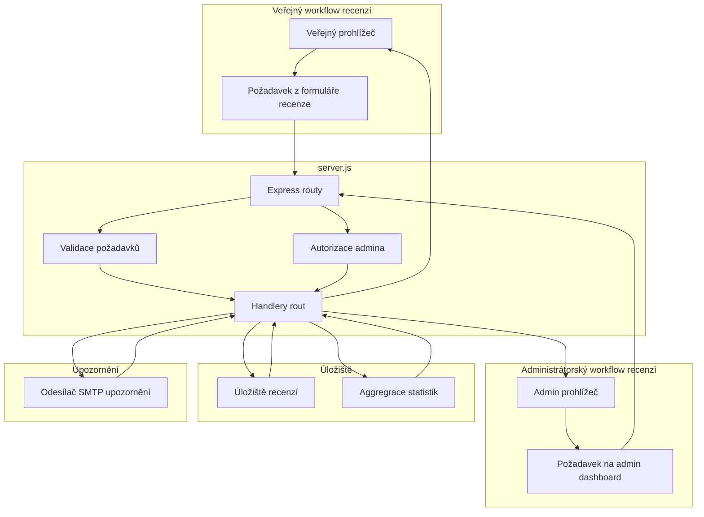
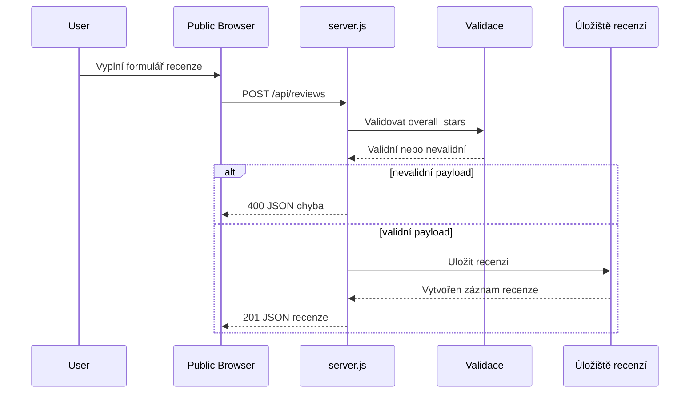
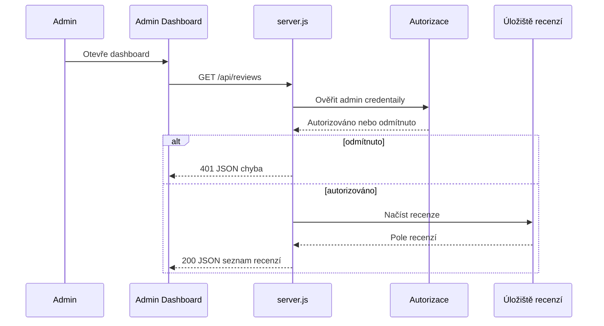
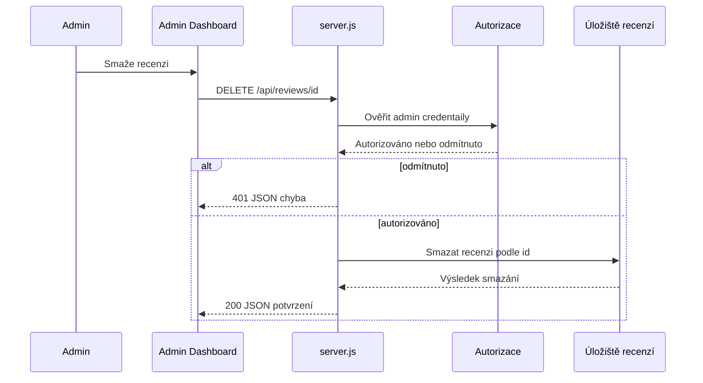
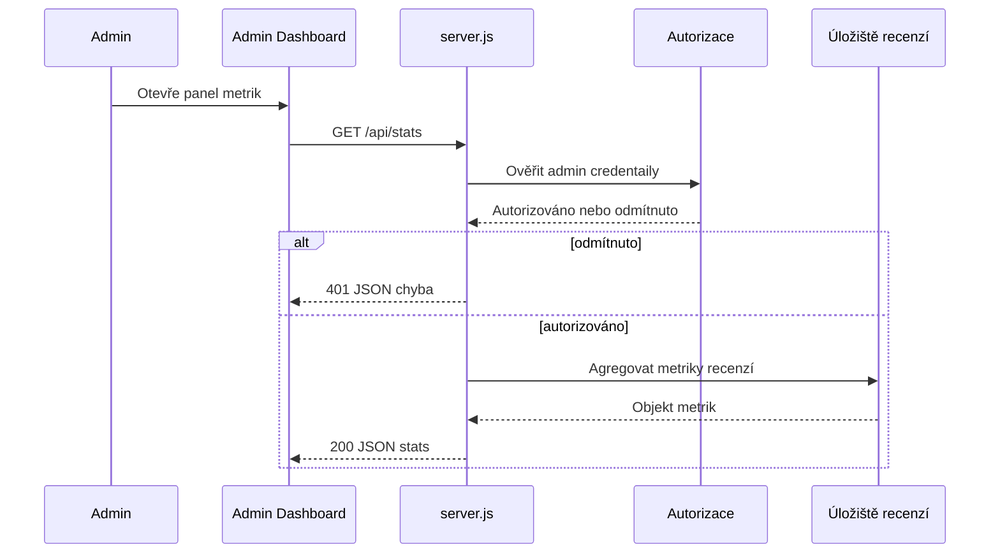

# Backend služba a runtime — HTTP API rozhraní a zpracování požadavků na serveru

*server.js*

## Přehled

`server.js` je jediný runtime vstup pro uživatelské i administrátorské pracovní toky recenzí. Přijímá veřejné odeslání recenzí, poskytuje data pro adminsitrátorský dashboard, maže recenze pro moderaci a poskytuje metriky dashboardu ze stejného Express procesu.

HTTP rozhraní je kompaktní a založené na JSON: jedna veřejná endpoint pro odeslání recenze a tři chráněné administrátorské endpointy. Validace, autorizace, přístup k persistence a převod chyb se provádí server‑side před tím, než se odpověď vrátí do prohlížeče.

## Architektonický přehled



## HTTP API rozhraní

### Veřejné odeslání recenze

#### Odeslat recenzi

*server.js*

```api
{
    "title": "Submit Review",
    "description": "Přijme veřejné odeslání recenze, validuje overall_stars, uloží recenzi a vrátí vytvořený záznam jako JSON.",
    "method": "POST",
    "baseUrl": "<ServerBaseUrl>",
    "endpoint": "/api/reviews",
    "headers": [
        {
            "key": "Content-Type",
            "value": "application/json",
            "required": true
        }
    ],
    "queryParams": [],
    "pathParams": [],
    "bodyType": "json",
    "requestBody": "{\n    \"overall_stars\": 2,\n    \"comment\": \"The checkout flow was confusing and slow.\"\n}",
    "formData": [],
    "rawBody": "",
    "responses": {
        "201": {
            "description": "Recenze vytvořena",
            "body": "{\n    \"id\": 17,\n    \"overall_stars\": 2,\n    \"comment\": \"The checkout flow was confusing and slow.\",\n    \"created_at\": \"2026-04-29T14:12:00.000Z\"\n}"
        },
        "400": {
            "description": "Chyba validace",
            "body": "{\n    \"error\": \"overall_stars je povinné a musí být mezi 1 a 5\"\n}"
        },
        "500": {
            "description": "Chyba serveru",
            "body": "{\n    \"error\": \"Internal Server Error\"\n}"
        }
    }
}
```

### Administrátorské vypsání recenzí

#### Seznam recenzí

*server.js*

```api
{
    "title": "List Reviews",
    "description": "Vrátí kompletní seznam recenzí pro administrátorský dashboard jako JSON.",
    "method": "GET",
    "baseUrl": "<ServerBaseUrl>",
    "endpoint": "/api/reviews",
    "headers": [
        {
            "key": "Authorization",
            "value": "Bearer <admin-token>",
            "required": true
        }
    ],
    "queryParams": [],
    "pathParams": [],
    "bodyType": "none",
    "requestBody": "",
    "formData": [],
    "rawBody": "",
    "responses": {
        "200": {
            "description": "Kolekce recenzí",
            "body": "[\n    {\n        \"id\": 17,\n        \"overall_stars\": 2,\n        \"comment\": \"The checkout flow was confusing and slow.\",\n        \"created_at\": \"2026-04-29T14:12:00.000Z\"\n    }\n]"
        },
        "401": {
            "description": "Neautorizováno",
            "body": "{\n    \"error\": \"Unauthorized\"\n}"
        },
        "500": {
            "description": "Chyba serveru",
            "body": "{\n    \"error\": \"Internal Server Error\"\n}"
        }
    }
}
```

### Administrátorská moderace

#### Smazat recenzi

*server.js*

```api
{
    "title": "Delete Review",
    "description": "Smaže recenzi identifikovanou parametrem cesty id po úspěšné admin autorizaci.",
    "method": "DELETE",
    "baseUrl": "<ServerBaseUrl>",
    "endpoint": "/api/reviews/:id",
    "headers": [
        {
            "key": "Authorization",
            "value": "Bearer <admin-token>",
            "required": true
        }
    ],
    "queryParams": [],
    "pathParams": [
        {
            "key": "id",
            "value": "17",
            "required": true
        }
    ],
    "bodyType": "none",
    "requestBody": "",
    "formData": [],
    "rawBody": "",
    "responses": {
        "200": {
            "description": "Recenze smazána",
            "body": "{\n    \"success\": true,\n    \"id\": 17\n}"
        },
        "401": {
            "description": "Neautorizováno",
            "body": "{\n    \"error\": \"Unauthorized\"\n}"
        },
        "500": {
            "description": "Chyba serveru",
            "body": "{\n    \"error\": \"Internal Server Error\"\n}"
        }
    }
}
```

### Administrátorské metriky

#### Získat statistiky recenzí

*server.js*

```api
{
    "title": "Get Review Stats",
    "description": "Vrátí agregované administrátorské metriky spočtené ze uložených recenzí.",
    "method": "GET",
    "baseUrl": "<ServerBaseUrl>",
    "endpoint": "/api/stats",
    "headers": [
        {
            "key": "Authorization",
            "value": "Bearer <admin-token>",
            "required": true
        }
    ],
    "queryParams": [],
    "pathParams": [],
    "bodyType": "none",
    "requestBody": "",
    "formData": [],
    "rawBody": "",
    "responses": {
        "200": {
            "description": "Agregované metriky",
            "body": "{\n    \"total_reviews\": 48,\n    \"average_overall_stars\": 4.3,\n    \"positive_reviews\": 41,\n    \"negative_reviews\": 7\n}"
        },
        "401": {
            "description": "Neautorizováno",
            "body": "{\n    \"error\": \"Unauthorized\"\n}"
        },
        "500": {
            "description": "Chyba serveru",
            "body": "{\n    \"error\": \"Internal Server Error\"\n}"
        }
    }
}
```

## Zpracování požadavků na serveru

### Veřejná cesta pro odeslání

- Požadavek vstoupí do `POST /api/reviews`.
- `overall_stars` se validuje před pokračováním v persistenci.
- Neplatné payloady vrací `400` s JSON chybou.
- Platné recenze se uloží a vytvořený záznam se vrátí volajícímu.
- Pokud je recenze negativní, může server‑side workflow pokračovat do notifikačního kroku v rámci stejného runtime.

### Admin vypsání a moderace

- `GET /api/reviews`, `DELETE /api/reviews/:id` a `GET /api/stats` běží pod admin ochranou v `server.js`.
- Požadavky, které selžou v autorizaci, vrátí `401` jako JSON dříve, než proběhne přístup k datům.
- Úspěšné požadavky vrací JSON přímo ze serverového procesu, což umožňuje admin dashboardu číst, mazat a sumarizovat recenze bez samostatného backendu.

### Validace `overall_stars`

- `overall_stars` je hlavní server‑side validační brána pro veřejné odeslání.
- Požadavky, které toto pole vynechají nebo zadají hodnotu mimo rozsah, jsou odmítnuty s `400`.
- Přijatý rozsah je `1` až `5`, což odpovídá hvězdičkovému modelu recenzí na backendu.

## Zpracování chyb

`server.js` vrací JSON chybové objekty pro všechny ošetřené chybové cesty.

| Stav | Kdy nastane | Tvar JSON |
| --- | --- | --- |
| `400` | Validace veřejné recenze selže, včetně neplatného `overall_stars` | `{ "error": "<message>" }` |
| `401` | Autorizace admina selže pro chráněné routy | `{ "error": "Unauthorized" }` |
| `500` | Chyby persistence, statistik nebo runtime během zpracování požadavku | `{ "error": "Internal Server Error" }` |


## Feature toky

### Veřejné odeslání recenze



### Admin vypsání recenzí



### Admin moderace — smazání



### Načtení admin metrik



## Závislosti

### Runtime závislosti používané HTTP vrstvou

Administrátorské routy jsou chráněné na serverové vrstvě, takže autorizace je vynucena před vypsáním, smazáním nebo generováním statistik. Veřejné odeslání tyto restrikce nepoužívá.

- Express pro routing a JSON odpovědi
- Vrstva persistence recenzí
- Admin autorizacní guard
- SMTP alert cesta pro negativní zpětnou vazbu

### Závislosti cesty požadavku

- Veřejné odeslání závisí na validaci `overall_stars` před persistencí.
- Admin endpointy závisí na autorizaci před jakoukoli prací s daty.
- Delete a stats požadavky závisí na identifikátoru recenze nebo agregované množině dostupné ve storage vrstvě.

## Integrace

- Veřejné odeslání recenzí je zpracováváno tím samým backend procesem, který servíruje admin dashboard.
- Admin dashboard čte, maže a sumarizuje recenze přes chráněné JSON endpointy v `server.js`.
- Zpracování negativních recenzí může být přesměrováno do email pipeline ve stejném runtime.

## Referenční přehled tříd

| Třída | Umístění | Odpovědnost |
| --- | --- | --- |
| `server.js` | `server.js` | Express HTTP runtime, zpracování odeslání recenzí, vypsání recenzí pro admina, moderace mazání a endpoint pro admin metriky |
