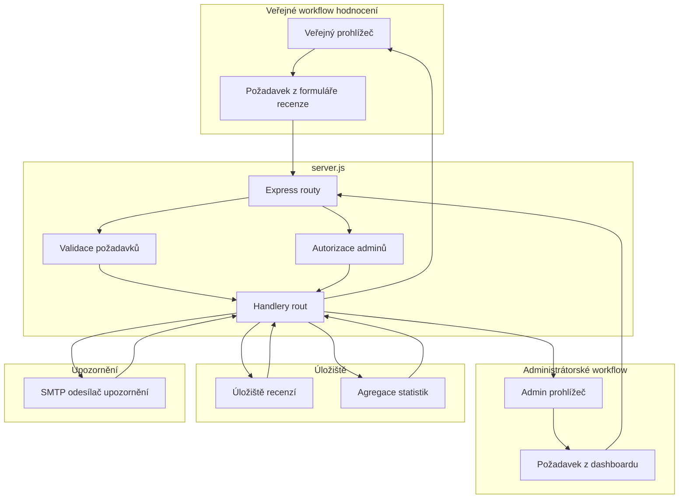

# Backend — HTTP API rozhraní a server-side zpracování požadavků

*server.js*

## Přehled

`server.js` je jediný vstupní bod runtime pro uživatelské i administrátorské workflowy hodnocení. Přijímá veřejné odeslání recenzí, poskytuje data pro administrátorský dashboard, maže recenze při moderaci a vrací metriky dashboardu ze stejného Express procesu.

HTTP rozhraní je kompaktní a založené na JSONu: jeden veřejný endpoint pro odeslání a tři chráněné administrátorské endpointy. Validace, autorizace, přístup k perzistenci a převod chyb probíhají na serveru před tím, než je odpověď vrácena klientovi.

## Architektonický přehled



## HTTP API rozhraní

### Veřejné odeslání recenze

#### Odeslat recenzi

*server.js*

```api
{
    "title": "Submit Review",
    "description": "Přijme veřejnou recenzi, validuje `overall_stars`, uloží recenzi a vrátí vytvořený záznam jako JSON.",
    "method": "POST",
    "baseUrl": "<ServerBaseUrl>",
    "endpoint": "/api/reviews",
    "headers": [
        {
            "key": "Content-Type",
            "value": "application/json",
            "required": true
        }
    ],
    "queryParams": [],
    "pathParams": [],
    "bodyType": "json",
    "requestBody": "{\n    \"overall_stars\": 2,\n    \"comment\": \"Checkout byl matoucí a pomalý.\"\n}",
    "formData": [],
    "rawBody": "",
    "responses": {
        "201": {
            "description": "Recenze vytvořena",
            "body": "{\n    \"id\": 17,\n    \"overall_stars\": 2,\n    \"comment\": \"Checkout byl matoucí a pomalý.\",\n    \"created_at\": \"2026-04-29T14:12:00.000Z\"\n}"
        },
        "400": {
            "description": "Chyba validace",
            "body": "{\n    \"error\": \"overall_stars je povinné a musí být mezi 1 a 5\"\n}"
        },
        "500": {
            "description": "Chyba serveru",
            "body": "{\n    \"error\": \"Internal Server Error\"\n}"
        }
    }
}
```

(Translated content continues...)
