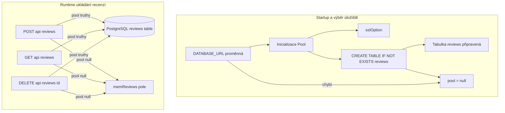
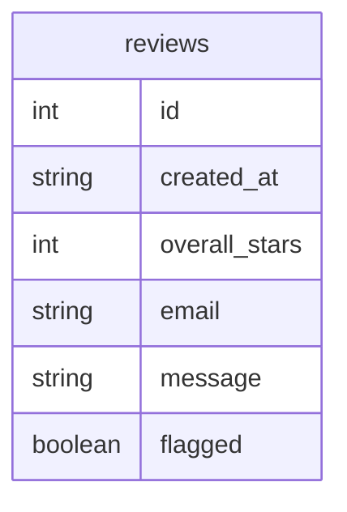
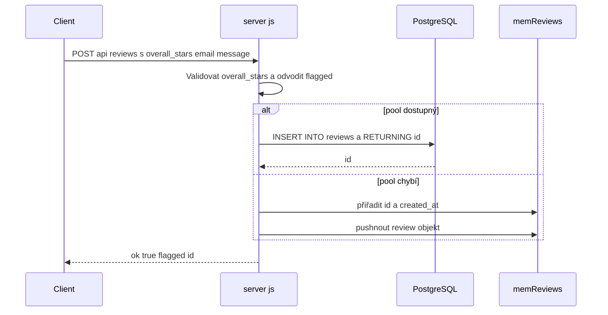
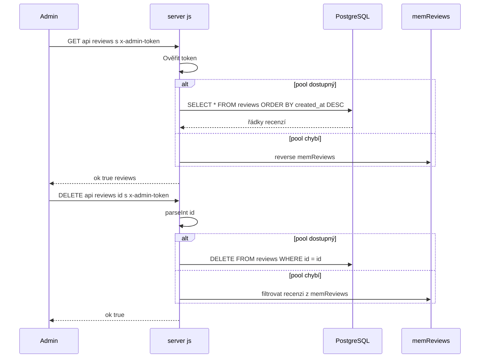

# Backend služba a runtime — Strategie persistence, vytvoření schématu a chování fallbacku úložiště

*server.js*

## Přehled

Tato runtime vrstva ukládá odeslané recenze do PostgreSQL, pokud je k dispozici `DATABASE_URL` a inicializace databázového schématu proběhne úspěšně. Když tato cesta není aktivní, stejné routy pro recenze spadnou zpět na in‑process pole `memReviews` a aplikace tak nadále funguje i bez připojení k databázi.

Volba úložiště ovlivňuje trvalost, generování id, časová razítka a pořadí čtení. Data v SQL přežijí restart procesu a jsou řazena podle `created_at DESC`, zatímco data v paměti existují pouze pro běh aktuálního procesu a vrací se převrácením pole podle pořadí vložení.

## Architektonický přehled



## Runtime stav a režimy úložiště

Chování persistence řídí modulově‑rozsahové runtime proměnné v `server.js`. Handlery rout větví podle pravdivosti `pool`, takže stejné endpointy obslouží buď perzistentní, nebo efemérní úložiště bez změny veřejného API.

| Vlastnost | Typ | Popis |
| --- | --- | --- |
| `ADMIN_TOKEN` | string | Token porovnávaný s hlavičkou `x-admin-token` v chráněných routách pro čtení a mazání. Výchozí hodnota je `"admin123"`. |
| `DATABASE_URL` | string | Connection string pro PostgreSQL čtený z `process.env.DATABASE_URL`; prázdný řetězec zakáže SQL cestu. |
| `memReviews` | array | In‑process fallback úložiště pro objekty recenzí, když `pool` není dostupný. |
| `pool` | Pool nebo null | Aktivní `pg` connection pool použitý pro SQL-backed persistence a načítání recenzí. |


### Matice režimů úložiště

| Režim | Spouštěč | Chování zápisu | Chování čtení | Trvalost |
| --- | --- | --- | --- | --- |
| PostgreSQL‑backed | `DATABASE_URL` je nastaven a inicializace schématu uspěje | Vloží do `reviews` s `RETURNING id` | Query `SELECT * FROM reviews ORDER BY created_at DESC` | Perzistentní napříč restarty |
| In‑memory fallback | `DATABASE_URL` chybí nebo inicializace schématu vyhodí chybu | Přiřadí `id = memReviews.length + 1`, nastaví `created_at` a push do `memReviews` | Vrací `[...memReviews].reverse()` | Ztrácí se při ukončení procesu |


## Vytvoření schématu

SQL větev a paměťová větev nenormalizují ukládané hodnoty stejným způsobem. SQL zápisy převedou prázdné hodnoty `email` a `message` na `NULL`, zatímco paměťová větev ukládá hodnoty přesně tak, jak dorazí v requestu. SQL čtení jsou řazena podle `created_at DESC`, paměťová čtení jednoduše převrátí aktuální pole. Zobrazované pořadí je novější‑první v obou režimech, ale SQL používá časová razítka a paměť používá pořadí vložení. Poznámka: alokátor id v paměťovém režimu používá `memReviews.length + 1`, takže id se přiřazují podle aktuální délky pole, nikoli podle separátní sekvence.

Když je `DATABASE_URL` přítomna, `server.js` vytvoří `Pool` s connection stringem a okamžitě spustí startovní dotaz, který zajistí existenci tabulky `reviews`.

```sql
CREATE TABLE IF NOT EXISTS reviews (
  id SERIAL PRIMARY KEY,
  created_at TIMESTAMP DEFAULT NOW(),
  overall_stars INTEGER NOT NULL,
  email TEXT,
  message TEXT,
  flagged BOOLEAN DEFAULT false
);
```

### Tvar tabulky `reviews`

| Pole | SQL typ | Omezení nebo výchozí | Popis |
| --- | --- | --- | --- |
| `id` | `SERIAL` | `PRIMARY KEY` | Database‑generované id pro každou recenzi. |
| `created_at` | `TIMESTAMP` | `DEFAULT NOW()` | Databázové časové razítko použité pro řazení a zobrazení v SQL módu. |
| `overall_stars` | `INTEGER` | `NOT NULL` | Odeslané hodnocení od 1 do 5. |
| `email` | `TEXT` | žádné | Volitelný email zákazníka. |
| `message` | `TEXT` | žádné | Volitelný text recenze. |
| `flagged` | `BOOLEAN` | `DEFAULT false` | Odvozený moderátorský příznak nastavený, když je rating pod 4. |


### Tvar uloženého záznamu recenze

| Vlastnost | Typ | Popis |
| --- | --- | --- |
| `id` | number | Id vrácené z PostgreSQL nebo přidělené v paměťovém režimu. |
| `created_at` | string | Timestamp uložený PostgreSQL nebo generovaný `new Date().toISOString()` v paměťovém režimu. |
| `overall_stars` | number | Hodnocení zaslané uživatelem. |
| `email` | string nebo null | Email zákazníka. V SQL módu prázdné hodnoty ukládá jako `null`; v paměťovém módu se uloží přesně hodnota z requestu. |
| `message` | string nebo null | Text recenze. V SQL módu prázdné hodnoty uloží jako `null`; v paměťovém módu se uloží původní hodnota. |
| `flagged` | boolean | `true` když `overall_stars < 4`, jinak `false`. |




## Pomocné funkce

### `sslOption`

| Metoda | Popis |
| --- | --- |
| `sslOption` | Přijme connection string `cs` a vrátí `{ rejectUnauthorized: false }`, když `cs` obsahuje hostitele typicky používané cloud providery jako `amazonaws`, `render`, `railway`, `supabase`, `azure`, `gcp`, `neon`, `timescale` nebo `heroku` (case‑insensitive); jinak vrátí `undefined`. Návratová hodnota se předává do `Pool` jako volba `ssl`. |


## API endpointy

### Vytvořit recenzi

#### Create Review

```api
{
    "title": "Create Review",
    "description": "Validuje rating a uloží recenzi do PostgreSQL, když je `pool` dostupný; jinak ji přidá do `memReviews`.",
    "method": "POST",
    "baseUrl": "<ServerBaseUrl>",
    "endpoint": "/api/reviews",
    "headers": [
        {
            "key": "Content-Type",
            "value": "application/json",
            "required": true
        }
    ],
    "queryParams": [],
    "pathParams": [],
    "bodyType": "json",
    "requestBody": "{\n    \"overall_stars\": 2,\n    \"email\": \"customer@example.com\",\n    \"message\": \"The service was slow and the staff was unhelpful.\"\n}",
    "formData": [],
    "rawBody": "",
    "responses": {
        "200": {
            "description": "Recenze úspěšně uložena",
            "body": "{\n    \"ok\": true,\n    \"flagged\": true,\n    \"id\": 42\n}"
        },
        "400": {
            "description": "Neplatné hodnocení",
            "body": "{\n    \"ok\": false,\n    \"error\": \"Neplatn\\u00e9 hodnocen\\u00ed.\"\n}"
        },
        "500": {
            "description": "Chyba úložiště",
            "body": "{\n    \"ok\": false,\n    \"error\": \"Database connection failed\"\n}"
        }
    }
}
```

Handler načte `overall_stars`, `email` a `message` z `req.body`, odmítne ratingy mimo rozsah 1 až 5 a odvodí `flagged = overall_stars < 4`. V SQL módu vloží řádek s `email || null` a `message || null`, poté zkopíruje vrácené `id` do objektu recenze. V paměťovém módu přiřadí id z aktuální délky pole, nastaví `created_at` a pushne recenzi do `memReviews`.

### Seznam recenzí

#### List Reviews

```api
{
    "title": "List Reviews",
    "description": "Vrací všechny recenze pro admin dashboard po validaci `x-admin-token`. SQL módu čte z PostgreSQL v sestupném pořadí podle timestampu; paměťový mód vrací in‑process pole v obráceném pořadí vložení.",
    "method": "GET",
    "baseUrl": "<ServerBaseUrl>",
    "endpoint": "/api/reviews",
    "headers": [
        {
            "key": "x-admin-token",
            "value": "<admin token>",
            "required": true
        }
    ],
    "queryParams": [],
    "pathParams": [],
    "bodyType": "none",
    "requestBody": "",
    "formData": [],
    "rawBody": "",
    "responses": {
        "200": {
            "description": "Seznam recenzí vrácen",
            "body": "{\n    \"ok\": true,\n    \"reviews\": [\n        {\n            \"id\": 42,\n            \"created_at\": \"2026-04-29T10:15:00.000Z\",\n            \"overall_stars\": 2,\n            \"email\": \"customer@example.com\",\n            \"message\": \"The service was slow and the staff was unhelpful.\",\n            \"flagged\": true\n        }\n    ]\n}"
        },
        "401": {
            "description": "Neautorizováno",
            "body": "{\n    \"ok\": false,\n    \"error\": \"Neopr\\u00e1vn\\u011bn\\u00fd p\\u0159\\u00edstup.\"\n}"
        },
        "500": {
            "description": "Chyba úložiště",
            "body": "{\n    \"ok\": false,\n    \"error\": \"Database query failed\"\n}"
        }
    }
}
```

Endpoint kontroluje `req.headers["x-admin-token"]` před přístupem k storage. Pokud token nesouhlasí s `ADMIN_TOKEN`, vrací okamžitě `401`. Když token sedí, handler zvolí PostgreSQL nebo `memReviews` podle `pool`.

### Smazat recenzi

#### Delete Review

```api
{
    "title": "Delete Review",
    "description": "Smaže recenzi podle numerického id po validaci `x-admin-token`. SQL mód smaže řádek v PostgreSQL; paměťový mód ji odfiltruje z `memReviews`.",
    "method": "DELETE",
    "baseUrl": "<ServerBaseUrl>",
    "endpoint": "/api/reviews/:id",
    "headers": [
        {
            "key": "x-admin-token",
            "value": "<admin token>",
            "required": true
        }
    ],
    "queryParams": [],
    "pathParams": [
        {
            "key": "id",
            "type": "string",
            "required": true,
            "description": "Identifikátor recenze parsovaný pomocí `parseInt`."
        }
    ],
    "bodyType": "none",
    "requestBody": "",
    "formData": [],
    "rawBody": "",
    "responses": {
        "200": {
            "description": "Recenze smazána",
            "body": "{\n    \"ok\": true\n}"
        },
        "401": {
            "description": "Neautorizováno",
            "body": "{\n    \"ok\": false,\n    \"error\": \"Neopr\\u00e1vn\\u011bn\\u00fd p\\u0159\\u00edstup.\"\n}"
        },
        "500": {
            "description": "Chyba úložiště",
            "body": "{\n    \"ok\": false,\n    \"error\": \"Delete failed\"\n}"
        }
    }
}
```

Handler parsuje `req.params.id` přes `parseInt` a poté větví podle `pool`. V SQL módu provede `DELETE FROM reviews WHERE id=$1`; v paměťovém módu přepíše `memReviews` filtrovanou verzí, která vyloučí odpovídající id.

## Feature toky

### Tok persistence recenze



Stejný request body produkuje stejnou odpověď v obou režimech. Jediný viditelný rozdíl je místo uložení záznamu a způsob vytvoření metadat úložiště.

### Admin čtení a mazání



Čtecí cesta používá ochrannou hlavičku před jakýmkoli přístupem k datům. Smazací cesta používá stejnou hlavičkovou bránu a poté odstraní recenzi z aktivního backendu úložiště.

## Zpracování chyb

Vrstva persistence používá malé, explicitní větve chyb kolem startu a přístupu k úložišti za běhu.

| Situace | Chování |
| --- | --- |
| Selže vytvoření databázového schématu při startu | Zaloguje `DB init error:` a nastaví `pool = null`, což přesměruje pozdější požadavky do paměťové větve. |
| Neplatné hodnocení v POST | Vrátí `400` s `{ ok: false, error: "Neplatné hodnocení." }`. |
| Špatný admin token | Vrátí `401` s `{ ok: false, error: "Neoprávněný přístup." }`. |
| Dotaz nebo delete v úložišti vyhodí | Vrátí `500` s `{ ok: false, error: e.message }`. |


Request handlery netransformují chyby úložiště do jiného tvaru; ponechávají vyhozenou zprávu v JSON chybovém obálce.

## Závislosti

| Závislost | Použití v této sekci |
| --- | --- |
| `pg` | Poskytuje `Pool` pro PostgreSQL‑backed storage. |
| PostgreSQL | Ukládá tabulku `reviews`, pokud je `DATABASE_URL` dostupné. |
| Express JSON parsing | Poskytuje `req.body` pro `POST /api/reviews` přes `express.json()`. |


## Referenční přehled tříd

| Třída | Odpovědnost |
| --- | --- |
| `server.js` | Inicializuje PostgreSQL persistence, vytvoří tabulku `reviews`, větví mezi SQL a in‑memory storage a vystavuje endpointy pro persistenci recenzí. |
