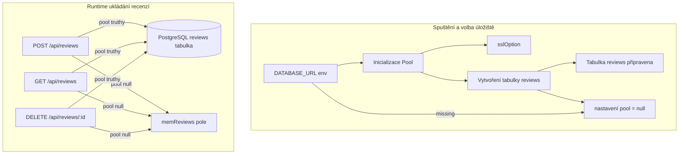
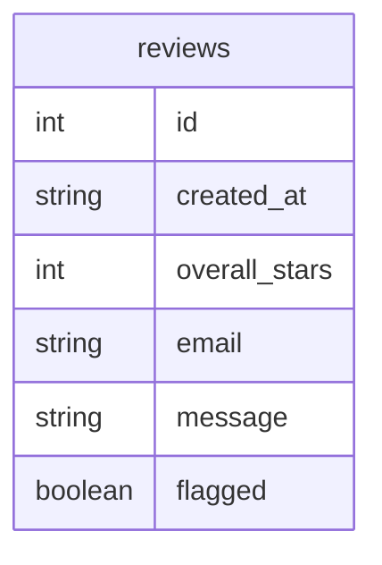
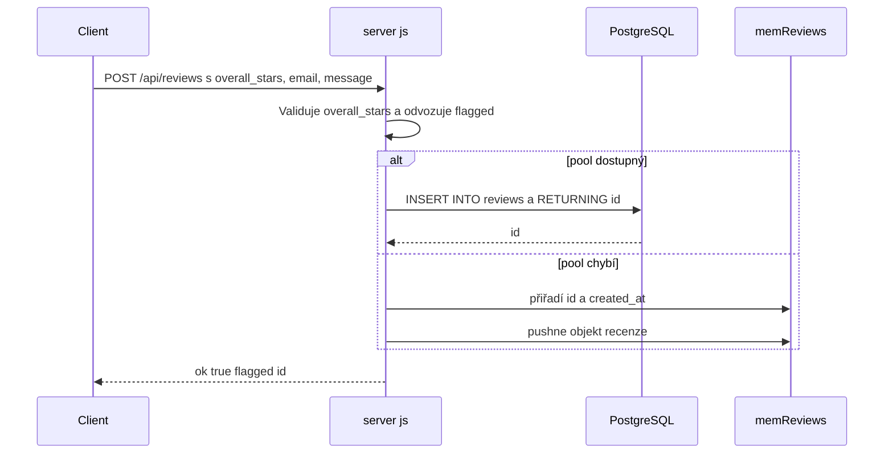
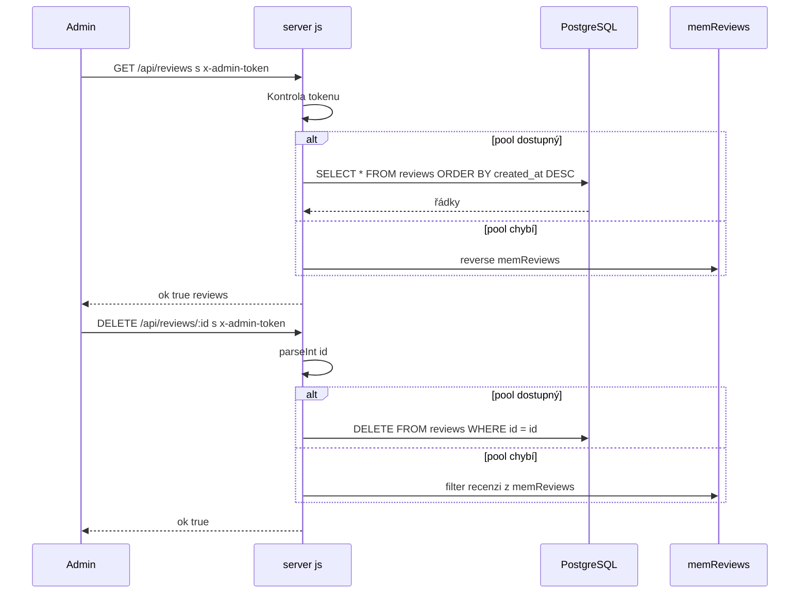

# Backend — Strategie perzistence, vytváření schématu a fallback na úložiště

*server.js*

## Přehled

Tato runtime vrstva ukládá odeslané recenze do PostgreSQL, pokud je v prostředí nastavena proměnná `DATABASE_URL` a inicializace schématu proběhne úspěšně. Pokud není tento režim dostupný, stejné koncové body pro recenze přepnou na in-process pole `memReviews` a aplikace dál funguje bez připojení k databázi.

Volba úložiště ovlivňuje trvanlivost dat, generování identifikátorů, časová razítka a pořadí při čtení. Data v SQL přežijí restart procesu a jsou vrácena v pořadí `created_at DESC`, zatímco data v paměti existují pouze během běhu procesu a pro čtení se vracejí jako obnova pole v opačném pořadí (novější první).

## Architektonický přehled



## Runtime stav a režimy úložiště

Chování perzistence je řízeno modulově-scopeovanými proměnnými v `server.js`. Handlery rout se větví podle truthiness `pool`, takže stejné API vrací buď perzistentní, nebo ephemerní data bez změny veřejného rozhraní.

| Vlastnost | Typ | Popis |
| --- | --- | --- |
| `ADMIN_TOKEN` | string | Token porovnávaný s hlavičkou `x-admin-token` pro chráněné read a delete routy. Výchozí hodnota v kódu je `"admin123"`. |
| `DATABASE_URL` | string | Connection string pro PostgreSQL čtený z `process.env.DATABASE_URL`. Prázdný string deaktivuje SQL větev. |
| `memReviews` | array | In-process fallback úložiště pro objekty recenzí, pokud `pool` není dostupný. |
| `pool` | Pool nebo null | Aktivní `pg` connection pool používaný pro SQL-backed persistence a čtení. |


### Matice režimů úložiště

| Režim | Spouštěč | Chování zápisu | Chování čtení | Trvanlivost |
| --- | --- | --- | --- | --- |
| PostgreSQL | `DATABASE_URL` je nastaven a inicializace schématu proběhne | Vkládá do `reviews` s `RETURNING id` | Čte `SELECT * FROM reviews ORDER BY created_at DESC` | Persistuje přes restarty |
| In-memory fallback | `DATABASE_URL` chybí nebo inicializace schématu selže | Přiřadí `id = memReviews.length + 1`, nastaví `created_at` a pushne do `memReviews` | Vrací `[...memReviews].reverse()` | Ztrácí se po ukončení procesu |


## Vytvoření schématu

SQL a paměťová větev ne-normalizují hodnoty úplně stejně. SQL vkládání převádí prázdné `email` a `message` na `NULL`, zatímco paměťová větev ukládá hodnoty přesně tak, jak přišly v požadavku. SQL čtení jsou řazena podle `created_at DESC`, paměťové čtení zase inverzí pole — výstup je tedy vždy od nejnovějších po nejstarší, ale metrika času je v SQL založená na timestampech, zatímco v paměti na pořadí vložení. In-memory alokátor id používá `memReviews.length + 1`, takže id rostou podle velikosti pole místo dedikované sekvence.

Pokud je `DATABASE_URL` přítomna, `server.js` vytvoří `Pool` s connection stringem a okamžitě spustí startup dotaz, který zajistí existenci tabulky `reviews`.

```sql
CREATE TABLE IF NOT EXISTS reviews (
  id SERIAL PRIMARY KEY,
  created_at TIMESTAMP DEFAULT NOW(),
  overall_stars INTEGER NOT NULL,
  email TEXT,
  message TEXT,
  flagged BOOLEAN DEFAULT false
);
```

### Tvar tabulky `reviews`

| Pole | SQL typ | Omezení / výchozí | Popis |
| --- | --- | --- | --- |
| `id` | `SERIAL` | `PRIMARY KEY` | Databázový identifikátor recenze |
| `created_at` | `TIMESTAMP` | `DEFAULT NOW()` | Timestamp používaný pro řazení v SQL režimu |
| `overall_stars` | `INTEGER` | `NOT NULL` | Hodnocení 1–5 |
| `email` | `TEXT` | žádné | Volitelný email zákazníka |
| `message` | `TEXT` | žádné | Volitelný text recenze |
| `flagged` | `BOOLEAN` | `DEFAULT false` | Moderátorská značka, `true` pokud `overall_stars < 4` |


### Tvar uložené recenze

| Vlastnost | Typ | Popis |
| --- | --- | --- |
| `id` | number | ID z PostgreSQL nebo přidělené v paměťovém režimu |
| `created_at` | string | Timestamp z PostgreSQL nebo `new Date().toISOString()` v paměťovém režimu |
| `overall_stars` | number | Hodnota odeslaná uživatelem |
| `email` | string nebo null | Email zákazníka. V SQL režimu prázdné hodnoty jsou `null`; v paměťovém režimu se ukládá původní hodnota |
| `message` | string nebo null | Text recenze. V SQL režimu prázdné hodnoty jsou `null`; v paměťovém režimu se ukládá původní hodnota |
| `flagged` | boolean | `true` pokud `overall_stars < 4`, jinak `false` |




## Pomocné funkce

### `sslOption`

| Metoda | Popis |
| --- | --- |
| `sslOption` | Přijímá connection string `cs` a vrací `{ rejectUnauthorized: false }`, pokud `cs` obsahuje hostitele typické pro hostované DB (např. `amazonaws`, `render`, `railway`, `supabase`, `azure`, `gcp`, `neon`, `timescale`, `heroku`), porovnání je case-insensitive; jinak vrací `undefined`. Hodnota se předává do `Pool` jako volba `ssl`. |


## API koncové body

### Vytvoření recenze

#### Vytvoření recenze

```api
{
    "title": "Create Review",
    "description": "Validuje hodnocení a uloží recenzi do PostgreSQL pokud je `pool` dostupný, jinak ji přidá do `memReviews`.",
    "method": "POST",
    "baseUrl": "<ServerBaseUrl>",
    "endpoint": "/api/reviews",
    "headers": [
        {
            "key": "Content-Type",
            "value": "application/json",
            "required": true
        }
    ],
    "queryParams": [],
    "pathParams": [],
    "bodyType": "json",
    "requestBody": "{\n    \"overall_stars\": 2,\n    \"email\": \"customer@example.com\",\n    \"message\": \"Služba byla pomalá a personál nepomohl.\"\n}",
    "formData": [],
    "rawBody": "",
    "responses": {
        "200": {
            "description": "Recenze uložena úspěšně",
            "body": "{\n    \"ok\": true,\n    \"flagged\": true,\n    \"id\": 42\n}"
        },
        "400": {
            "description": "Neplatné hodnocení",
            "body": "{\n    \"ok\": false,\n    \"error\": \"Neplatn\\u00e9 hodnocen\\u00ed.\"\n}"
        },
        "500": {
            "description": "Chyba úložiště",
            "body": "{\n    \"ok\": false,\n    \"error\": \"Chyba připojení k databázi\"\n}"
        }
    }
}
```

Handler čte `overall_stars`, `email` a `message` z `req.body`, odmítne hodnocení mimo rozsah 1–5 a odvodí `flagged` podle `overall_stars < 4`. V SQL režimu vloží řádek s `email || null` a `message || null` a zkopíruje vrácené `id` do objektu recenze. V paměťovém režimu přiřadí id podle délky pole, nastaví `created_at` a pushne objekt do `memReviews`.

### Výpis recenzí

#### Výpis recenzí

```api
{
    "title": "List Reviews",
    "description": "Vrací všechny recenze pro administrátorský dashboard po ověření `x-admin-token`. SQL režim čte z PostgreSQL v pořadí podle timestamput; paměťový režim vrací in-memory pole v obráceném pořadí.",
    "method": "GET",
    "baseUrl": "<ServerBaseUrl>",
    "endpoint": "/api/reviews",
    "headers": [
        {
            "key": "x-admin-token",
            "value": "<admin token>",
            "required": true
        }
    ],
    "queryParams": [],
    "pathParams": [],
    "bodyType": "none",
    "requestBody": "",
    "formData": [],
    "rawBody": "",
    "responses": {
        "200": {
            "description": "Seznam recenzí vrácen",
            "body": "{\n    \"ok\": true,\n    \"reviews\": [\n        {\n            \"id\": 42,\n            \"created_at\": \"2026-04-29T10:15:00.000Z\",\n            \"overall_stars\": 2,\n            \"email\": \"customer@example.com\",\n            \"message\": \"Služba byla pomalá a personál nepomohl.\",\n            \"flagged\": true\n        }\n    ]\n}"
        },
        "401": {
            "description": "Neoprávněný",
            "body": "{\n    \"ok\": false,\n    \"error\": \"Neopr\\u00e1vn\\u011bn\\u00fd p\\u0159\\u00edstup.\"\n}"
        },
        "500": {
            "description": "Chyba úložiště",
            "body": "{\n    \"ok\": false,\n    \"error\": \"Chyba databázového dotazu\"\n}"
        }
    }
}
```

Tento endpoint kontroluje `req.headers["x-admin-token"]` před přístupem k úložišti. Pokud token nesedí s `ADMIN_TOKEN`, vrací `401`. Pokud token sedí, handler vybere backend podle `pool`.

### Smazání recenze

#### Smazání recenze

```api
{
    "title": "Delete Review",
    "description": "Maže recenzi podle číselného id po ověření `x-admin-token`. V SQL režimu smaže řádek, v paměťovém režimu provede filter přes `memReviews`.",
    "method": "DELETE",
    "baseUrl": "<ServerBaseUrl>",
    "endpoint": "/api/reviews/:id",
    "headers": [
        {
            "key": "x-admin-token",
            "value": "<admin token>",
            "required": true
        }
    ],
    "queryParams": [],
    "pathParams": [
        {
            "key": "id",
            "type": "string",
            "required": true,
            "description": "Identifikátor recenze parsovaný `parseInt`."
        }
    ],
    "bodyType": "none",
    "requestBody": "",
    "formData": [],
    "rawBody": "",
    "responses": {
        "200": {
            "description": "Recenze smazána",
            "body": "{\n    \"ok\": true\n}"
        },
        "401": {
            "description": "Neoprávněný",
            "body": "{\n    \"ok\": false,\n    \"error\": \"Neopr\\u00e1vn\\u011bn\\u00fd p\\u0159\\u00edstup.\"\n}"
        },
        "500": {
            "description": "Chyba úložiště",
            "body": "{\n    \"ok\": false,\n    \"error\": \"Smazání selhalo\"\n}"
        }
    }
}
```

Handler parsuje `req.params.id` pomocí `parseInt` a poté se větví podle `pool`. V SQL režimu provede `DELETE FROM reviews WHERE id=$1`; v paměťovém režimu přenastaví `memReviews` na filtrované pole bez daného id.

## Feature toky

### Tok perzistence recenze



Stejný request tělo generuje v obou režimech stejnou odpověď; rozdíl je pouze, kde je záznam uložen a jak se vytvoří metadata.

### Tok pro administrátorské čtení a mazání



Cesta čtení kontroluje hlavičku před jakýmkoli přístupem k datům. Cesta mazání používá stejnou bránu a poté odstraní recenzi z aktivního úložiště.

## Zpracování chyb

Vrstva perzistence používá malé explicitní větve pro chyby při startupu a za běhu.

| Situace | Chování |
| --- | --- |
| Selhání vytvoření schématu při startu | Zapíše `DB init error:` a nastaví `pool = null`, což přesměruje pozdější požadavky do paměťové větve. |
| Neplatné hodnocení v POST | Vrátí `400` s `{ ok: false, error: "Neplatné hodnocení." }`. |
| Špatný admin token | Vrátí `401` s `{ ok: false, error: "Neoprávněný přístup." }`. |
| Chyba dotazu nebo smazání | Vrátí `500` s `{ ok: false, error: e.message }`. |


Handlery netransformují chyby úložiště do jiného tvaru; předají chybovou zprávu přímo v JSON obálce.

## Závislosti

| Závislost | Použití v této sekci |
| --- | --- |
| `pg` | Poskytuje `Pool` pro PostgreSQL-backed persistence. |
| PostgreSQL | Ukládá tabulku `reviews` pokud je `DATABASE_URL` dostupná. |
| Express JSON parsing | Dodává `req.body` pro `POST /api/reviews` přes `express.json()`. |


## Přehled klíčových komponent

| Komponenta | Odpovědnost |
| --- | --- |
| `server.js` | Inicializuje PostgreSQL perzistenci, vytváří tabulku `reviews`, rozhoduje mezi SQL a in-memory úložištěm a vystavuje endpoints pro perzistenci recenzí. |

