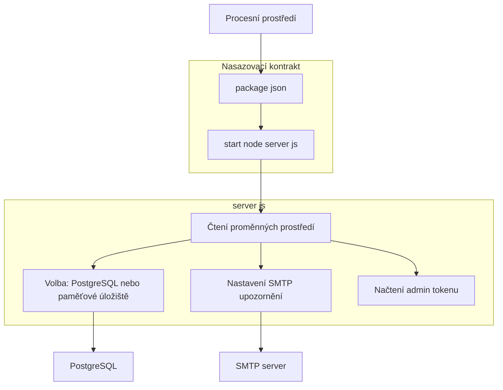
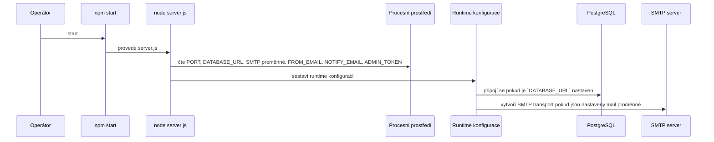

# Proměnné prostředí, tajné hodnoty a provozní konfigurace

## Přehled

Tento dokument popisuje runtime konfigurační rozhraní, které `server.js` čte z proměnných prostředí, a minimální nasazovací kontrakt definovaný v `package.json`. Aplikace je určena k běhu jako jeden Node.js proces s konfigurací řízenou prostředím pro perzistenci, SMTP upozornění a administrativní přístup.

Pro provoz lze aplikaci spustit s perzistencí založenou na PostgreSQL, pokud je nastavena proměnná `DATABASE_URL`. Pokud není, aplikace používá paměťové (in-memory) úložiště jako fallback. Posílání emailových upozornění na negativní hodnocení je řízeno SMTP proměnnými a administrátorský přístup je řízen sdíleným tokenem zasílaným v hlavičce `x-admin-token`.

## Architektonický přehled

## Runtime konfigurační rozhraní

### Proměnné prostředí

*server.js*

| Proměnná | Účel | Výchozí / fallback v kódu | Požadováno pro | Chování při vynechání |
| --- | --- | --- | --- | --- |
| `PORT` | Port, na kterém naslouchá HTTP server | Není uvedeno v obnoveném snippetu | Spuštění serveru | Server čte port z prostředí |
| `DATABASE_URL` | Connection string do PostgreSQL | Není výchozí hodnota | Trvalé ukládání recenzí | Pokud není přítomna, používá se paměťové úložiště |
| `SMTP_HOST` | Hostitel SMTP | `smtp.resend.com` | Odesílání emailů | Výchozí hostitel je `smtp.resend.com` |
| `SMTP_PORT` | Port SMTP | `465` | Odesílání emailů | Výchozí port je `465` |
| `SMTP_USER` | Uživatelské jméno pro SMTP | Není uvedeno | Odesílání emailů | Použije se hodnota z prostředí |
| `SMTP_PASS` | Heslo pro SMTP | `""` (prázdný string) | Odesílání emailů | Pokud není nastaveno, padá zpět na prázdný řetězec |
| `SMTP_SECURE` | Flag pro TLS u SMTP | Odvozeno z `SMTP_PORT === 465`, pokud není nastaveno | Odesílání emailů | Pokud není nastaveno, pro port `465` je secure režim povolen |
| `FROM_EMAIL` | Odesílatel upozornění | Není uvedeno | Odesílání emailů | Adresa odesílatele se čte z prostředí |
| `NOTIFY_EMAIL` | Příjemce upozornění | Není uvedeno | Odesílání emailů | Adresa příjemce se čte z prostředí |
| `ADMIN_TOKEN` | Sdílené tajemství pro admin požadavky | Není uvedeno | Administrativní přístup | Administrativní požadavky jsou ověřovány proti této hodnotě |

### Volba režimu perzistence

Proměnná `DATABASE_URL` slouží jako přepínač mezi dvěma režimy ukládání:

- **Přítomná:** aplikace se připojí k PostgreSQL a používá ho pro trvalé ukládání recenzí.
- **Nepřítomná:** aplikace používá paměťové úložiště (in-memory) jako fallback.

SMTP proměnná `SMTP_SECURE` obsahuje jednoduchou logiku: pokud je explicitně nastavena, kód ji porovnává s řetězcem `"true"`; pokud není, hodnota se odvozuje z porovnání `SMTP_PORT === 465`.

## Bezpečnost a tajné hodnoty

### Proměnné obsahující tajné hodnoty

*server.js*

| Proměnná | Bezpečnostní role | Poznámky z kódu |
| --- | --- | --- |
| `DATABASE_URL` | Tajemství pro připojení k databázi | Řídí připojení k PostgreSQL |
| `SMTP_USER` | Přihlašovací údaj pro SMTP | Používá se k autentizaci u SMTP transportu |
| `SMTP_PASS` | Přihlašovací údaj pro SMTP | Pokud chybí, výchozí je prázdný řetězec |
| `ADMIN_TOKEN` | Tajemství pro administrátorský přístup | Ochrana administrátorských endpointů pomocí sdíleného tokenu |

### Provozně citlivé hodnoty

- `FROM_EMAIL` a `NOTIFY_EMAIL` určují směrování upozornění emailem.
- `SMTP_HOST`, `SMTP_PORT` a `SMTP_SECURE` ovlivňují vlastnosti SMTP transportu.
- `PORT` definuje veřejný posluchač Node.js procesu.

### Využití admin tajemství na straně požadavku

Klient pro administraci posílá token v hlavičce `x-admin-token` pro privilegované požadavky. Server pak porovnává hodnotu s `ADMIN_TOKEN` uloženým v prostředí.

## Provozní kontrakt

### Start script v `package.json`

*package.json*

| Pole | Hodnota | Provozní efekt |
| --- | --- | --- |
| `scripts.start` | `node server.js` | Aplikace se spouští přímo Node.js |
| `type` | `module` | `server.js` běží jako ES modul |

Nasazovací rozhraní je záměrně jednoduché: existuje pouze jeden skript, takže spuštění aplikace znamená instalaci závislostí a zavolání `npm start`.

### Běhové závislosti

*package.json*

| Balíček | Role |
| --- | --- |
| `express` | HTTP server |
| `dotenv` | Načítání proměnných prostředí (pokud se používá) |
| `nodemailer` | Odesílání e-mailů |
| `pg` | Připojení k PostgreSQL |

## Start a inicializace konfigurace

### Pořadí spuštění

1. `npm start` spustí `node server.js`.
2. `server.js` načte proměnné prostředí uvedené výše.
3. Cesta ukládání je vybrána podle `DATABASE_URL`.
4. SMTP nastavení jsou sestavena z `SMTP_*` hodnot a `FROM_EMAIL` / `NOTIFY_EMAIL`.
5. Administrátorské tajemství se načte z `ADMIN_TOKEN`.

## Přehled klíčových komponent

| Komponenta | Umístění | Odpovědnost |
| --- | --- | --- |
| `server.js` | `server.js` | Inicializuje runtime konfiguraci, volí perzistenci a email nastavení a konzumuje proměnné prostředí |
| `package.json` | `package.json` | Definuje vstupní bod nasazení a seznam runtime závislostí |

