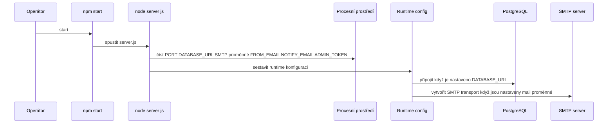

# Konfigurace, tajné hodnoty a provozní nastavení

## Přehled

Tato sekce dokumentuje runtime konfigurační plochu, kterou `server.js` čte z procesního prostředí, a minimální nasazovací kontrakt definovaný v `package.json`. Aplikace je navržena tak, aby běžela jako jediný Node.js proces s nastaveními řízenými pomocí proměnných prostředí pro persistenci, SMTP notifikace a admin přístup.

Pro provoz lze použít PostgreSQL‑backed storage, pokud je k dispozici `DATABASE_URL`, nebo fallback v paměti, pokud není. Emailové upozornění pro negativní zpětnou vazbu je řízeno SMTP proměnnými a administrátorský dashboard spoléhá na sdílený tajný token posílaný v hlavičce `x-admin-token`.

## Runtime konfigurační plocha

### Proměnné prostředí

*server.js*

| Proměnná | Účel | Výchozí nebo fallback v kódu | Vyžadováno pro | Chování když chybí |
| --- | --- | --- | --- | --- |
| `PORT` | Port HTTP listeneru pro Node.js server | Není zobrazeno v obnovené ukázce | Start serveru | Server čte port z prostředí. |
| `DATABASE_URL` | Connection string pro PostgreSQL | Žádný výchozí | Persistenci recenzí v DB | Recenze používají paměťový fallback místo PostgreSQL. |
| `SMTP_HOST` | SMTP hostname | `smtp.resend.com` | Odchozí emaily | SMTP host má výchozí `smtp.resend.com`. |
| `SMTP_PORT` | SMTP port | `465` | Odchozí emaily | Port má výchozí `465`. |
| `SMTP_USER` | SMTP uživatel | Žádný výchozí | Odchozí emaily | Transport používá hodnotu z prostředí. |
| `SMTP_PASS` | SMTP heslo | `""` | Odchozí emaily | Heslo fallbackuje na prázdný řetězec. |
| `SMTP_SECURE` | Příznak TLS pro SMTP | Odvozeno z `SMTP_PORT === 465` když není nastaveno | Odchozí emaily | Pokud není nastaveno, secure mode je povolen pro port `465`. |
| `FROM_EMAIL` | Odesílatel alert emailu | Žádný výchozí | Odchozí emaily | Adresa odesílatele se bere z prostředí. |
| `NOTIFY_EMAIL` | Příjemce alert emailu | Žádný výchozí | Odchozí emaily | Příjemce se bere z prostředí. |
| `ADMIN_TOKEN` | Sdílené tajemství pro chráněné admin požadavky | Žádný výchozí | Admin přístup | Admin požadavky spoléhají na nastavenou hodnotu tokenu. |

### Volba režimu persistence

`SMTP_SECURE` je jediná SMTP proměnná s viditelnou podmíněnou logikou: když je proměnná přítomna, kód kontroluje, zda je rovna "true"; jinak vyvozuje hodnotu z `SMTP_PORT === 465`.

`DATABASE_URL` je přepínač mezi dvěma režimy úložiště:

- **Přítomná**: aplikace může použít PostgreSQL pro perzistentní ukládání recenzí.
- **Chybějící**: aplikace použije in‑memory persistenci.

To je jediný dokumentovaný rozhodovací bod pro úložiště v obnovené konfigurační ploše.

## Bezpečnost a tajné hodnoty

### Hodnoty obsahující tajemství

*server.js*

| Proměnná | Bezpečnostní role | Poznámky z kódu |
| --- | --- | --- |
| `DATABASE_URL` | Databázové přihlašovací údaje | Řídí PostgreSQL persistenci. |
| `SMTP_USER` | SMTP přihlašovací údaje | Používá se v SMTP transportu. |
| `SMTP_PASS` | SMTP přihlašovací údaje | Fallbackuje na prázdný řetězec pokud chybí. |
| `ADMIN_TOKEN` | Admin přístupové tajemství | Chrání administrátorské požadavky přes sdílený token. |

### Provozní citlivé hodnoty

- `FROM_EMAIL` a `NOTIFY_EMAIL` ovlivňují routování emailů.
- `SMTP_HOST`, `SMTP_PORT` a `SMTP_SECURE` definují charakteristiky odchozího mailu.
- `PORT` definuje veřejný listener pro Node.js proces.

### Použití admin tajemství na klientské straně

Admin klient posílá token v hlavičce `x-admin-token` pro privilegované požadavky. To činí `ADMIN_TOKEN` sdílenou hodnotou, která musí souhlasit mezi klientem a serverem.

## Provozní kontrakt

### package.json Start Script

*package.json*

| Pole | Hodnota | Provozní efekt |
| --- | --- | --- |
| `scripts.start` | `node server.js` | Aplikace se spouští přímo pomocí Node.js. |
| `type` | `module` | `server.js` běží jako ES modul. |

Nasazovací plocha je záměrně minimální: existuje pouze jeden skript, takže spuštění aplikace znamená instalaci závislostí a volání `npm start`.

## Startup a konfigurační tok

### Sekvence startu

1. `npm start` spustí `node server.js`.
2. `server.js` načte proměnné prostředí uvedené výše.
3. Cesta úložiště se vybere na základě `DATABASE_URL`.
4. SMTP nastavení se složí z `SMTP_*` hodnot plus `FROM_EMAIL` a `NOTIFY_EMAIL`.
5. Admin tajemství se načte z `ADMIN_TOKEN` pro chráněné požadavky.

## Referenční přehled tříd

| Třída | Umístění | Odpovědnost |
| --- | --- | --- |
| `server.js` | `server.js` | Inicializuje runtime konfiguraci, volí persistence a email nastavení, a spotřebovává proměnné prostředí. |
| `package.json` | `package.json` | Definuje vstupní bod nasazení a set závislostí. |
