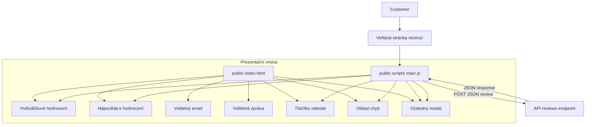

# Public Review Submission Domain — Struktura veřejného formuláře, UX hodnocení a správa stavu odeslání

## Přehled

Tato doména je vstupním bodem pro zákazníka. Zobrazuje jednoduchý formulář pro hodnocení hvězdami, vybízí uživatele, aby nejdříve vybral skóre, a poté odešle zpětnou vazbu jako JSON na `POST /api/reviews`.

Tok je navržený jako lehký: uživatel vybere 1–5 hvězd, volitelně doplní email a text a odešle z téže stránky. Klientský skript spravuje viditelný stav hodnocení, validuje výběr, zobrazuje loading a chybové stavy a otevře modal po úspěšném přijetí recenze backendem.

## Architektonický přehled

## Struktura komponent

### Veřejný formulář

*public/index.html*

Stránka definuje strukturu formuláře a kontejnery, které se během běhu mění. Obsahuje hvězdové hodnocení, volitelné kontaktní pole, odesílací tlačítko, inline chybovou oblast a modal overlay.

#### Klíčové DOM cíle

| ID | Element | Účel |
| --- | --- | --- |
| `mainStars` | `div.stars-row` | Kontejner radiogroup pro hvězdy s `role="radiogroup"` a `aria-label="Celkové hodnocení"` |
| `mainHint` | `div.star-hint` | Instrukční/sentiment nápověda |
| `email` | `input[type="email"]` | Volitelný email |
| `message` | `textarea` | Volitelná zpráva |
| `submitBtn` | `button.btn-submit` | Odeslání recenze a zobrazení loading stavu |
| `errorMsg` | `div.error-msg` | Zobrazuje chyby |
| `modalOverlay` | `div.modal-overlay` | Výsledný modal overlay |
| `modalTitle` | `h2` | Nadpis modalu |
| `modalText` | `p` | Tělo modalu |
| `modalBtns` | `div` | Akční tlačítka v modalu |

Hvězdičkový ovladač se renderuje jako pět labelů, každý obalující radio input `name="overall"` s atributem `data-val` od `1` do `5`.

### Skript odeslání

*public/scripts/main.js*

Skript spravuje klientský stav pro výběr hodnocení, bránu pro odeslání a zobrazení výsledků. Přidává hover a click chování, ukládá `overallVal` a provádí `fetch` na API.

#### Konstanty a stav

| Název | Typ | Popis |
| --- | --- | --- |
| `HINTS` | `string[]` | Nápovědy podle hvězd |
| `GOOGLE_MAPS_URL` | `string` | Externí cíl pro pozitivní recenze |
| `overallVal` | `number` | Vybraná hodnota pro submit |

#### Mapování hintů

| Hodnota | Text |
| --- | --- |
| `0` | `""` |
| `1` | `Velké zklamání` |
| `2` | `Nic extra` |
| `3` | `Průměr` |
| `4` | `Velmi v pořádku` |
| `5` | `Perfektní` |

#### Funkce

| Metoda | Popis |
| --- | --- |
| `setupStars` | Připojí posluchače na štítky hvězd |
| `highlight` | Aplikuje `active` třídu až do vybrané hodnoty |
| `showModal` | Vytvoří obsah modalu a otevře overlay |

## UX výběru hodnocení

Ovladač je radio group, ne volný vstup. Každá hvězda je label + native radio, což dává skriptu konzistentní způsob mapování hover/click akcí.

`setupStars`:

- `mouseenter` zobrazí preview volby
- `mouseleave` obnoví poslední zvolenou hodnotu
- `click` uzamkne volbu a aktualizuje `overallVal` a `mainHint`

Funkce `highlight` přidává `active` všem labelům s `data-val` menším nebo rovným zvolené hodnotě.

## Správa stavu odeslání

`overallVal` se aktualizuje pouze v click callbacku uvnitř `setupStars`. Odeslání čte `overallVal` jako stráž, takže změna radio stavu mimo tento callback může zanechat `overallVal` na staré hodnotě nebo `0`.

Při odeslání se tlačítko přepne:

- `btn.disabled = true`
- `btn.innerHTML = 'Odesílám...'`

V případě chyby je tlačítko obnoveno a zobrazen text chyby. Po úspěchu se otevře modal a stránka se resetuje po zavření.

## Testovací poznámky

- Ověřit každou hvězdu a ověřit správný `overallVal` a `mainHint`.
- Hover vyzkoušejte pro preview.
- Odeslat bez hodnocení a ověřit, že nedojde k síťovému volání.
- Odeslat s prázdným emailem a zprávou a ověřit, že payload obsahuje `null` pro obě pole.
