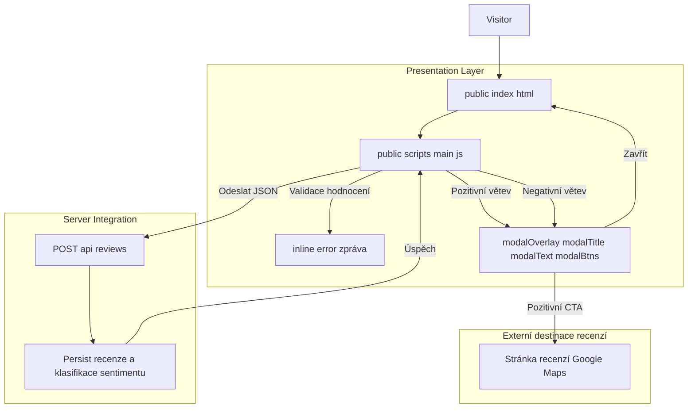

# Public Review Submission Domain — Výsledky odeslání, větvení po odeslání a přesměrování na externí recenze

*Zdrojové soubory: `public/index.html`, `public/scripts/main.js`, `server.js`*

## Přehled

Tato část aplikace řeší, co se stane poté, co návštěvník klikne na **Odeslat hodnocení**. Klient validuje, že bylo vybráno hodnocení hvězdami, odešle recenzi na backend a poté se rozdělí do jedné ze dvou cest: pozitivní modal s CTA pro Google Maps, nebo negativní modal, který poděkuje a ponechá recenzenta v aplikaci.

Obchodní cíl je rozdělen na dvě outcome větve. Recenze, které splňují pozitivní práh, jsou ihned nasměrovány na externí veřejnou recenzní destinaci přes `GOOGLE_MAPS_URL`, zatímco nižší hodnocení jsou potvrzena lokálně bez přesměrování. Stejná odeslaná hvězda určuje text v modalu, takže UI větvení se provede až po úspěšném uložení na backendu.

## Architektonický přehled

## Struktura komponent

### Prezentační vrstva

#### `public/index.html`

Tento soubor vykresluje veřejný formulář recenze a modální kostru, která se naplní po úspěšném odeslání. Markup definuje inline error oblast, tlačítko odeslat a modal container, který skript zobrazuje nebo skrývá.

| Element ID | Typ | Účel |
| --- | --- | --- |
| `mainStars` | kontejner hodnocení | Hostí volitelné štítky hvězd, které nastavují `overallVal` přes `setupStars` |
| `mainHint` | hint text | Zobrazuje hint text podle `HINTS` |
| `email` | vstup emailu | Volitelný email odesílaný s payloadem |
| `message` | textarea | Volitelný text recenze |
| `submitBtn` | tlačítko | Spouští validaci a odeslání |
| `errorMsg` | inline message | Zobrazuje chyby validace a chyby odeslání |
| `modalOverlay` | modal container | Skrytý, zobrazuje se po úspěšném postu |
| `modalTitle` | nadpis | Aktualizuje se podle pozitivního/negativního scénáře |
| `modalText` | odstavec | Aktualizovaný text v modalu |
| `modalBtns` | akce | Naplněno Google Maps CTA a tlačítkem zavřít |

Modal je již v HTML a skript jen přepíná `show` třídu a nahrazuje obsah modalu.

### `public/scripts/main.js`

Tento modul řídí celý tok výsledku odeslání. Zachytí vybranou hvězdu, validuje ji, odešle recenzi na `/api/reviews` a po úspěchu větví UI.

| Člen | Typ | Účel |
| --- | --- | --- |
| `HINTS` | `string[]` | Texty nápovědy podle hvězd |
| `GOOGLE_MAPS_URL` | `string` | Externí cílová adresa pro pozitivní recenze |
| `overallVal` | `number` | Aktuálně vybrané hodnocení |

| Funkce | Popis |
| --- | --- |
| `setupStars` | Přidá chování hover a click pro hvězdy |
| `highlight` | Aplikuje `active` na štítky do vybrané hodnoty |
| `showModal` | Vykreslí modal, větví text podle sentimentu a připojí chování zavření |

`showModal(overallVal >= 4)` určuje, která větev se vykreslí; backend pouze potvrzuje úspěšné uložení.

## API integrace

### `POST /api/reviews`

Klient očekává JSON odpověď s tvarem `{ ok, error }`. Když `data.ok` je truthy, klient považuje odeslání za úspěšné a vybere místní větvení podle právě vybrané hvězdy.

## Matice výsledků odeslání

| Podmínka | Inline výsledek | Obsah modalu | CTA |
| --- | --- | --- | --- |
| Žádná hvězda | `errorMsg` se zobrazí `Prosím vyberte celkové hodnocení hvězdičkami.` | Žádný modal | Žádné |
| Chyba požadavku nebo backend vrátí `ok: false` | `errorMsg` se zobrazí `Chyba při odesílání: ...` | Žádný modal | Žádné |
| Úspěšné odeslání s `overallVal >= 4` | Žádná inline chyba | `Skvělé, děkujeme!` + výzva na Google Maps | `★ Ohodnotit na Google Mapách` |
| Úspěšné odeslání s `overallVal < 4` | Žádná inline chyba | `Děkujeme za zpětnou vazbu` + omluva a follow‑up zpráva | Žádné |

## Testovací poznámky

- Zkusit odeslat bez hvězd a ověřit inline chybu.
- Zkusit 4‑ nebo 5‑hvězdové odeslání a ověřit, že modal obsahuje Google Maps CTA.
- Zkusit 1–3 hvězdy a ověřit negativní modal bez extení CTA.
- Ověřit, že zavření modalu reloadne stránku po 350 ms.
