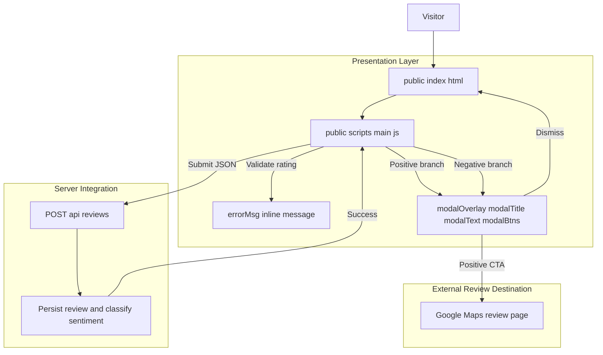
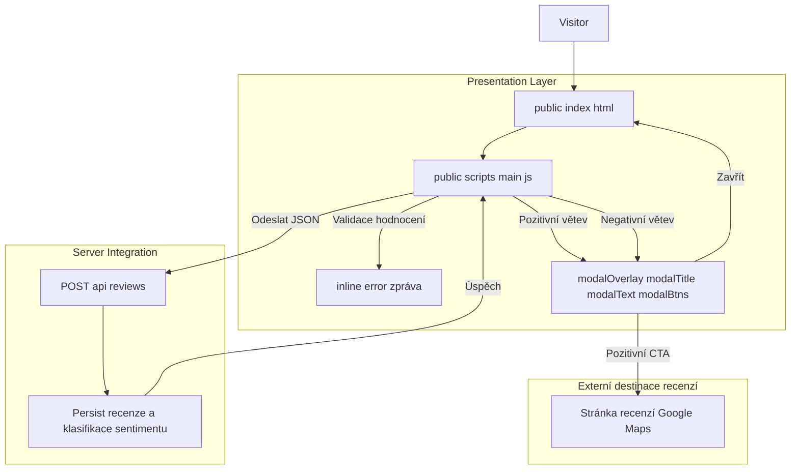

# Public Review Submission Domain - Submission outcomes, post-submit branching, and external review redirection

*Source files: `public/index.html`, `public/scripts/main.js`, `server.js`*

## Overview

This part of the review app handles what happens after a visitor presses **Odeslat hodnocení**. The client validates that a star rating exists, submits the review to the backend, and then branches into one of two post-submit paths: a positive-review modal that offers a Google Maps review CTA, or a negative-review modal that acknowledges the feedback and keeps the reviewer inside the app.

The business goal is split into two outcomes. Reviews that meet the positive threshold are immediately routed toward an external public review destination through `GOOGLE_MAPS_URL`, while lower ratings are acknowledged privately in-place. The same submitted star value is also what drives the positive/negative post-submit copy, so the UI path changes only after a successful backend submission and not before.

## Architecture Overview

## Component Structure

### Presentation Layer

#### 

*`public/index.html`*

This file renders the public review form and the modal shell that  fills after a successful submission. The markup defines the inline error region, the submit button, and the modal container that is shown or hidden by script.

| Element ID | Type | Purpose |
| --- | --- | --- |
| `mainStars` | rating container | Hosts the selectable star labels that set `overallVal` through `setupStars` |
# Public Review Submission Domain — Výsledky odeslání, větvení po odeslání a přesměrování na externí recenze

*Zdrojové soubory: `public/index.html`, `public/scripts/main.js`, `server.js`*

## Přehled

Tato část aplikace řeší, co se stane poté, co návštěvník klikne na **Odeslat hodnocení**. Klient validuje, že bylo vybráno hodnocení hvězdami, odešle recenzi na backend a poté se rozdělí do jedné ze dvou cest: pozitivní modal s CTA pro Google Maps, nebo negativní modal, který poděkuje a ponechá recenzenta v aplikaci.

Obchodní cíl je rozdělen na dvě outcome větve. Recenze, které splňují pozitivní práh, jsou ihned nasměrovány na externí veřejnou recenzní destinaci přes `GOOGLE_MAPS_URL`, zatímco nižší hodnocení jsou potvrzena lokálně bez přesměrování. Stejná odeslaná hvězda určuje text v modalu, takže UI větvení se provede až po úspěšném uložení na backendu.

## Architektonický přehled

{
